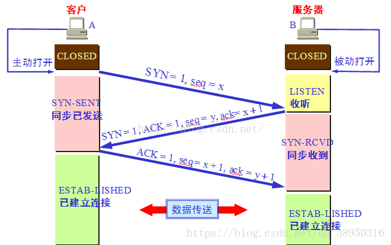
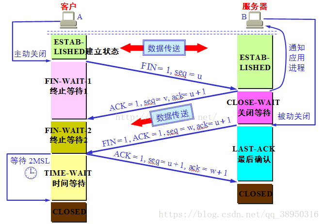

# JavaScript总结

[toc]

## 1.异步编程

### 1.1.实现Promise.limit()，实现对promise数组的限制运行

```javascript
class LimitPromise {
  constructor (max) {
    // 异步任务“并发”上限
    this._max = max
    // 当前正在执行的任务数量
    this._count = 0
    // 等待执行的任务队列
    this._taskQueue = []
  }

  /**
   * 调用器，将异步任务函数和它的参数传入
   * @param caller 异步任务函数，它必须是async函数或者返回Promise的函数
   * @param args 异步任务函数的参数列表
   * @returns {Promise<unknown>} 返回一个新的Promise
   */
  call (caller, ...args) {
    return new Promise((resolve, reject) => {
      const task = this._createTask(caller, args, resolve, reject)
      if (this._count >= this._max) {
        // console.log('count >= max, push a task to queue')
        this._taskQueue.push(task)
      } else {
        task()
      }
    })
  }

  /**
   * 创建一个任务
   * @param caller 实际执行的函数
   * @param args 执行函数的参数
   * @param resolve
   * @param reject
   * @returns {Function} 返回一个任务函数
   */
  _createTask (caller, args, resolve, reject) {
    return () => {
      // 实际上是在这里调用了异步任务，并将异步任务的返回（resolve和reject）抛给了上层
      caller(...args)
        .then(resolve)
        .catch(reject)
        .finally(() => {
          // 任务队列的消费区，利用Promise的finally方法，在异步任务结束后，取出下一个任务执行
          this._count--
          if (this._taskQueue.length) {
            // console.log('a task run over, pop a task to run')
            let task = this._taskQueue.shift()
            task()
          } else {
            // console.log('task count = ', count)
          }
        })
      this._count++
      // console.log('task run , task count = ', count)
    }
  }
}
```

```javascript
const LimitPromise = require('limit-promise')
const request = require('./request')
// 请求上限
const MAX = 10
// 核心控制器
const limitP = new LimitPromise(MAX)

// 利用核心控制器包装request中的函数
function get (url, params) {
  return limitP.call(request.get, url, params)
}
function post (url, params) {
  return limitP.call(request.post, url, params)
}
// 导出
module.exports = {get, post}
```

[demo](https://github.com/onechunlin/JS_Demo/tree/master/Promise.limit的原生实现)

### 1.2.异步编程的实现方式

    js 中的异步机制可以分为以下几种
    
    第一种最常见的是使用回调函数的方式，使用回调函数的方式有一个缺点是，多个回调函数嵌套的时候会造成回调函数地狱，上下两层的回调函数间的代码耦合度太高，不利于代码的可维护。
    
    第二种是 Promise 的方式，使用 Promise 的方式可以将嵌套的回调函数作为链式调用。但是使用这种方法，有时会造成多个 then 的链式调用，可能会造成代码的语义不够明确。
    
    第三种是使用 generator 的方式，它可以在函数的执行过程中，将函数的执行权转移出去，在函数外部我们还可以将执行权转移回来。当我们遇到异步函数执行的时候，将函数执行权转移出去，当异步函数执行完毕的时候我们再将执行权给转移回来。因此我们在 generator 内部对于异步操作的方式，可以以同步的顺序来书写。使用这种方式我们需要考虑的问题是何时将函数的控制权转移回来，因此我们需要有一个自动执行 generator 的机制，比如说 co 模块等方式来实现 generator 的自动执行。
    
    第四种是使用 async 函数的形式，async 函数是 generator 和 promise 实现的一个自动执行的语法糖，它内部自带执行器，当函数内部执行到一个 await 语句的时候，如果语句返回一个 promise 对象，那么函数将会等待 promise 对象的状态变为 resolve 后再继续向下执行。因此我们可以将异步逻辑，转化为同步的顺序来书写，并且这个函数可以自动执行。
### 1.3为什么使用 setTimeout 实现 setInterval？怎么模拟

```javascript
思路是使用递归函数，不断地去执行 setTimeout 从而达到 setInterval 的效果

function mySetInterval(fn, timeout) {
  // 控制器，控制定时器是否继续执行
  var timer = {
    flag: true
  };
  // 设置递归函数，模拟定时器执行。
  function interval() {
    if (timer.flag) {
      fn();
      setTimeout(interval, timeout);
    }
  }
  // 启动定时器
  setTimeout(interval, timeout);
  // 返回控制器
  return timer;
}
```
    setInterval 的作用是每隔一段指定时间执行一个函数，但是这个执行不是真的到了时间立即执行，它真正的作用是每隔一段时间将事件加入事件队列中去，只有当当前的执行栈为空的时候，才能去从事件队列中取出事件执行。所以可能会出现这样的情况，就是当前执行栈执行的时间很长，导致事件队列里边积累多个定时器加入的事件，当执行栈结束的时候，这些事件会依次执行，因此就不能到间隔一段时间执行的效果。
    
    针对 setInterval 的这个缺点，我们可以使用 setTimeout 递归调用来模拟 setInterval，这样我们就确保了只有一个事件结束了，我们才会触发下一个定时器事件，这样解决了 setInterval 的问题。
 [《用 setTimeout 实现 setInterval》](https://www.jianshu.com/p/32479bdfd851)
 [《setInterval 有什么缺点？》](https://zhuanlan.zhihu.com/p/51995737)

### 1.4.手写一个 Promise

```javascript
class MyPromise {
  constructor(excutor) {
    // 状态
    this._state = "pending";
    // 成功回调
    this._callbacks_resolved = [];
    // 失败回调
    this._callbacks_rejected = [];
    // 执行
    excutor(
      (data) => {
        // 避免重复执行
        if (this._state !== "pending") {
          return;
        }
        // 保存结果
        this._data = data;
        // 状态变更
        this._state = "resolved";
        // 处理
        this._handle();
      },
      (err) => {
        if (this._state !== "pending") {
          return;
        }
        // 错误信息
        this._err = err;
        // 状态变更
        this._state = "rejected";
        this._handle();
      }
    );
  }
  then(onfulfilled, onrejected) {
    return new MyPromise((resolve, reject) => {
      this._callbacks_resolved.push((data) => {
        // 没有处理，直接往后传
        if (!onfulfilled) {
          return resolve(data);
        }
        try {
          let r = onfulfilled(data);
          // 有then函数
          if (r && typeof r.then === "function") {
            return r.then(resolve, reject);
          }
          resolve(r);
        } catch (e) {
          // 有错误直接向后传
          reject(e);
        }
      });
      this._callbacks_rejected.push((err) => {
        if (!onrejected) {
          return reject(err);
        }
        try {
          let r = onrejected(err);
          if (r && typeof r.then === "function") {
            return r.then(resolve, reject);
          }
          resolve(r);
        } catch (e) {
          reject(e);
        }
      });
      this._handle();
    });
  }

  catch(onrejected) {
    return this.then(undefined, onrejected);
  }

  _handle() {
    if (this._state === "pending") {
      return;
    }
    // 为什么要延时，then的东西是不能马上执行的，可以看看micro-task和macro-task，这里只能模拟
    setTimeout(() => {
      if (this._state === "resolved") {
        this._callbacks_resolved.forEach((cb) => cb(this._data));
      } else {
        this._callbacks_rejected.forEach((cb) => cb(this._err));
      }
      this._callbacks_resolved = [];
      this._callbacks_rejected = [];
    });
  }
}

module.exports = MyPromise;
```

[动手写一个promise](http://www.fly63.com/article/detial/8711)

### 1.5.尾部js的加载也是阻塞式的，有什么办法解决吗

```javascript
js的延时加载
	defer的使用 
  defer是一个常用的优化方案，它表示脚本会被延迟到文档完全被解析和显示之后再执行，加载后续文档元素的过程将和js脚本的加载并行进行（异步），这样页面加载会更快
	<script src="main.js" defer></script>
	async的使用
	async是html5的属性，async 属性规定一旦脚本可用，则会异步执行。async不保证按照脚本出现的先后顺序执行，因此，确保两者之前互不依赖非常重要，指定async属性的目的是不让页面等待两个脚本的下载和执行，从而异步加载页面其他内容，异步脚本一定会在页面的load事件前执行，但可能会在DOMContentLoaded事件触发之前或之后执行。支持异步脚本的浏览器有Firefox 3.6、Safari 5 和Chrome。
<script async src="main.js"></script>

js的动态加载
	由于文档对象模型（DOM）允许您使用 JavaScript 动态创建 HTML 的几乎全部文档内容。  当然也就应许我们动态创建<script>元素
  function loadScript(url, callback){
   var script = document.createElement ("script")
   script.type = "text/javascript";
   if (script.readyState){ //IE
    script.onreadystatechange = function(){
     if (script.readyState == "loaded" || script.readyState == "complete"){
      script.onreadystatechange = null;
      callback();
     }
    };
   }else{ //Others
    script.onload = function(){
     callback();
    };
   }
   script.src = url;
   document.getElementsByTagName("head")[0].appendChild(script);
  }
	loadScript("main.js", function(){
  	console.log("File is loaded!");
  });

js动态注入
	创建一个XMLHttpRequest对象，然后下载 JavaScript 文件，接着用一个动态 <script> 元素将 JavaScript 代码注入页面
  var xhr = new XMLHttpRequest();
  xhr.open("get", "main.js", true);
  xhr.onreadystatechange = function(){
   if (xhr.readyState == 4){
    if (xhr.status >= 200 && xhr.status < 300 || xhr.status == 304){
     var script = document.createElement ("script");
     script.type = "text/javascript";
     script.text = xhr.responseText;
     document.body.appendChild(script);
    }
   }
  };
  xhr.send(null);
	向服务器发送一个GET 请求 ,去获取main.js文件，当状态成功，我们把获取的js文件动态加载到页面。采取了它的好处是：它下载后不会自动执行，这使得您可以推迟执行，直到一切都准备好了。另一个优点是，同样的代码在所有现代浏览器中都不会引发异常。需要注意的是，加载的js文件不能跨域获取，所以一般网站通常不采用 XHR 脚本注入技术
```

[js无阻塞加载方式](http://www.fly63.com/article/detial/44)

### 1.6.Promise.all如果有一个reject了，会怎样？如何忽略会报reject的异步(意思就是一系列异步任务如何让它一直执行到最后，不管会不会reject)

[Promise.all中对于reject的处理方法](https://blog.csdn.net/q3254421/article/details/84347433)

### 1.7.Generator函数有哪些接口？Generator函数是异步的，它跟Promise有什么区别

### 1.8.ajax原理，手写实现

```javascript
function createxmlHttpRequest() {
  if (window.XMLHttpRequest) {
    return new XMLHttpRequest();
  } else {
    return new ActiveXObject('Microsoft.XMLHTTP');
  }
}
//元数据格式 data:{"user":"abc","pwd":"123"};
//目标数据格式 convertData(data):"user=abc&pwd=123"
function convertData(data) {
  if (typeof data === 'object') {
    var convertResult = "";
    for (var i in data) {
      convertResult += i + "=" + data[i] + "&";
    }
    // 去掉最后一个&
    convertResult.substring(0, convertResult.length - 1);
    return convertResult;
  } else {
    return data;
  }
}
 
// 原生ajax
function ajax() {
  var ajaxData = {
    type: arguments[0].type || 'GET',
    url: arguments[0].url || '',
    async: arguments[0].async || "true", //是否使用异步
    data: arguments[0].data || null, //发送数据
    dataType: arguments[0].dataType || 'text',
    contentType: arguments[0].contentType || 'application/x-www-form-urlencoded',
    beforeSend: arguments[0].beforeSend || function () {},
    success: arguments[0].success || function () {},
    error: arguments[0].error || function () {},
  }
  ajaxData.beforeSend();
 
  var xhr = createxmlHttpRequest();
  xhr.open(ajaxData.type, ajaxData.url, ajaxData.async);
  xhr.setRequestHeader('Content-Type', ajaxData.contentType);
  xhr.send(convertData(ajaxData.data));
  xhr.onReadyStateChange = function () {
    if (xhr.readyState == 4) {
      if (xhr.status == 200) {
        ajaxData.success(xhr.response);
      } else {
        ajax.error()
      }
    }
  }
}
 
//使用案例
ajax({
  type: "POST",
  url: '/graphql',
  dataType: 'json',
  data: {
    "val1": "abc",
    "val2": 123,
    "val3": "def"
  },
  beforeSend: function () {
 
  },
  success: function (msg) {
    console.log(msg);
  },
  error: function (msg) {
    console.log(msg);
  }
})
```

[了解ajax工作原理及手写ajax](https://blog.csdn.net/chenzeze0707/article/details/84393295)

### 1.9.fetch原理，与ajax区别，优点

[ajax和fetch、axios的优缺点以及比较](https://cloud.tencent.com/developer/article/1359550)

## 2.框架

### 2.1.你能写一下Vue的双向绑定吗？

```html
<!DOCTYPE html>
<html lang="en">
<head>
    <meta charset="UTF-8">
    <meta name="viewport" content="width=device-width, initial-scale=1.0">
    <title>Document</title>
</head>
<body>
    <label for="name">姓名：</label>
    <input id="name" type="text" oninput="changeValue(this)" onfocus="init(this)" v-model="data.name">
    <label for="age">年龄</label>
    <input id="age" type="text" oninput="changeValue(this)" onfocus="init(this)" v-model="data.age">
    <h3>内容展示</h3>
    <p id="text"></p>
    <script>
        let data = {
            name: "李四",
            age: 12
        };
        data = new Proxy(data,{
            set(target,property,value){
                target[property] = value;
                let input = document.querySelector(`input[v-model='data.${property}']`)
                input.value = value;
                text.innerHTML = value;
            }
        })
        function changeValue(ele) {
            let modelDate = ele.getAttribute("v-model")
            property = modelDate.split(".")[1]
            data[property] = ele.value;
        }
        function init(ele){
            let modelData = ele.getAttribute("v-model")
            property = modelData.split(".")[1]
            ele.value = data[property]
        }
    </script>
</body>
</html>
```

[proxy实现双向绑定](https://github.com/onechunlin/JS_Demo/tree/master/Vue双向绑定的实现)

[defineProperty实现双向绑定](https://segmentfault.com/a/1190000014274840)

[[Vue2.x 与Vue3.x 双向数据绑定区别](https://segmentfault.com/a/1190000019101006)](https://segmentfault.com/a/1190000019101006)

### 2.2.Vue 2.x和Vue 3.x的区别

```
数据劫持方式、脚手架命令、UI界面等等
```

[数据劫持](https://www.toutiao.com/a6791364801932034574/?timestamp=1581475651&app=news_article&group_id=6791364801932034574&req_id=202002121047310100260601501E337E8D)

[创建一个项目的脚手架命令](https://cli.vuejs.org/zh/guide/creating-a-project.html#vue-create)

### 2.3. 什么是 MVVM？比之 MVC 有什么区别？什么又是 MVP ？

    MVC、MVP 和 MVVM 是三种常见的软件架构设计模式，主要通过分离关注点的方式来组织代码结构，优化我们的开发效率。
    
    比如说我们实验室在以前项目开发的时候，使用单页应用时，往往一个路由页面对应了一个脚本文件，所有的页面逻辑都在一个脚本文件里。页面的渲染、数据的获取，对用户事件的响应所有的应用逻辑都混合在一起，这样在开发简单项目时，可能看不出什么问题，当时一旦项目变得复杂，那么整个文件就会变得冗长，混乱，这样对我们的项目开发和后期的项目维护是非常不利的。
    
    MVC 通过分离 Model、View 和 Controller 的方式来组织代码结构。其中 View 负责页面的显示逻辑，Model 负责存储页面的业务数据，以及对相应数据的操作。并且 View 和 Model 应用了观察者模式，当 Model 层发生改变的时候它会通知有关 View 层更新页面。Controller 层是 View 层和 Model 层的纽带，它主要负责用户与应用的响应操作，当用户与页面产生交互的时候，Controller 中的事件触发器就开始工作了，通过调用 Model 层，来完成对 Model 的修改，然后 Model 层再去通知 View 层更新。
    
    MVP 模式与 MVC 唯一不同的在于 Presenter 和 Controller。在 MVC 模式中我们使用观察者模式，来实现当 Model 层数据发生变化的时候，通知 View 层的更新。这样 View 层和 Model 层耦合在一起，当项目逻辑变得复杂的时候，可能会造成代码的混乱，并且可能会对代码的复用性造成一些问题。MVP 的模式通过使用 Presenter 来实现对 View 层和 Model 层的解耦。MVC 中的Controller 只知道 Model 的接口，因此它没有办法控制 View 层的更新，MVP 模式中，View 层的接口暴露给了 Presenter 因此我们可以在 Presenter 中将 Model 的变化和 View 的变化绑定在一起，以此来实现 View 和 Model 的同步更新。这样就实现了对 View 和 Model 的解耦，Presenter 还包含了其他的响应逻辑。
    
    MVVM 模式中的 VM，指的是 ViewModel，它和 MVP 的思想其实是相同的，不过它通过双向的数据绑定，将 View 和 Model 的同步更新给自动化了。当 Model 发生变化的时候，ViewModel 就会自动更新；ViewModel 变化了，View 也会更新。这样就将 Presenter 中的工作给自动化了。我了解过一点双向数据绑定的原理，比如 vue 是通过使用数据劫持和发布订阅者模式来实现的这一功能。
   [《浅析前端开发中的 MVC/MVP/MVVM 模式》](https://juejin.im/post/593021272f301e0058273468)
   [《MVC，MVP 和 MVVM 的图示》](http://www.ruanyifeng.com/blog/2015/02/mvcmvp_mvvm.html)
   [《MVVM》](https://juejin.im/book/5bdc715fe51d454e755f75ef/section/5bdc72e6e51d45054f664dbf)
   [《一篇文章了解架构模式：MVC/MVP/MVVM》](https://segmentfault.com/a/1190000015310674)

   [界面之下：还原真实的MV*模式 ](https://github.com/livoras/blog/issues/11)

### 2.4. 什么是 Virtual DOM？为什么 Virtual DOM 比原生 DOM 快？

   ```
    我对 Virtual DOM 的理解是，

    首先对我们将要插入到文档中的 DOM 树结构进行分析，使用 js 对象将其表示出来，比如一个元素对象，包含 TagName、props 和 Children 这些属性。然后我们将这个 js 对象树给保存下来，最后再将 DOM 片段插入到文档中。

    当页面的状态发生改变，我们需要对页面的 DOM 的结构进行调整的时候，我们首先根据变更的状态，重新构建起一棵对象树，然后将这棵新的对象树和旧的对象树进行比较，记录下两棵树的的差异。

    最后将记录的有差异的地方应用到真正的 DOM 树中去，这样视图就更新了。

    我认为 Virtual DOM 这种方法对于我们需要有大量的 DOM 操作的时候，能够很好的提高我们的操作效率，通过在操作前确定需要做的最小修改，尽可能的减少 DOM 操作带来的重流和重绘的影响。其实 Virtual DOM 并不一定比我们真实的操作 DOM 要快，这种方法的目的是为了提高我们开发时的可维护性，在任意的情况下，都能保证一个尽量小的性能消耗去进行操作。
   ```

   详细资料可以参考：
   [《Virtual DOM》](https://juejin.im/book/5bdc715fe51d454e755f75ef/section/5bdc72e6e51d45054f664dbf)
   [《理解 Virtual DOM》](https://github.com/y8n/blog/issues/5)
   [《深度剖析：如何实现一个 Virtual DOM 算法》](https://github.com/livoras/blog/issues/13)
   [《网上都说操作真实 DOM 慢，但测试结果却比 React 更快，为什么？》](https://www.zhihu.com/question/31809713/answer/53544875)

### 2.5.如何比较两个 DOM 树的差异？

   ```
    两个树的完全 diff 算法的时间复杂度为 O(n^3) ，但是在前端中，我们很少会跨层级的移动元素，所以我们只需要比较同一层级的元素进行比较，这样就可以将算法的时间复杂度降低为 O(n)。

    算法首先会对新旧两棵树进行一个深度优先的遍历，这样每个节点都会有一个序号。在深度遍历的时候，每遍历到一个节点，我们就将这个节点和新的树中的节点进行比较，如果有差异，则将这个差异记录到一个对象中。

    在对列表元素进行对比的时候，由于 TagName 是重复的，所以我们不能使用这个来对比。我们需要给每一个子节点加上一个 key，列表对比的时候使用 key 来进行比较，这样我们才能够复用老的 DOM 树上的节点。
   ```

### 2.6. vue 双向数据绑定原理？

   ```
    vue 通过使用双向数据绑定，来实现了 View 和 Model 的同步更新。vue 的双向数据绑定主要是通过使用数据劫持和发布订阅者模式来实现的。

    首先我们通过 Object.defineProperty() 方法来对 Model 数据各个属性添加访问器属性，以此来实现数据的劫持，因此当 Model 中的数据发生变化的时候，我们可以通过配置的 setter 和 getter 方法来实现对 View 层数据更新的通知。

    数据在 html 模板中一共有两种绑定情况，一种是使用 v-model 来对 value 值进行绑定，一种是作为文本绑定，在对模板引擎进行解析的过程中。

    如果遇到元素节点，并且属性值包含 v-model 的话，我们就从 Model 中去获取 v-model 所对应的属性的值，并赋值给元素的value 值。然后给这个元素设置一个监听事件，当 View 中元素的数据发生变化的时候触发该事件，通知 Model 中的对应的属性的值进行更新。

    如果遇到了绑定的文本节点，我们使用 Model 中对应的属性的值来替换这个文本。对于文本节点的更新，我们使用了发布订阅者模式，属性作为一个主题，我们为这个节点设置一个订阅者对象，将这个订阅者对象加入这个属性主题的订阅者列表中。当 Model 层数据发生改变的时候，Model 作为发布者向主题发出通知，主题收到通知再向它的所有订阅者推送，订阅者收到通知后更改自己的数据。

   ```

   详细资料可以参考：
   [《Vue.js 双向绑定的实现原理》](http://www.cnblogs.com/kidney/p/6052935.html?utm_source=gold_browser_extension)

### 2.7. Object.defineProperty 介绍？

   ```
    Object.defineProperty 函数一共有三个参数，第一个参数是需要定义属性的对象，第二个参数是需要定义的属性，第三个是该属性描述符。

    一个属性的描述符有四个属性，分别是 value 属性的值，writable 属性是否可写，enumerable 属性是否可枚举，configurable 属性是否可配置修改。
   ```

   详细资料可以参考：
   [《Object.defineProperty()》](https://developer.mozilla.org/zh-CN/docs/Web/JavaScript/Reference/Global_Objects/Object/defineProperty)

### 2.8.使用 Object.defineProperty() 来进行数据劫持有什么缺点？

   ```
    有一些对属性的操作，使用这种方法无法拦截，比如说通过下标方式修改数组数据或者给对象新增属性，vue 内部通过重写函数解决了这个问题。在 Vue3.0 中已经不使用这种方式了，而是通过使用 Proxy 对对象进行代理，从而实现数据劫持。使用 Proxy 的好处是它可以完美的监听到任何方式的数据改变，唯一的缺点是兼容性的问题，因为这是 ES6 的语法。
   ```

### 2.9.Vue 的生命周期是什么？

   ```
    Vue 的生命周期指的是组件从创建到销毁的一系列的过程，被称为 Vue 的生命周期。通过提供的 Vue 在生命周期各个阶段的钩子函数，我们可以很好的在 Vue 的各个生命阶段实现一些操作。
   ```

### 2.10.Vue 的各个生命阶段是什么？

   ```
    Vue 一共有8个生命阶段，分别是创建前、创建后、加载前、加载后、更新前、更新后、销毁前和销毁后，每个阶段对应了一个生命周期的钩子函数。

    （1）beforeCreate 钩子函数，在实例初始化之后，在数据监听和事件配置之前触发。因此在这个事件中我们是获取不到 data 数据的。

    （2）created 钩子函数，在实例创建完成后触发，此时可以访问 data、methods 等属性。但这个时候组件还没有被挂载到页面中去，所以这个时候访问不到 $el 属性。一般我们可以在这个函数中进行一些页面初始化的工作，比如通过 ajax 请求数据来对页面进行初始化。

    （3）beforeMount 钩子函数，在组件被挂载到页面之前触发。在 beforeMount 之前，会找到对应的 template，并编译成 render 函数。

    （4）mounted 钩子函数，在组件挂载到页面之后触发。此时可以通过 DOM API 获取到页面中的 DOM 元素。

    （5）beforeUpdate 钩子函数，在响应式数据更新时触发，发生在虚拟 DOM 重新渲染和打补丁之前，这个时候我们可以对可能会被移除的元素做一些操作，比如移除事件监听器。

    （6）updated 钩子函数，虚拟 DOM 重新渲染和打补丁之后调用。

    （7）beforeDestroy 钩子函数，在实例销毁之前调用。一般在这一步我们可以销毁定时器、解绑全局事件等。

    （8）destroyed 钩子函数，在实例销毁之后调用，调用后，Vue 实例中的所有东西都会解除绑定，所有的事件监听器会被移除，所有的子实例也会被销毁。

    当我们使用 keep-alive 的时候，还有两个钩子函数，分别是 activated 和 deactivated 。用 keep-alive 包裹的组件在切换时不会进行销毁，而是缓存到内存中并执行 deactivated 钩子函数，命中缓存渲染后会执行 actived 钩子函数。
   ```

   详细资料可以参考：
   [《vue 生命周期深入》](https://juejin.im/entry/5aee8fbb518825671952308c)
   [《Vue 实例》](https://cn.vuejs.org/v2/guide/instance.html)

### 2.11. Vue 组件间的参数传递方式？

   ```
    （1）父子组件间通信

        第一种方法是子组件通过 props 属性来接受父组件的数据，然后父组件在子组件上注册监听事件，子组件通过 emit 触发事件来向父组件发送数据。

        第二种是通过 ref 属性给子组件设置一个名字。父组件通过 $refs 组件名来获得子组件，子组件通过 $parent 获得父组件，这样也可以实现通信。

        第三种是使用 provider/inject，在父组件中通过 provider 提供变量，在子组件中通过 inject 来将变量注入到组件中。不论子组件有多深，只要调用了 inject 那么就可以注入 provider 中的数据。

    （2）兄弟组件间通信
        
        第一种是使用 eventBus 的方法，它的本质是通过创建一个空的 Vue 实例来作为消息传递的对象，通信的组件引入这个实例，通信的组件通过在这个实例上监听和触发事件，来实现消息的传递。

        第二种是通过 $parent.$refs 来获取到兄弟组件，也可以进行通信。

    （3）任意组件之间

        使用 eventBus ，其实就是创建一个事件中心，相当于中转站，可以用它来传递事件和接收事件。


    如果业务逻辑复杂，很多组件之间需要同时处理一些公共的数据，这个时候采用上面这一些方法可能不利于项目的维护。这个时候可以使用 vuex ，vuex 的思想就是将这一些公共的数据抽离出来，将它作为一个全局的变量来管理，然后其他组件就可以对这个公共数据进行读写操作，这样达到了解耦的目的。
   ```

   详细资料可以参考：
   [《VUE 组件之间数据传递全集》](https://juejin.im/entry/5ba215ac5188255c6d0d8345)

### 2.12.computed 和 watch 的差异？

   ```
    （1）computed 是计算一个新的属性，并将该属性挂载到 Vue 实例上，而 watch 是监听已经存在且已挂载到 Vue 实例上的数据，所以用 watch 同样可以监听 computed 计算属性的变化。

    （2）computed 本质是一个惰性求值的观察者，具有缓存性，只有当依赖变化后，第一次访问 computed 属性，才会计算新的值。而 watch 则是当数据发生变化便会调用执行函数。

    （3）从使用场景上说，computed 适用一个数据被多个数据影响，而 watch 适用一个数据影响多个数据。
   ```

   详细资料可以参考：
   [《做面试的不倒翁：浅谈 Vue 中 computed 实现原理》](https://juejin.im/post/5b98c4da6fb9a05d353c5fd7)
   [《深入理解 Vue 的 watch 实现原理及其实现方式》](https://juejin.im/post/5af908ea5188254265399009)

[计算属性和侦听器](https://cn.vuejs.org/v2/guide/computed.html)

### 2.13. vue-router 中的导航钩子函数

   ```
    （1）全局的钩子函数 beforeEach 和 afterEach

        beforeEach 有三个参数，to 代表要进入的路由对象，from 代表离开的路由对象。next 是一个必须要执行的函数，如果不传参数，那就执行下一个钩子函数，如果传入 false，则终止跳转，如果传入一个路径，则导航到对应的路由，如果传入 error ，则导航终止，error 传入错误的监听函数。

    （2）单个路由独享的钩子函数 beforeEnter，它是在路由配置上直接进行定义的。

    （3）组件内的导航钩子主要有这三种：beforeRouteEnter、beforeRouteUpdate、beforeRouteLeave。它们是直接在路由组件内部直接进行定义的。
   ```

   详细资料可以参考：
   [《导航守卫》](https://router.vuejs.org/zh/guide/advanced/navigation-guards.html#%E5%85%A8%E5%B1%80%E5%89%8D%E7%BD%AE%E5%AE%88%E5%8D%AB)

### 2.14.\$route  和  \$router 的区别？

   ```
    $route 是“路由信息对象”，包括 path，params，hash，query，fullPath，matched，name 等路由信息参数。而 $router 是“路由实例”对象包括了路由的跳转方法，钩子函数等。
   ```

### 2.15. vue 常用的修饰符？

   ```
    .stop: 阻止单击事件冒泡
    .prevent: 提交事件不再重载页面
    .capture: 即内部元素触发的事件先在此处理，然后才交由内部元素进行处理
    .self: 只当事件是从事件绑定的元素本身触发时才触发回调
    .once: 只能用一次，绑定了事件以后只能触发一次，第二次就不会触发
    .passive: 当我们在监听元素滚动事件的时候，会一直触发onscroll事件，在pc端是没啥问题的，但是在移动端，会让							我们的网页变卡，因此我们使用这个修饰符的时候，相当于给onscroll事件整了一个.lazy修饰符
    .native: 可以理解为该修饰符的作用就是把一个vue组件转化为一个普通的HTML标签，
						 注意：使用.native修饰符来操作普通HTML标签是会令事件失效的
   ```

### 2.16. vue中 key 值的作用？

   ```
    vue 中 key 值的作用可以分为两种情况来考虑。

    第一种情况是 v-if 中使用 key。由于 Vue 会尽可能高效地渲染元素，通常会复用已有元素而不是从头开始渲染。因此当我们使用 v-if 来实现元素切换的时候，如果切换前后含有相同类型的元素，那么这个元素就会被复用。如果是相同的 input 元素，那么切换前后用户的输入不会被清除掉，这样是不符合需求的。因此我们可以通过使用 key 来唯一的标识一个元素，这个情况下，使用 key 的元素不会被复用。这个时候 key 的作用是用来标识一个独立的元素。

    第二种情况是 v-for 中使用 key。用 v-for 更新已渲染过的元素列表时，它默认使用“就地复用”的策略。如果数据项的顺序发生了改变，Vue 不会移动 DOM 元素来匹配数据项的顺序，而是简单复用此处的每个元素。因此通过为每个列表项提供一个 key 值，来以便 Vue 跟踪元素的身份，从而高效的实现复用。这个时候 key 的作用是为了高效的更新渲染虚拟 DOM。
   ```

   详细资料可以参考：
   [《Vue 面试中，经常会被问到的面试题 Vue 知识点整理》](https://segmentfault.com/a/1190000016344599)
   [《Vue2.0 v-for 中 :key 到底有什么用？》](https://www.zhihu.com/question/61064119)
   [《vue 中 key 的作用》](https://www.cnblogs.com/RainyBear/p/8563101.html)

### 2.17. keep-alive 组件有什么作用？

   ```
    如果你需要在组件切换的时候，保存一些组件的状态防止多次渲染，就可以使用 keep-alive 组件包裹需要保存的组件。
   ```

### 2.18.vue 中 mixin 和 mixins 区别？

   ```
     mixin 用于全局混入，会影响到每个组件实例。

     mixins 应该是我们最常使用的扩展组件的方式了。如果多个组件中有相同的业务逻辑，就可以将这些逻辑剥离出来，通过 mixins 混入代码，比如上拉下拉加载数据这种逻辑等等。另外需要注意的是 mixins 混入的钩子函数会先于组件内的钩子函数执行，并且在遇到同名选项的时候也会有选择性的进行合并，
   ```

   详细资料可以参考：
   [《前端面试之道》](https://juejin.im/book/5bdc715fe51d454e755f75ef/section/5bdc731b51882516c56ced6f)
   [《混入》](https://cn.vuejs.org/v2/guide/mixins.html)
     

## 3.cookie

### 3.1.简单谈一下cookie

```
    我的理解是 cookie 是服务器提供的一种用于维护会话状态信息的数据，通过服务器发送到浏览器，浏览器保存在本地，当下一次有同源的请求时，将保存的 cookie 值添加到请求头部，发送给服务端。这可以用来实现记录用户登录状态等功能。cookie 一般可以存储 4k 大小的数据，并且只能够被同源的网页所共享访问。

    服务器端可以使用 Set-Cookie 的响应头部来配置 cookie 信息。一条 cookie 包括了5个属性值 expires、domain、path、secure、HttpOnly。其中 expires 指定了 cookie 失效的时间，domain 是域名、path是路径，domain 和 path 一起限制了 cookie 能够被哪些 url 访问。secure 规定了 cookie 只能在确保安全的情况下传输，HttpOnly 规定了这个 cookie 只能被服务器访问，不能使用 js 脚本访问。

    在发生 xhr 的跨域请求的时候，即使是同源下的 cookie，也不会被自动添加到请求头部，除非显示地规定。
```

[《HTTP cookies》 ](https://developer.mozilla.org/zh-CN/docs/Web/HTTP/Cookies)
[《聊一聊 cookie》 ](https://segmentfault.com/a/1190000004556040)

### 3.2.客户端和服务器怎么维持登录态

HTTP协议与状态保持

```
HTTP协议本身是无状态的，这与HTTP协议本来的目的是相符的，客户端只需要简单的向服务器请求下载某些文件，无论是客户端还是服务器都没有必要纪录彼此过去的行为，每一次请求之间都是独立的，好比一个顾客和一个自动售货机或者一个普通的（非会员制）大卖场之间的关系一样。
```

举例

```
让我们用几个例子来描述一下cookie和session机制之间的区别与联系。笔者曾经常去的一家咖啡店有喝5杯咖啡免费赠一杯咖啡的优惠，然而一次性消费5杯咖啡的机会微乎其微，这时就需要某种方式来纪录某位顾客的消费数量。想象一下其实也无外乎下面的几种方案：
1、该店的店员很厉害，能记住每位顾客的消费数量，只要顾客一走进咖啡店，店员就知道该怎么对待了。这种做法就是协议本身支持状态。
2、发给顾客一张卡片，上面记录着消费的数量，一般还有个有效期限。每次消费时，如果顾客出示这张卡片，则此次消费就会与以前或以后的消费相联系起来。这种做法就是在客户端保持状态。
3、发给顾客一张会员卡，除了卡号之外什么信息也不纪录，每次消费时，如果顾客出示该卡片，则店员在店里的纪录本上找到这个卡号对应的纪录添加一些消费信息。这种做法就是在服务器端保持状态。
```

```
由于HTTP协议是无状态的，而出于种种考虑也不希望使之成为有状态的，因此，后面两种方案就成为现实的选择。具体来说cookie机制采用的是在客户端保持状态的方案
session机制采用的是在服务器端保持状态的方案。
同时我们也看到，由于采用服务器端保持状态的方案在客户端也需要保存一个标识，所以session机制可能需要借助于cookie机制来达到保存标识的目的
token,登录成功获取token，以后每个请求都要带上token
```

  3.3.cookie是每次请求都会发送给服务器吗

```
不会，因为服务器设置cookie时会指定其domain和path，只有请求相应的域时才会带上cookie
```

## 4.同源策略&跨域

### 4.1.同源策略

    我对浏览器的同源政策的理解是，一个域下的 js 脚本在未经允许的情况下，不能够访问另一个域的内容。这里的同源指的是两个域的协议、域名、端口号必须相同，否则则不属于同一个域。
    
    同源政策主要限制了三个方面
    
    第一个是当前域下的 js 脚本不能够访问其他域下的 cookie、localStorage 和 indexDB。
    
    第二个是当前域下的 js 脚本不能够操作访问其他域下的 DOM。
    
    第三个是当前域下 ajax 无法发送跨域请求。
    
    同源政策的目的主要是为了保证用户的信息安全，它只是对 js 脚本的一种限制，并不是对浏览器的限制，对于一般的 img、或者script 脚本请求都不会有跨域的限制，这是因为这些操作都不会通过响应结果来进行可能出现安全问题的操作。
[《浏览器同源政策及其规避方法》](http://www.ruanyifeng.com/blog/2016/04/same-origin-policy.html)

### 4.2.跨域的方法

 相关知识点：

   ```
    （1） 通过 jsonp 跨域
    （2） document.domain + iframe 跨域
    （3） location.hash + iframe
    （4） window.name + iframe 跨域
    （5） postMessage 跨域
    （6） 跨域资源共享（CORS）
    （7） nginx 代理跨域
    （8） nodejs 中间件代理跨域
    （9） WebSocket 协议跨域
   ```

   回答：

   ```
    解决跨域的方法我们可以根据我们想要实现的目的来划分。

    首先我们如果只是想要实现主域名下的不同子域名的跨域操作，我们可以使用设置 document.domain 来解决。

    （1）将 document.domain 设置为主域名，来实现相同子域名的跨域操作，这个时候主域名下的 cookie 就能够被子域名所访问。同时如果文档中含有主域名相同，子域名不同的 iframe 的话，我们也可以对这个 iframe 进行操作。

    如果是想要解决不同跨域窗口间的通信问题，比如说一个页面想要和页面的中的不同源的 iframe 进行通信的问题，我们可以使用 location.hash 或者 window.name 或者 postMessage 来解决。

    （2）使用 location.hash 的方法，我们可以在主页面动态的修改 iframe 窗口的 hash 值，然后在 iframe 窗口里实现监听函数来实现这样一个单向的通信。因为在 iframe 是没有办法访问到不同源的父级窗口的，所以我们不能直接修改父级窗口的 hash 值来实现通信，我们可以在 iframe 中再加入一个 iframe ，这个 iframe 的内容是和父级页面同源的，所以我们可以 window.parent.parent 来修改最顶级页面的 src，以此来实现双向通信。

    （3）使用 window.name 的方法，主要是基于同一个窗口中设置了 window.name 后不同源的页面也可以访问，所以不同源的子页面可以首先在 window.name 中写入数据，然后跳转到一个和父级同源的页面。这个时候级页面就可以访问同源的子页面中 window.name 中的数据了，这种方式的好处是可以传输的数据量大。

    （4）使用 postMessage 来解决的方法，这是一个 h5 中新增的一个 api。通过它我们可以实现多窗口间的信息传递，通过获取到指定窗口的引用，然后调用 postMessage 来发送信息，在窗口中我们通过对 message 信息的监听来接收信息，以此来实现不同源间的信息交换。
    如果是像解决 ajax 无法提交跨域请求的问题，我们可以使用 jsonp、cors、websocket 协议、服务器代理来解决问题。
        
    （5）使用 jsonp 来实现跨域请求，它的主要原理是通过动态构建 script  标签来实现跨域请求，因为浏览器对 script 标签的引入没有跨域的访问限制 。通过在请求的 url 后指定一个回调函数，然后服务器在返回数据的时候，构建一个 json 数据的包装，这个包装就是回调函数，然后返回给前端，前端接收到数据后，因为请求的是脚本文件，所以会直接执行，这样我们先前定义好的回调函数就可以被调用，从而实现了跨域请求的处理。这种方式只能用于 get 请求。

    （6）使用 CORS 的方式，CORS 是一个 W3C 标准，全称是"跨域资源共享"。CORS 需要浏览器和服务器同时支持。目前，所有浏览器都支持该功能，因此我们只需要在服务器端配置就行。浏览器将 CORS 请求分成两类：简单请求和非简单请求。对于简单请求，浏览器直接发出 CORS 请求。具体来说，就是会在头信息之中，增加一个 Origin 字段。Origin 字段用来说明本次请求来自哪个源。服务器根据这个值，决定是否同意这次请求。对于如果 Origin 指定的源，不在许可范围内，服务器会返回一个正常的 HTTP 回应。浏览器发现，这个回应的头信息没有包含 Access-Control-Allow-Origin 字段，就知道出错了，从而抛出一个错误，ajax 不会收到响应信息。如果成功的话会包含一些以 Access-Control- 开头的字段。
非简单请求，浏览器会先发出一次预检请求，来判断该域名是否在服务器的白名单中，如果收到肯定回复后才会发起请求。

    （7）使用 websocket 协议，这个协议没有同源限制。

    （8）使用服务器来代理跨域的访问请求，就是有跨域的请求操作时发送请求给后端，让后端代为请求，然后最后将获取的结果发返回。
   ```

   详细资料可以参考：
   [《前端常见跨域解决方案（全）》](https://segmentfault.com/a/1190000011145364)
   [《浏览器同源政策及其规避方法》](http://www.ruanyifeng.com/blog/2016/04/same-origin-policy.html)
   [《跨域，你需要知道的全在这里》](https://juejin.im/entry/59feae9df265da43094488f6)
   [《为什么 form 表单提交没有跨域问题，但 ajax 提交有跨域问题？》](https://www.zhihu.com/question/31592553)

### 4.3.你说的跨域资源共享(CORS)是怎么用的呢

[跨域资源共享 CORS 详解](http://www.ruanyifeng.com/blog/2016/04/cors.html)

## 5.作用域(链)&闭包

### 5.1.作用域

```
在JS中，变量的作用域有两种：全局作用域和函数作用域。ES6中有了块级作用域的概念，使用let、const定义变量即可。
1）全局作用域:
	1.没有用var声明的变量（除去函数的参数）都具有全局作用域，成为全局变量；
	2.window的所有属性都具有全局作用域；
	3.最外层函数体外声明的变量也具有全局作用域
  可以被任何函数访问
  容易引起冲突
  
2）函数作用域：在函数作用域中定义的变量，在函数外部是无法访问的

3）ES6中的块级作用域：
	任何一个对花括号（{}）中的语句都属于一个块，在这之中定义的所有变量在代码块外都是不可见的，称之为块级作用域。
	let所声明的变量，只在使用let所在的代码块内有效，在代码块外调用let声明的变量则会报错
	说明：
	(1)不存在变量提升，使用let命令声明的变量，只能在声明后使用，语法上称为“暂时性死区”
	(2)使用const声明的变量不能再次赋值。
```

### 5.2.变量提升&函数提升

```
1)使用var声明的变量存在变量提升，即可在声明变量之前使用变量。使用let、const声明的变量不能在声明变量之前使用变量。
2)函数提升优先于变量提升，函数提升会把整个函数挪到作用域顶部，变量提升会把变量声明挪到作用域顶部。
```

### 5.3.作用域链

```
要得到一个变量的值，若当前作用域没有定义，就到父级作用域寻找。如果父级作用域中也没找到，就再向上一层去寻找，直到找到全局作用域。这种一层一层的关系，就是作用域链
```

### 5.4闭包

```
是指有权访问另一个函数作用域中的变量的函数
1）优点：
 可以避免全局变量的污染
2）缺点
	参数和变量不会被垃圾回收机制回收，闭包会常驻内存，增大内存使用率，使用不当容易造成内存泄漏
```

### 5.5.垃圾回收机制

    v8 的垃圾回收机制基于分代回收机制，这个机制又基于世代假说，这个假说有两个特点，一是新生的对象容易早死，另一个是不死的对象会活得更久。基于这个假说，v8 引擎将内存分为了新生代和老生代。
    
    新创建的对象或者只经历过一次的垃圾回收的对象被称为新生代。经历过多次垃圾回收的对象被称为老生代。
    
    新生代被分为 From 和 To 两个空间，To 一般是闲置的。当 From 空间满了的时候会执行 Scavenge 算法进行垃圾回收。当我们执行垃圾回收算法的时候应用逻辑将会停止，等垃圾回收结束后再继续执行。这个算法分为三步：
    
    （1）首先检查 From 空间的存活对象，如果对象存活则判断对象是否满足晋升到老生代的条件，如果满足条件则晋升到老生代。如果不满足条件则移动 To 空间。
    
    （2）如果对象不存活，则释放对象的空间。
    
    （3）最后将 From 空间和 To 空间角色进行交换。
    
    新生代对象晋升到老生代有两个条件：
    
    （1）第一个是判断是对象否已经经过一次 Scavenge 回收。若经历过，则将对象从 From 空间复制到老生代中；若没有经历，则复制到 To 空间。
    
    （2）第二个是 To 空间的内存使用占比是否超过限制。当对象从 From 空间复制到 To 空间时，若 To 空间使用超过 25%，则对象直接晋升到老生代中。设置 25% 的原因主要是因为算法结束后，两个空间结束后会交换位置，如果 To 空间的内存太小，会影响后续的内存分配。
    
    老生代采用了标记清除法和标记压缩法。标记清除法首先会对内存中存活的对象进行标记，标记结束后清除掉那些没有标记的对象。由于标记清除后会造成很多的内存碎片，不便于后面的内存分配。所以了解决内存碎片的问题引入了标记压缩法。
    
    由于在进行垃圾回收的时候会暂停应用的逻辑，对于新生代方法由于内存小，每次停顿的时间不会太长，但对于老生代来说每次垃圾回收的时间长，停顿会造成很大的影响。 为了解决这个问题 V8 引入了增量标记的方法，将一次停顿进行的过程分为了多步，每次执行完一小步就让运行逻辑执行一会，就这样交替运行。
   [《深入理解 V8 的垃圾回收原理》](https://www.jianshu.com/p/b8ed21e8a4fb)
   [《JavaScript 中的垃圾回收》](https://zhuanlan.zhihu.com/p/23992332)

## 6.事件机制

### 6.1.写一个通用的事件侦听器函数

```javascript
    const EventUtils = {
      // 视能力分别使用dom0||dom2||IE方式 来绑定事件
      // 添加事件
      addEvent: function (element, type, handler) {
        if (element.addEventListener) {
          element.addEventListener(type, handler, false);
        } else if (element.attachEvent) {
          element.attachEvent("on" + type, handler);
        } else {
          element["on" + type] = handler;
        }

      },
      // 移除事件
      removeEvent: function (element, type, handler) {
        if (element.removeEventListener) {
          element.removeEventListener(type, handler, false);
        } else if (element.detachEvent) {
          element.detachEvent("on" + type, handler);
        } else {
          element["on" + type] = null;
        }
      },
      // 获取事件目标
      getTarget: function (event) {
        return event.target || event.srcElement;
      },

      // 获取 event 对象的引用，取到事件的所有信息，确保随时能使用 event
      getEvent: function (event) {
        return event || window.event;
      },

      // 阻止事件（主要是事件冒泡，因为 IE 不支持事件捕获）
      stopPropagation: function (event) {
        if (event.stopPropagation) {
          event.stopPropagation();
        } else {
          event.cancelBubble = true;
        }
      },

      // 取消事件的默认行为
      preventDefault: function (event) {
        if (event.preventDefault) {
          event.preventDefault();
        } else {
          event.returnValue = false;
        }
      }
    }
```

   [《JS 事件模型》](https://segmentfault.com/a/1190000006934031#articleHeader6)

### 6.2. 事件是什么？IE 与火狐的事件机制有什么区别？ 如何阻止冒泡

   ```
    （1）事件是用户操作网页时发生的交互动作，比如 click/move， 事件除了用户触发的动作外，还可以是文档加载，窗口滚动和大小调整。事件被封装成一个 event 对象，包含了该事件发生时的所有相关信息（ event 的属性）以及可以对事件进行的操作（ event 的方法）。
    
    （2）事件处理机制：IE 支持事件冒泡、Firefox 同时支持两种事件模型，也就是：事件冒泡和事件捕获。

    （3）event.stopPropagation() 或者 ie 下的方法 event.cancelBubble = true;
   ```

   详细资料可以参考：
   [《Javascript 事件模型系列（一）事件及事件的三种模型》](https://www.cnblogs.com/lvdabao/p/3265870.html)
   [《Javascript 事件模型：事件捕获和事件冒泡》](https://blog.csdn.net/wuseyukui/article/details/13771493)

### 6.3. 三种事件模型是什么？

   ```
    事件是用户操作网页时发生的交互动作或者网页本身的一些操作，现代浏览器一共有三种事件模型。

    第一种事件模型是最早的 DOM0 级模型，这种模型不会传播，所以没有事件流的概念，但是现在有的浏览器支持以冒泡的方式实现，它可以在网页中直接定义监听函数，也可以通过 js 属性来指定监听函数。这种方式是所有浏览器都兼容的。

    第二种事件模型是 IE 事件模型，在该事件模型中，一次事件共有两个过程，事件处理阶段，和事件冒泡阶段。事件处理阶段会首先执行目标元素绑定的监听事件。然后是事件冒泡阶段，冒泡指的是事件从目标元素冒泡到 document，依次检查经过的节点是否绑定了事件监听函数，如果有则执行。这种模型通过 attachEvent 来添加监听函数，可以添加多个监听函数，会按顺序依次执行。

    第三种是 DOM2 级事件模型，在该事件模型中，一次事件共有三个过程，第一个过程是事件捕获阶段。捕获指的是事件从 document 一直向下传播到目标元素，依次检查经过的节点是否绑定了事件监听函数，如果有则执行。后面两个阶段和 IE 事件模型的两个阶段相同。这种事件模型，事件绑定的函数是 addEventListener，其中第三个参数可以指定事件是否在捕获阶段执行。
   ```

   详细资料可以参考：
   [《一个 DOM 元素绑定多个事件时，先执行冒泡还是捕获》](https://blog.csdn.net/u013217071/article/details/77613706)

 ### 6.4.事件委托是什么

   ```
    事件委托本质上是利用了浏览器事件冒泡的机制。因为事件在冒泡过程中会上传到父节点，并且父节点可以通过事件对象获取到目标节点，因此可以把子节点的监听函数定义在父节点上，由父节点的监听函数统一处理多个子元素的事件，这种方式称为事件代理。

    使用事件代理我们可以不必要为每一个子元素都绑定一个监听事件，这样减少了内存上的消耗。并且使用事件代理我们还可以实现事件的动态绑定，比如说新增了一个子节点，我们并不需要单独地为它添加一个监听事件，它所发生的事件会交给父元素中的监听函数来处理。
   ```

   详细资料可以参考：
[《JavaScript 事件委托详解》](https://zhuanlan.zhihu.com/p/26536815)

## 7.ES6语法新特性

```
let、const命令
变量的解构赋值
模板字符串
rest参数、箭头函数
扩展运算符(...):将一个数组转为用逗号分隔的参数序列,还可以替代函数的apply方法，赋值数组，合并数组等
Symbol
set和map数据结构
Proxy
Reflect
Promise对象
Class
```

[ES6 入门教程](https://es6.ruanyifeng.com/?search=instanceof&x=0&y=0)

## 8.性能

### 8.1防抖debounce

函数防抖：当持续触发事件时，一定时间段内没有再触发事件，事件处理函数才会执行一次，如果设定的时间到来之前，又一次触发了事件，就重新开始延时。如下图，持续触发scroll事件时，并不执行handle函数，当1000毫秒内没有触发scroll事件时，才会延时触发scroll事件。


```javascript
function debounce(fn, wait) {
  var timer = null;
  return function () {
      var context = this
      var args = arguments
      if (timer) {
          clearTimeout(timer);
          timer = null;
      }
      timer = setTimeout(function () {
          fn.apply(context, args)
      }, wait)
  }
}

var fn = function () {
  console.log('boom')
}

setInterval(debounce(fn,500),1000) // 第一次在1500ms后触发，之后每1000ms触发一次

setInterval(debounce(fn,2000),1000) // 不会触发一次（我把函数防抖看出技能读条，如果读条没完成就用技能，便会失败而且重新读条）
```

### 8.2.节流throttle

函数节流：当持续触发事件时，保证一定时间段内只调用一次事件处理函数。节流通俗解释就比如我们水龙头放水，阀门一打开，水哗哗的往下流，秉着勤俭节约的优良传统美德，我们要把水龙头关小点，最好是如我们心意按照一定规律在某个时间间隔内一滴一滴的往下滴。如下图，持续触发scroll事件时，并不立即执行handle函数，每隔1000毫秒才会执行一次handle函数


```javascript
function throttle(fn, delay) {
  var preTime = Date.now();
  return function () {
    var context = this,
      args = arguments,
      nowTime = Date.now();
    // 如果两次时间间隔超过了指定时间，则执行函数。
    if (nowTime - preTime >= delay) {
      fn.apply(context, args);
      preTime = Date.now();
    }
  }
}
let fn = ()=>{
  console.log('boom')
}

setInterval(throttle(fn,1000),10)
```

[《轻松理解 JS 函数节流和函数防抖》](https://juejin.im/post/5a35ed25f265da431d3cc1b1)
[《JavaScript 事件节流和事件防抖》](https://juejin.im/post/5aa60b0e518825556b6c6d1a)
[《JS 的防抖与节流》](https://juejin.im/entry/5b1d2d54f265da6e2545bfa4)

### 8.3.Performance API

   ```
    Performance API 用于精确度量、控制、增强浏览器的性能表现。这个 API 为测量网站性能，提供以前没有办法做到的精度。
    
    使用 getTime 来计算脚本耗时的缺点，首先，getTime方法（以及 Date 对象的其他方法）都只能精确到毫秒级别（一秒的千分之一），想要得到更小的时间差别就无能为力了。其次，这种写法只能获取代码运行过程中的时间进度，无法知道一些后台事件的时间进度，比如浏览器用了多少时间从服务器加载网页。

    为了解决这两个不足之处，ECMAScript 5引入“高精度时间戳”这个 API，部署在 performance 对象上。它的精度可以达到1毫秒的千分之一（1秒的百万分之一）。

    navigationStart：当前浏览器窗口的前一个网页关闭，发生 unload 事件时的 Unix 毫秒时间戳。如果没有前一个网页，则等于fetchStart 属性。

    loadEventEnd：返回当前网页 load 事件的回调函数运行结束时的 Unix 毫秒时间戳。如果该事件还没有发生，返回 0。

    根据上面这些属性，可以计算出网页加载各个阶段的耗时。比如，网页加载整个过程的耗时的计算方法如下：

    var t = performance.timing; 
    var pageLoadTime = t.loadEventEnd - t.navigationStart;
   ```

   [《Performance API》](http://javascript.ruanyifeng.com/bom/performance.html)

### 8.4.图片的懒加载和预加载

   ```
    懒加载也叫延迟加载，指的是在长网页中延迟加载图片的时机，当用户需要访问时，再去加载，这样可以提高网站的首屏加载速度，提升用户的体验，并且可以减少服务器的压力。它适用于图片很多，页面很长的电商网站的场景。懒加载的实现原理是，将页面上的图片的 src 属性设置为空字符串，将图片的真实路径保存在一个自定义属性中，当页面滚动的时候，进行判断，如果图片进入页面可视区域内，则从自定义属性中取出真实路径赋值给图片的 src 属性，以此来实现图片的延迟加载。

    预加载指的是将所需的资源提前请求加载到本地，这样后面在需要用到时就直接从缓存取资源。通过预加载能够减少用户的等待时间，提高用户的体验。我了解的预加载的最常用的方式是使用 js 中的 image 对象，通过为 image 对象来设置 scr 属性，来实现图片的预加载。

    这两种方式都是提高网页性能的方式，两者主要区别是一个是提前加载，一个是迟缓甚至不加载。懒加载对服务器前端有一定的缓解压力作用，预加载则会增加服务器前端压力。
   ```

   详细资料可以参考：
   [《懒加载和预加载》](https://juejin.im/post/5b0c3b53f265da09253cbed0)
   [《网页图片加载优化方案》](https://juejin.im/entry/5a73f38cf265da4e99575be3)
   [《基于用户行为的图片等资源预加载》](https://www.zhangxinxu.com/wordpress/2016/06/image-preload-based-on-user-behavior/)

### 8.5.如何进行网站性能优化

[雅虎 Best Practices for Speeding Up Your Web Site](https://developer.yahoo.com/performance/rules.html)

- content 方面

  1. 减少 HTTP 请求：合并文件、CSS 精灵、inline Image
  2. 减少 DNS 查询：DNS 查询完成之前浏览器不能从这个主机下载任何任何文件。方法：DNS 缓存、将资源分布到恰当数量的主机名，平衡并行下载和 DNS 查询
  3. 避免重定向：多余的中间访问
  4. 使 Ajax 可缓存
  5. 非必须组件延迟加载
  6. 未来所需组件预加载
  7. 减少 DOM 元素数量
  8. 将资源放到不同的域下：浏览器同时从一个域下载资源的数目有限，增加域可以提高并行下载量
  9. 减少 iframe 数量
  10. 不要 404

- Server 方面
  1. 使用 CDN
  2. 添加 Expires 或者 Cache-Control 响应头
  3. 对组件使用 Gzip 压缩
  4. 配置 ETag
  5. Flush Buffer Early
  6. Ajax 使用 GET 进行请求
  7. 避免空 src 的 img 标签
- Cookie 方面
  1. 减小 cookie 大小
  2. 引入资源的域名不要包含 cookie
- css 方面
  1. 将样式表放到页面顶部
  2. 不使用 CSS 表达式
  3. 使用<link>不使用@import
  4. 不使用 IE 的 Filter
- Javascript 方面
  1. 将脚本放到页面底部
  2. 将 javascript 和 css 从外部引入
  3. 压缩 javascript 和 css
  4. 删除不需要的脚本
  5. 减少 DOM 访问
  6. 合理设计事件监听器
- 图片方面
  1. 优化图片：根据实际颜色需要选择色深、压缩
  2. 优化 css 精灵
  3. 不要在 HTML 中拉伸图片
  4. 保证 favicon.ico 小并且可缓存
- 移动方面
  1. 保证组件小于 25k
  2. Pack Components into a Multipart Document

## 9.模块

### 9.1.模块化开发怎么做

    我对模块的理解是，一个模块是实现一个特定功能的一组方法。在最开始的时候，js 只实现一些简单的功能，所以并没有模块的概念，但随着程序越来越复杂，代码的模块化开发变得越来越重要。
    
    由于函数具有独立作用域的特点，最原始的写法是使用函数来作为模块，几个函数作为一个模块，但是这种方式容易造成全局变量的污染，并且模块间没有联系。
    
    后面提出了对象写法，通过将函数作为一个对象的方法来实现，这样解决了直接使用函数作为模块的一些缺点，但是这种办法会暴露所有的模块成员，外部代码可以修改内部属性的值。
    
    现在最常用的是立即执行函数的写法，通过利用闭包来实现模块私有作用域的建立，同时不会对全局作用域造成污染。
   [《浅谈模块化开发》](https://juejin.im/post/5ab378c46fb9a028ce7b824f)
   [《Javascript 模块化编程（一）：模块的写法》](http://www.ruanyifeng.com/blog/2012/10/javascript_module.html)
   [《前端模块化：CommonJS，AMD，CMD，ES6》](https://juejin.im/post/5aaa37c8f265da23945f365c)
   [《Module 的语法》](http://es6.ruanyifeng.com/#docs/module)

### 9.2.js.的几种模块规范

    js 中现在比较成熟的有四种模块加载方案。
    
    第一种是 CommonJS 方案，它通过 require 来引入模块，通过 module.exports 定义模块的输出接口。这种模块加载方案是服务器端的解决方案，它是以同步的方式来引入模块的，因为在服务端文件都存储在本地磁盘，所以读取非常快，所以以同步的方式加载没有问题。但如果是在浏览器端，由于模块的加载是使用网络请求，因此使用异步加载的方式更加合适。
    
    第二种是 AMD 方案，这种方案采用异步加载的方式来加载模块，模块的加载不影响后面语句的执行，所有依赖这个模块的语句都定义在一个回调函数里，等到加载完成后再执行回调函数。require.js 实现了 AMD 规范。
    
    第三种是 CMD 方案，这种方案和 AMD 方案都是为了解决异步模块加载的问题，sea.js 实现了 CMD 规范。它和 require.js的区别在于模块定义时对依赖的处理不同和对依赖模块的执行时机的处理不同。参考9.3
    
    第四种方案是 ES6 提出的方案，使用 import 和 export 的形式来导入导出模块。这种方案和上面三种方案都不同。参考 9.4。
### 9.3.AMD 和 CMD 规范的区别

    它们之间的主要区别有两个方面。
    
    （1）第一个方面是在模块定义时对依赖的处理不同。AMD 推崇依赖前置，在定义模块的时候就要声明其依赖的模块。而 CMD 推崇就近依赖，只有在用到某个模块的时候再去 require。
    
    （2）第二个方面是对依赖模块的执行时机处理不同。首先 AMD 和 CMD 对于模块的加载方式都是异步加载，不过它们的区别在于模块的执行时机，AMD 在依赖模块加载完成后就直接执行依赖模块，依赖模块的执行顺序和我们书写的顺序不一定一致。而 CMD在依赖模块加载完成后并不执行，只是下载而已，等到所有的依赖模块都加载好后，进入回调函数逻辑，遇到 require 语句的时候才执行对应的模块，这样模块的执行顺序就和我们书写的顺序保持一致了。
    
    // CMD
    define(function(require, exports, module) {
     var a = require('./a')
     a.doSomething()
     // 此处略去 100 行
     var b = require('./b') // 依赖可以就近书写
     b.doSomething()
     // ...
    })
    
    // AMD 默认推荐
    define(['./a', './b'], function(a, b) { // 依赖必须一开始就写好
     a.doSomething()
     // 此处略去 100 行
     b.doSomething()
     // ...
    })
[《前端模块化，AMD 与 CMD 的区别》](https://juejin.im/post/5a422b036fb9a045211ef789)

### 9.4.ES6 模块与 CommonJS 模块、AMD、CMD 的差异

    （1）CommonJS 模块输出的是一个值的拷贝，ES6 模块输出的是值的引用。CommonJS 模块输出的是值的拷贝，也就是说，一旦输出一个值，模块内部的变化就影响不到这个值。ES6 模块的运行机制与 CommonJS 不一样。JS 引擎对脚本静态分析的时候，遇到模块加载命令 import，就会生成一个只读引用。等到脚本真正执行时，再根据这个只读引用，到被加载的那个模块里面去取值。
    
    （2）CommonJS 模块是运行时加载，ES6 模块是编译时输出接口。CommonJS 模块就是对象，即在输入时是先加载整个模块，生成一个对象，然后再从这个对象上面读取方法，这种加载称为“运行时加载”。而 ES6 模块不是对象，它的对外接口只是一种静态定义，在代码静态解析阶段就会生成。
### 9.5.requireJS 的核心原理是什么？（如何动态加载的？如何避免多次加载的？如何 缓存的？）


    require.js 的核心原理是通过动态创建 script 脚本来异步引入模块，然后对每个脚本的 load 事件进行监听，如果每个脚本都加载完成了，再调用回调函数
[《requireJS 的用法和原理分析》](https://github.com/HRFE/blog/issues/10)
[《requireJS 的核心原理是什么？》](https://zhuanlan.zhihu.com/p/55039478)
[《从 RequireJs 源码剖析脚本加载原理》](https://www.cnblogs.com/dong-xu/p/7160919.html)
[《requireJS 原理分析》](https://www.jianshu.com/p/5a39535909e4)

### 9.6.JS 模块加载器的轮子怎么造，也就是如何实现一个模块加载器

 [《JS 模块加载器加载原理是怎么样的？》](https://www.zhihu.com/question/21157540)

### 9.7谈谈你对 webpack 的看法

   ```
    我当时使用 webpack 的一个最主要原因是为了简化页面依赖的管理，并且通过将其打包为一个文件来降低页面加载时请求的资源数。

    我认为 webpack 的主要原理是，它将所有的资源都看成是一个模块，并且把页面逻辑当作一个整体，通过一个给定的入口文件，webpack 从这个文件开始，找到所有的依赖文件，将各个依赖文件模块通过 loader 和 plugins 处理后，然后打包在一起，最后输出一个浏览器可识别的 JS 文件。

    Webpack 具有四个核心的概念，分别是 Entry（入口）、Output（输出）、loader 和 Plugins（插件）。

    Entry 是 webpack 的入口起点，它指示 webpack 应该从哪个模块开始着手，来作为其构建内部依赖图的开始。

    Output 属性告诉 webpack 在哪里输出它所创建的打包文件，也可指定打包文件的名称，默认位置为 ./dist。

    loader 可以理解为 webpack 的编译器，它使得 webpack 可以处理一些非 JavaScript 文件。在对 loader 进行配置的时候，test 属性，标志有哪些后缀的文件应该被处理，是一个正则表达式。use 属性，指定 test 类型的文件应该使用哪个 loader 进行预处理。常用的 loader 有 css-loader、style-loader 等。

    插件可以用于执行范围更广的任务，包括打包、优化、压缩、搭建服务器等等，要使用一个插件，一般是先使用 npm 包管理器进行安装，然后在配置文件中引入，最后将其实例化后传递给 plugins 数组属性。

    使用 webpack 的确能够提供我们对于项目的管理，但是它的缺点就是调试和配置起来太麻烦了。但现在 webpack4.0 的免配置一定程度上解决了这个问题。但是我感觉就是对我来说，就是一个黑盒，很多时候出现了问题，没有办法很好的定位。
   ```

   详细资料可以参考：
   [《不聊 webpack 配置，来说说它的原理》](https://juejin.im/post/5b38d27451882574d87aa5d5#heading-0)
   [《前端工程化——构建工具选型：grunt、gulp、webpack》](https://juejin.im/entry/5b5724d05188251aa01647fd)
   [《浅入浅出 webpack》](https://juejin.im/post/5afa9cd0f265da0b981b9af9#heading-0)
   [《前端构建工具发展及其比较》](https://juejin.im/entry/5ae5c8c9f265da0b9f400d8e)

### 9.8.require 模块引入的查找方式

    当 Node 遇到 require(X) 时，按下面的顺序处理。
    
    （1）如果 X 是内置模块（比如 require('http')） 
    　　a. 返回该模块。 
    　　b. 不再继续执行。
    
    （2）如果 X 以 "./" 或者 "/" 或者 "../" 开头 
    　　a. 根据 X 所在的父模块，确定 X 的绝对路径。 
    　　b. 将 X 当成文件，依次查找下面文件，只要其中有一个存在，就返回该文件，不再继续执行。
        X
        X.js
        X.json
        X.node
    
    　　c. 将 X 当成目录，依次查找下面文件，只要其中有一个存在，就返回该文件，不再继续执行。
        X/package.json（main字段）
        X/index.js
        X/index.json
        X/index.node
    
    （3）如果 X 不带路径 
    　　a. 根据 X 所在的父模块，确定 X 可能的安装目录。 
    　　b. 依次在每个目录中，将 X 当成文件名或目录名加载。
    
    （4）抛出 "not found"
  [《require() 源码解读》](http://www.ruanyifeng.com/blog/2015/05/require.html)

## 10.浏览器

### 10.1.简单介绍一下 V8 引擎的垃圾回收机制

    v8 的垃圾回收机制基于分代回收机制，这个机制又基于世代假说，这个假说有两个特点，一是新生的对象容易早死，另一个是不死的对象会活得更久。基于这个假说，v8 引擎将内存分为了新生代和老生代。
    
    新创建的对象或者只经历过一次的垃圾回收的对象被称为新生代。经历过多次垃圾回收的对象被称为老生代。
    
    新生代被分为 From 和 To 两个空间，To 一般是闲置的。当 From 空间满了的时候会执行 Scavenge 算法进行垃圾回收。当我们执行垃圾回收算法的时候应用逻辑将会停止，等垃圾回收结束后再继续执行。这个算法分为三步：
    
    （1）首先检查 From 空间的存活对象，如果对象存活则判断对象是否满足晋升到老生代的条件，如果满足条件则晋升到老生代。如果不满足条件则移动 To 空间。
    
    （2）如果对象不存活，则释放对象的空间。
    
    （3）最后将 From 空间和 To 空间角色进行交换。
    
    新生代对象晋升到老生代有两个条件：
    
    （1）第一个是判断是对象否已经经过一次 Scavenge 回收。若经历过，则将对象从 From 空间复制到老生代中；若没有经历，则复制到 To 空间。
    
    （2）第二个是 To 空间的内存使用占比是否超过限制。当对象从 From 空间复制到 To 空间时，若 To 空间使用超过 25%，则对象直接晋升到老生代中。设置 25% 的原因主要是因为算法结束后，两个空间结束后会交换位置，如果 To 空间的内存太小，会影响后续的内存分配。
    
    老生代采用了标记清除法和标记压缩法。标记清除法首先会对内存中存活的对象进行标记，标记结束后清除掉那些没有标记的对象。由于标记清除后会造成很多的内存碎片，不便于后面的内存分配。所以了解决内存碎片的问题引入了标记压缩法。
    
    由于在进行垃圾回收的时候会暂停应用的逻辑，对于新生代方法由于内存小，每次停顿的时间不会太长，但对于老生代来说每次垃圾回收的时间长，停顿会造成很大的影响。 为了解决这个问题 V8 引入了增量标记的方法，将一次停顿进行的过程分为了多步，每次执行完一小步就让运行逻辑执行一会，就这样交替运行。
[《深入理解 V8 的垃圾回收原理》](https://www.jianshu.com/p/b8ed21e8a4fb)
[《JavaScript 中的垃圾回收》](https://zhuanlan.zhihu.com/p/23992332)

### 10.2.哪些操作会造成内存泄漏

```
（1）意外的全局变量
（2）被遗忘的计时器或回调函数
（3）脱离 DOM 的引用
（4）闭包
```

    第一种情况是我们由于使用未声明的变量，而意外的创建了一个全局变量，而使这个变量一直留在内存中无法被回收。
    
    第二种情况是我们设置了 setInterval 定时器，而忘记取消它，如果循环函数有对外部变量的引用的话，那么这个变量会被一直留在内存中，而无法被回收。
    
    第三种情况是我们获取一个 DOM 元素的引用，而后面这个元素被删除，由于我们一直保留了对这个元素的引用，所以它也无法被回收。
    
    第四种情况是不合理的使用闭包，从而导致某些变量一直被留在内存当中。
 [《JavaScript 内存泄漏教程》](http://www.ruanyifeng.com/blog/2017/04/memory-leak.html)
[《4类 JavaScript 内存泄漏及如何避免》](https://jinlong.github.io/2016/05/01/4-Types-of-Memory-Leaks-in-JavaScript-and-How-to-Get-Rid-Of-Them/)
[《杜绝 js 中四种内存泄漏类型的发生》](https://juejin.im/entry/5a64366c6fb9a01c9332c706)
[《javascript 典型内存泄漏及 chrome 的排查方法》](https://segmentfault.com/a/1190000008901861)

### 10.3.实现一个页面操作不会整页刷新的网站，并且能在浏览器前进、后退时正确响应。给出你的技术实现方案

    通过使用 pushState + ajax 实现浏览器无刷新前进后退，当一次 ajax 调用成功后我们将一条 state 记录加入到 history 对象中。一条 state 记录包含了 url、title 和 content 属性，在 popstate 事件中可以获取到这个 state 对象，我们可以使用 content 来传递数据。最后我们通过对 window.onpopstate 事件监听来响应浏览器的前进后退操作。
    
    使用 pushState 来实现有两个问题，一个是打开首页时没有记录，我们可以使用 replaceState 来将首页的记录替换，另一个问题是当一个页面刷新的时候，仍然会向服务器端请求数据，因此如果请求的 url 需要后端的配合将其重定向到一个页面。
   [《pushState + ajax 实现浏览器无刷新前进后退》](http://blog.chenxu.me/post/detail?id=ed4f0732-897f-48e4-9d4f-821e82f17fad)
   [《Manipulating the browser history》](https://developer.mozilla.org/zh-CN/docs/Web/API/History_API)

### 10.4.如何判断当前脚本运行在浏览器还是 node 环境中

    this === window ? 'browser' : 'node';
    
    通过判断 Global 对象是否为 window，如果不为 window，当前脚本没有运行在浏览器中。
### 10.5.把 script 标签放在页面的最底部的 body 封闭之前和封闭之后有什么区别？浏览器会如何解析它们？

[《为什么把 script 标签放在 body 结束标签之后 html 结束标签之前？》](https://www.zhihu.com/question/20027966)
[《从 Chrome 源码看浏览器如何加载资源》](https://zhuanlan.zhihu.com/p/30558018)

### 10.6什么是“前端路由”？什么时候适合使用“前端路由”？“前端路由”有哪些优点和缺点

    （1）什么是前端路由？
    
        前端路由就是把不同路由对应不同的内容或页面的任务交给前端来做，之前是通过服务端根据 url 的不同返回不同的页面实现的。
    
    （2）什么时候使用前端路由？
    
        在单页面应用，大部分页面结构不变，只改变部分内容的使用
    
    （3）前端路由有什么优点和缺点？
    
        优点
        用户体验好，不需要每次都从服务器全部获取，快速展现给用户
    
        缺点
        单页面无法记住之前滚动的位置，无法在前进，后退的时候记住滚动的位置
    
    前端路由一共有两种实现方式，一种是通过 hash 的方式，一种是通过使用 pushState 的方式。
   [《什么是“前端路由”》](https://segmentfault.com/q/1010000005336260)
   [《浅谈前端路由》 ](https://github.com/kaola-fed/blog/issues/137)
   [《前端路由是什么东西？》](https://www.zhihu.com/question/53064386)

### 10.7.js的执行过程和浏览器渲染过程

渲染过程

```
1.HTML代码转化成DOM
2.CSS代码转化成CSSOM（CSS Object Model）
3.结合DOM和CSSOM，生成一棵渲染树（包含每个节点的视觉信息）
4.生成布局（layout），即将所有渲染树的所有节点进行平面合成
5.将布局绘制（paint）在屏幕上
```

js执行过程


```js
同步和异步任务分别进入不同的执行"场所"，同步的进入主线程，异步的进入Event Table并注册函数。
当指定的事情完成时，Event Table会将这个函数移入Event Queue。
主线程内的任务执行完毕为空，会去Event Queue读取对应的函数，进入主线程执行。
上述过程会不断重复，也就是常说的Event Loop(事件循环)。

我们不禁要问了，那怎么知道主线程执行栈为空啊？js引擎存在monitoring process进程，会持续不断的检查主线程执行栈是否为空，一旦为空，就会去Event Queue那里检查是否有等待被调用的函数
let data = [];
$.ajax({
    url:www.javascript.com,
    data:data,
    success:() => {
        console.log('发送成功!');
    }
})
console.log('代码执行结束');
1.ajax进入Event Table，注册回调函数success。
2.执行console.log('代码执行结束')。
3.ajax事件完成，回调函数success进入Event Queue。
4.主线程从Event Queue读取回调函数success并执行。

setTimeout(() => {
    task()
},3000)

sleep(10000000)
1.task()进入Event Table并注册,计时开始。
2.执行sleep函数，很慢，非常慢，计时仍在继续。
3.3秒到了，计时事件timeout完成，task()进入Event Queue，但是sleep也太慢了吧，还没执行完，只好等着。
4.sleep终于执行完了，task()终于从Event Queue进入了主线程执行

macro-task(宏任务)：包括整体代码script，setTimeout，setInterval
micro-task(微任务)：Promise，process.nextTick

setTimeout(function() {
    console.log('setTimeout');
})
new Promise(function(resolve) {
    console.log('promise');
}).then(function() {
    console.log('then');
})
console.log('console');
1.这段代码作为宏任务，进入主线程。
2.先遇到setTimeout，那么将其回调函数注册后分发到宏任务Event Queue。(注册过程与上同，下文不再描述)
3.接下来遇到了Promise，new Promise立即执行，then函数分发到微任务Event Queue。
4.遇到console.log()，立即执行。
5.好啦，整体代码script作为第一个宏任务执行结束，看看有哪些微任务？我们发现了then在微任务Event Queue里面，执行。
6.ok，第一轮事件循环结束了，我们开始第二轮循环，当然要从宏任务Event Queue开始。我们发现了宏任务Event Queue中setTimeout对应的回调函数，立即执行。
7.结束


javascript是一门单线程语言
Event Loop是javascript的执行机制
```


## 11.安全

### 11.1.什么是 XSS 攻击？如何防范 XSS 攻击

     XSS 攻击指的是跨站脚本攻击，是一种代码注入攻击。攻击者通过在网站注入恶意脚本，使之在用户的浏览器上运行，从而盗取用户的信息如 cookie 等。
    
     XSS 的本质是因为网站没有对恶意代码进行过滤，与正常的代码混合在一起了，浏览器没有办法分辨哪些脚本是可信的，从而导致了恶意代码的执行。
    
     XSS 一般分为存储型、反射型和 DOM 型。
    
     存储型指的是恶意代码提交到了网站的数据库中，当用户请求数据的时候，服务器将其拼接为 HTML 后返回给了用户，从而导致了恶意代码的执行。
    
     反射型指的是攻击者构建了特殊的 URL，当服务器接收到请求后，从 URL 中获取数据，拼接到 HTML 后返回，从而导致了恶意代码的执行。
    
     DOM 型指的是攻击者构建了特殊的 URL，用户打开网站后，js 脚本从 URL 中获取数据，从而导致了恶意代码的执行。
    
     XSS 攻击的预防可以从两个方面入手，一个是恶意代码提交的时候，一个是浏览器执行恶意代码的时候。
    
     对于第一个方面，如果我们对存入数据库的数据都进行的转义处理，但是一个数据可能在多个地方使用，有的地方可能不需要转义，由于我们没有办法判断数据最后的使用场景，所以直接在输入端进行恶意代码的处理，其实是不太可靠的。
    
     因此我们可以从浏览器的执行来进行预防，一种是使用纯前端的方式，不用服务器端拼接后返回。另一种是对需要插入到 HTML 中的代码做好充分的转义。对于 DOM 型的攻击，主要是前端脚本的不可靠而造成的，我们对于数据获取渲染和字符串拼接的时候应该对可能出现的恶意代码情况进行判断。
    
     还有一些方式，比如使用 CSP ，CSP 的本质是建立一个白名单，告诉浏览器哪些外部资源可以加载和执行，从而防止恶意代码的注入攻击。
    
     还可以对一些敏感信息进行保护，比如 cookie 使用 http-only ，使得脚本无法获取。也可以使用验证码，避免脚本伪装成用户执行一些操作。
### 11.2. 什么是 CSP？

   ```
  CSP 指的是内容安全策略，它的本质是建立一个白名单，告诉浏览器哪些外部资源可以加载和执行。我们只需要配置规则，如何拦截由浏览器自己来实现。
  通常有两种方式来开启 CSP，一种是设置 HTTP 首部中的 Content-Security-Policy，一种是设置 meta 标签的方式 <meta http-equiv="Content-Security-Policy">
   ```

   详细资料可以参考：
   [《内容安全策略（CSP）》](https://developer.mozilla.org/zh-CN/docs/Web/HTTP/CSP) 
   [《前端面试之道》](https://juejin.im/book/5bdc715fe51d454e755f75ef/section/5bdc721851882516c33430a2)

### 11.3. 什么是 CSRF 攻击？如何防范 CSRF 攻击？

   ```
     CSRF 攻击指的是跨站请求伪造攻击，攻击者诱导用户进入一个第三方网站，然后该网站向被攻击网站发送跨站请求。如果用户在被攻击网站中保存了登录状态，那么攻击者就可以利用这个登录状态，绕过后台的用户验证，冒充用户向服务器执行一些操作。

     CSRF 攻击的本质是利用了 cookie 会在同源请求中携带发送给服务器的特点，以此来实现用户的冒充。

     一般的 CSRF 攻击类型有三种：
    
     第一种是 GET 类型的 CSRF 攻击，比如在网站中的一个 img 标签里构建一个请求，当用户打开这个网站的时候就会自动发起提交。

     第二种是 POST 类型的 CSRF 攻击，比如说构建一个表单，然后隐藏它，当用户进入页面时，自动提交这个表单。

     第三种是链接类型的 CSRF 攻击，比如说在 a 标签的 href 属性里构建一个请求，然后诱导用户去点击。

     CSRF 可以用下面几种方法来防护：

     第一种是同源检测的方法，服务器根据 http 请求头中 origin 或者 referer 信息来判断请求是否为允许访问的站点，从而对请求进行过滤。当 origin 或者 referer 信息都不存在的时候，直接阻止。这种方式的缺点是有些情况下 referer 可以被伪造。还有就是我们这种方法同时把搜索引擎的链接也给屏蔽了，所以一般网站会允许搜索引擎的页面请求，但是相应的页面请求这种
     请求方式也可能被攻击者给利用。
    
     第二种方法是使用 CSRF Token 来进行验证，服务器向用户返回一个随机数 Token ，当网站再次发起请求时，在请求参数中加入服务器端返回的 token ，然后服务器对这个 token 进行验证。这种方法解决了使用 cookie 单一验证方式时，可能会被冒用的问题，但是这种方法存在一个缺点就是，我们需要给网站中的所有请求都添加上这个 token，操作比较繁琐。还有一个问题是一般不会只有一台网站服务器，如果我们的请求经过负载平衡转移到了其他的服务器，但是这个服务器的 session 中没有保留这个 token 的话，就没有办法验证了。这种情况我们可以通过改变 token 的构建方式来解决。

     第三种方式使用双重 Cookie 验证的办法，服务器在用户访问网站页面时，向请求域名注入一个Cookie，内容为随机字符串，然后当用户再次向服务器发送请求的时候，从 cookie 中取出这个字符串，添加到 URL 参数中，然后服务器通过对 cookie 中的数据和参数中的数据进行比较，来进行验证。使用这种方式是利用了攻击者只能利用 cookie，但是不能访问获取 cookie 的特点。并且这种方法比 CSRF Token 的方法更加方便，并且不涉及到分布式访问的问题。这种方法的缺点是如果网站存在 XSS 漏洞的 ，那么这种方式会失效。同时这种方式不能做到子域名的隔离。

     第四种方式是使用在设置 cookie 属性的时候设置 Samesite ，限制 cookie 不能作为被第三方使用，从而可以避免被攻击者利用。Samesite 一共有两种模式，一种是严格模式，在严格模式下 cookie 在任何情况下都不可能作为第三方 Cookie 使用，
     在宽松模式下，cookie 可以被请求是 GET 请求，且会发生页面跳转的请求所使用。
 
   ```

   详细资料可以参考：
   [《前端安全系列之二：如何防止 CSRF 攻击？》](https://juejin.im/post/5bc009996fb9a05d0a055192)
   [《[ HTTP 趣谈] origin, referer 和 host 区别》](https://www.jianshu.com/p/1f9c71850299)

### 11.4. 什么是 Samesite Cookie 属性？

   ```
    Samesite Cookie 表示同站 cookie，避免 cookie 被第三方所利用。

    将 Samesite 设为 strict ，这种称为严格模式，表示这个 cookie 在任何情况下都不可能作为第三方 cookie。

    将 Samesite 设为 Lax ，这种模式称为宽松模式，如果这个请求是个 GET 请求，并且这个请求改变了当前页面或者打开了新的页面，那么这个 cookie 可以作为第三方 cookie，其余情况下都不能作为第三方 cookie。

    使用这种方法的缺点是，因为它不支持子域，所以子域没有办法与主域共享登录信息，每次转入子域的网站，都回重新登录。还有一个问题就是它的兼容性不够好。
   ```

### 11.5. 什么是点击劫持？如何防范点击劫持？

   ```
    点击劫持是一种视觉欺骗的攻击手段，攻击者将需要攻击的网站通过 iframe 嵌套的方式嵌入自己的网页中，并将 iframe 设置为透明，在页面中透出一个按钮诱导用户点击。

    我们可以在 http 相应头中设置 X-FRAME-OPTIONS 来防御用 iframe 嵌套的点击劫持攻击。通过不同的值，可以规定页面在特定的一些情况才能作为 iframe 来使用。
   ```

   详细资料可以参考：
   [《web 安全之--点击劫持攻击与防御技术简介》](https://www.jianshu.com/p/251704d8ff18)

### 11.6.SQL 注入攻击？

   ```
    SQL 注入攻击指的是攻击者在 HTTP 请求中注入恶意的 SQL 代码，服务器使用参数构建数据库 SQL 命令时，恶意 SQL 被一起构造，破坏原有 SQL 结构，并在数据库中执行，达到编写程序时意料之外结果的攻击行为。
   ```

   详细资料可以参考：
 [《Web 安全漏洞之 SQL 注入》](https://juejin.im/post/5bd5b820e51d456f72531fa8)
 [《如何防范常见的 Web 攻击》](http://blog.720ui.com/2016/security_web/#SQL%E6%B3%A8%E5%85%A5%E6%94%BB%E5%87%BB)

## 12.模式

### 12.1.单例模式是什么？

   ```
    单例模式保证了全局只有一个实例来被访问。比如说常用的如弹框组件的实现和全局状态的实现。
   ```

### 12.2.策略模式是什么？

   ```
    策略模式主要是用来将方法的实现和方法的调用分离开，外部通过不同的参数可以调用不同的策略。我主要在 MVP 模式解耦的时候用来将视图层的方法定义和方法调用分离。
   ```

### 12.3.代理模式是什么？

   ```
    代理模式是为一个对象提供一个代用品或占位符，以便控制对它的访问。比如说常见的事件代理。
   ```

### 12.4.中介者模式是什么？

   ```
    中介者模式指的是，多个对象通过一个中介者进行交流，而不是直接进行交流，这样能够将通信的各个对象解耦。
   ```

### 12.5.适配器模式是什么？

   ```
    适配器用来解决两个接口不兼容的情况，不需要改变已有的接口，通过包装一层的方式实现两个接口的正常协作。假如我们需要一种新的接口返回方式，但是老的接口由于在太多地方已经使用了，不能随意更改，这个时候就可以使用适配器模式。比如我们需要一种自定义的时间返回格式，但是我们又不能对 js 时间格式化的接口进行修改，这个时候就可以使用适配器模式。
   ```

   更多关于设计模式的资料可以参考：
   [《前端面试之道》](https://juejin.im/book/5bdc715fe51d454e755f75ef/section/5bdc74186fb9a049ab0d0b6b)
   [《JavaScript 设计模式》](https://juejin.im/post/59df4f74f265da430f311909#heading-3)
   [《JavaScript 中常见设计模式整理》](https://juejin.im/post/5afe6430518825428630bc4d)

### 12.6. 观察者模式和发布订阅模式有什么不同？

   ```
    发布订阅模式其实属于广义上的观察者模式

    在观察者模式中，观察者需要直接订阅目标事件。在目标发出内容改变的事件后，直接接收事件并作出响应。
    
    而在发布订阅模式中，发布者和订阅者之间多了一个调度中心。调度中心一方面从发布者接收事件，另一方面向订阅者发布事件，订阅者需要在调度中心中订阅事件。通过调度中心实现了发布者和订阅者关系的解耦。使用发布订阅者模式更利于我们代码的可维护性。
   ```

   详细资料可以参考：
   [《观察者模式和发布订阅模式有什么不同？》](https://www.zhihu.com/question/23486749)

### 12.7.手写一个jsonp

```javascript
function jsonp(url, params, callback) {

  // 判断是否含有参数
  let queryString = url.indexOf("?") === "-1" ? "?" : "&";

  // 添加参数
  for (var k in params) {
    if (params.hasOwnProperty(k)) {
      queryString += k + "=" + params[k] + "&";
    }
  }

  // 处理回调函数名
  let random = Math.random().toString().replace(".", ""),
    callbackName = "myJsonp" + random;

  // 添加回调函数
  queryString += "callback=" + callbackName;

  // 构建请求
  let scriptNode = document.createElement("script");
  scriptNode.src = url + queryString;

  window[callbackName] = function () {

    // 调用回调函数
    callback(...arguments);

    // 删除这个引入的脚本
    document.getElementsByTagName("head")[0].removeChild(scriptNode);
  }

  // 发起请求
  document.getElementsByTagName("head")[0].appendChild(scriptNode);
}
```
[《原生 jsonp 具体实现》](https://www.cnblogs.com/zzc5464/p/jsonp.html)
[《jsonp 的原理与实现》](https://segmentfault.com/a/1190000007665361#articleHeader1)

### 12.8.手写一个观察者模式

```javascript
var events = (function () {

  var topics = {};

  return {

    // 注册监听函数
    subscribe: function (topic, handler) {
      if (!topics.hasOwnProperty(topic)) {
        topics[topic] = [];
      }
      topics[topic].push(handler);
    },

    // 发布事件，触发观察者回调事件
    publish: function (topic, info) {
      if (topics.hasOwnProperty(topic)) {
        topics[topic].forEach(function (handler) {
          handler(info);
        })
      }
    },

    // 移除主题的一个观察者的回调事件
    remove: function (topic, handler) {

      if (!topics.hasOwnProperty(topic)) return;

      var handlerIndex = -1;
      topics[topic].forEach(function (item, index) {
        if (item === handler) {
          handlerIndex = index;
        }
      })

      if (handlerIndex >= 0) {
        topics[topic].splice(handlerIndex, 1);
      }
    },

    // 移除主题的所有观察者的回调事件
    removeAll: function (topic) {
      if (topics.hasOwnProperty(topic)) {
        topics[topic] = [];
      }
    }
  }

})();
```
## 13.网络

### 13.1.一次http请求的过程


## 14.对象

### 14.1.javascript 创建对象的几种方式

```
    我们一般使用字面量的形式直接创建对象，但是这种创建方式对于创建大量相似对象的时候，会产生大量的重复代码。但 js和一般的面向对象的语言不同，在 ES6 之前它没有类的概念。但是我们可以使用函数来进行模拟，从而产生出可复用的对象创建方式，我了解到的方式有这么几种：

    （1）第一种是工厂模式，工厂模式的主要工作原理是用函数来封装创建对象的细节，从而通过调用函数来达到复用的目的。但是它有一个很大的问题就是创建出来的对象无法和某个类型联系起来，它只是简单的封装了复用代码，而没有建立起对象和类型间的关系。

    （2）第二种是构造函数模式。js 中每一个函数都可以作为构造函数，只要一个函数是通过 new 来调用的，那么我们就可以把它称为构造函数。执行构造函数首先会创建一个对象，然后将对象的原型指向构造函数的 prototype 属性，然后将执
行上下文中的 this 指向这个对象，最后再执行整个函数，如果返回值不是对象，则返回新建的对象。因为 this 的值指向了新建的对象，因此我们可以使用 this 给对象赋值。构造函数模式相对于工厂模式的优点是，所创建的对象和构造函数建立起了联系，因此我们可以通过原型来识别对象的类型。但是构造函数存在一个缺点就是，造成了不必要的函数对象的创建，因为在 js 中函数也是一个对象，因此如果对象属性中如果包含函数的话，那么每次我们都会新建一个函数对象，浪费了不必要的内存空间，因为函数是所有的实例都可以通用的。

    （3）第三种模式是原型模式，因为每一个函数都有一个 prototype 属性，这个属性是一个对象，它包含了通过构造函数创建的所有实例都能共享的属性和方法。因此我们可以使用原型对象来添加公用属性和方法，从而实现代码的复用。这种方
式相对于构造函数模式来说，解决了函数对象的复用问题。但是这种模式也存在一些问题，一个是没有办法通过传入参数来初始化值，另一个是如果存在一个引用类型如 Array 这样的值，那么所有的实例将共享一个对象，一个实例对引用类型值的改变会影响所有的实例。

    （4）第四种模式是组合使用构造函数模式和原型模式，这是创建自定义类型的最常见方式。因为构造函数模式和原型模式分开使用都存在一些问题，因此我们可以组合使用这两种模式，通过构造函数来初始化对象的属性，通过原型对象来实现函数方法的复用。这种方法很好的解决了两种模式单独使用时的缺点，但是有一点不足的就是，因为使用了两种不同的模式，所以对于代码的封装性不够好。

    （5）第五种模式是动态原型模式，这一种模式将原型方法赋值的创建过程移动到了构造函数的内部，通过对属性是否存在的判断，可以实现仅在第一次调用函数时对原型对象赋值一次的效果。这一种方式很好地对上面的混合模式进行了封装。

    （6）第六种模式是寄生构造函数模式，这一种模式和工厂模式的实现基本相同，我对这个模式的理解是，它主要是基于一个已有的类型，在实例化时对实例化的对象进行扩展。这样既不用修改原来的构造函数，也达到了扩展对象的目的。它的一个缺点和工厂模式一样，无法实现对象的识别。

    嗯我目前了解到的就是这么几种方式。
```

[红宝书:第6章]()

### 14.2.JavaScript 继承的几种实现方式

```
    我了解的 js 中实现继承的几种方式有：

    （1）第一种是以原型链的方式来实现继承，但是这种实现方式存在的缺点是，在包含有引用类型的数据时，会被所有的实例对象所共享，容易造成修改的混乱。还有就是在创建子类型的时候不能向超类型传递参数。

    （2）第二种方式是使用借用构造函数的方式，这种方式是通过在子类型的函数中调用超类型的构造函数来实现的，这一种方法解决了不能向超类型传递参数的缺点，但是它存在的一个问题就是无法实现函数方法的复用，并且超类型原型定义的方法子类型也没有办法访问到。

    （3）第三种方式是组合继承，组合继承是将原型链和借用构造函数组合起来使用的一种方式。通过借用构造函数的方式来实现类型的属性的继承，通过将子类型的原型设置为超类型的实例来实现方法的继承。这种方式解决了上面的两种模式单独使用时的问题，但是由于我们是以超类型的实例来作为子类型的原型，所以调用了两次超类的构造函数，造成了子类型的原型中多了很多不必要的属性。

    （4）第四种方式是原型式继承，原型式继承的主要思路就是基于已有的对象来创建新的对象，实现的原理是，向函数中传入一个对象，然后返回一个以这个对象为原型的对象。这种继承的思路主要不是为了实现创造一种新的类型，只是对某个对象实现一种简单继承，ES5 中定义的 Object.create() 方法就是原型式继承的实现。缺点与原型链方式相同。

    （5）第五种方式是寄生式继承，寄生式继承的思路是创建一个用于封装继承过程的函数，通过传入一个对象，然后复制一个对象的副本，然后对象进行扩展，最后返回这个对象。这个扩展的过程就可以理解是一种继承。这种继承的优点就是对一个简单对象实现继承，如果这个对象不是我们的自定义类型时。缺点是没有办法实现函数的复用。

    （6）第六种方式是寄生式组合继承，组合继承的缺点就是使用超类型的实例做为子类型的原型，导致添加了不必要的原型属性。寄生式组合继承的方式是使用超类型的原型的副本来作为子类型的原型，这样就避免了创建不必要的属性。
```

[红宝书:第6章]()

### 14.3.谈谈 This 对象的理解

```
    this 是执行上下文中的一个属性，它指向最后一次调用这个方法的对象。在实际开发中，this 的指向可以通过四种调用模式来判断。

    （1）第一种是函数调用模式，当一个函数不是一个对象的属性时，直接作为函数来调用时，this 指向全局对象。

    （2）第二种是方法调用模式，如果一个函数作为一个对象的方法来调用时，this 指向这个对象。

    （3）第三种是构造器调用模式，如果一个函数用 new 调用时，函数执行前会新创建一个对象，this 指向这个新创建的对象。
    
    （4）第四种是 apply 、 call 和 bind 调用模式，这三个方法都可以显示的指定调用函数的 this 指向。其中 apply方法接收两个参数：一个是 this 绑定的对象，一个是参数数组。call 方法接收的参数，第一个是 this 绑定的对象
，后面的其余参数是传入函数执行的参数。也就是说，在使用 call() 方法时，传递给函数的参数必须逐个列举出来。bind 方法通过传入一个对象，返回一个 this 绑定了传入对象的新函数。这个函数的 this 指向除了使用 new 时会被改变，其他情况下都不会改变。

    这四种方式，使用构造器调用模式的优先级最高，然后是 apply 、 call 和 bind 调用模式，然后是方法调用模式，然后是函数调用模式。
```

[《JavaScript 深入理解之 this 详解》](http://cavszhouyou.top/JavaScript%E6%B7%B1%E5%85%A5%E7%90%86%E8%A7%A3%E4%B9%8Bthis%E8%AF%A6%E8%A7%A3.html)

## other

### 1.手写 call、apply 及 bind 函数

```javascript
call函数实现

Function.prototype.myCall = function (context) {
  // 判断调用对象
  if (typeof this !== "function") {
    console.error("type error");
  }

  // 获取参数
  let args = [...arguments].slice(1),
    result = null;

  // 判断 context 是否传入，如果未传入则设置为 window
  context = context || window;

  // 将调用函数设为对象的方法
  context.fn = this;

  // 调用函数
  result = context.fn(...args);

  // 将属性删除
  delete context.fn;

  return result;
}
```


```javascript
apply 函数实现

Function.prototype.myApply = function (context) {
  // 判断调用对象是否为函数
  if (typeof this !== "function") {
    throw new TypeError("Error");
  }

  let result = null;

  // 判断 context 是否存在，如果未传入则为 window
  context = context || window;

  // 将函数设为对象的方法
  context.fn = this;

  // 调用方法
  if (arguments[1]) {
    result = context.fn(...arguments[1]);
  } else {
    result = context.fn();
  }

  // 将属性删除
  delete context.fn;

  return result;
}
```


```javascript
bind 函数实现

Function.prototype.myBind = function (context) {
  // 判断调用对象是否为函数
  if (typeof this !== "function") {
    throw new TypeError("Error");
  }

  // 获取参数
  var args = [...arguments].slice(1),
    fn = this;

  return function Fn() {

    // 根据调用方式，传入不同绑定值
    return fn.apply(this instanceof Fn ? this : context, args.concat(...arguments));
  }

}
call 函数的实现步骤：

（1）判断调用对象是否为函数，即使我们是定义在函数的原型上的，但是可能出现使用 call 等方式调用的情况。

（2）判断传入上下文对象是否存在，如果不存在，则设置为 window 。

（3）处理传入的参数，截取第一个参数后的所有参数。

（4）将函数作为上下文对象的一个属性。

（5）使用上下文对象来调用这个方法，并保存返回结果。

（6）删除刚才新增的属性。

（7）返回结果。
```


    apply 函数的实现步骤：
    
    （1）判断调用对象是否为函数，即使我们是定义在函数的原型上的，但是可能出现使用 call 等方式调用的情况。
    
    （2）判断传入上下文对象是否存在，如果不存在，则设置为 window 。
    
    （3）将函数作为上下文对象的一个属性。
    
    （4）判断参数值是否传入
    
    （4）使用上下文对象来调用这个方法，并保存返回结果。
    
    （5）删除刚才新增的属性
    
    （6）返回结果


    bind 函数的实现步骤：
    
    （1）判断调用对象是否为函数，即使我们是定义在函数的原型上的，但是可能出现使用 call 等方式调用的情况。
    
    （2）保存当前函数的引用，获取其余传入参数值。
    
    （3）创建一个函数返回
    
    （4）函数内部使用 apply 来绑定函数调用，需要判断函数作为构造函数的情况，这个时候需要传入当前函数的 this 给 apply 调
        用，其余情况都传入指定的上下文对象。
  [《手写 call、apply 及 bind 函数》](https://juejin.im/book/5bdc715fe51d454e755f75ef/section/5bdd0d8e6fb9a04a044073fe)
 [《JavaScript 深入之 call 和 apply 的模拟实现》](https://github.com/mqyqingfeng/Blog/issues/11)

### 2.函数柯里化的实现

```javascript
函数柯里化指的是一种将使用多个参数的一个函数转换成一系列使用一个参数的函数的技术。

function curry(fn, args) {

  // 获取函数需要的参数长度
  let length = fn.length;

  args = args || [];

  return function () {

    let subArgs = args.slice(0);
    
    // 拼接得到现有的所有参数
    for (let i = 0; i < arguments.length; i++) {
      subArgs.push(arguments[i]);
    }
    
    // 判断参数的长度是否已经满足函数所需参数的长度
    if (subArgs.length >= length) {
      // 如果满足，执行函数
      return fn.apply(this, subArgs);
    } else {
      // 如果不满足，递归返回柯里化的函数，等待参数的传入
      return curry.call(this, fn, subArgs);
    }

  }
}

// es6 实现
function curry(fn, ...args) {
  return fn.length <= args.length ? fn(...args) : curry.bind(null, fn, ...args);
}
```
### 3.Object.is() 与原来的比较操作符 “===”、“==” 的区别

    使用双等号进行相等判断时，如果两边的类型不一致，则会进行强制类型转化后再进行比较。
    
    使用三等号进行相等判断时，如果两边的类型不一致时，不会做强制类型准换，直接返回 false。
    
    使用 Object.is 来进行相等判断时，一般情况下和三等号的判断相同，它处理了一些特殊的情况，比如 -0 和 +0 不再相等，两个 NaN 认定为是相等的。 
### 4.escape,encodeURI,encodeURIComponent 有什么区别

   ```
    encodeURI 是对整个 URI 进行转义，将 URI 中的非法字符转换为合法字符，所以对于一些在 URI 中有特殊意义的字符不会进行转义。

    encodeURIComponent 是对 URI 的组成部分进行转义，所以一些特殊字符也会得到转义。 

    escape 和 encodeURI 的作用相同，不过它们对于 unicode 编码为 0xff 之外字符的时候会有区别，escape 是直接在字符的unicode 编码前加上 %u，而 encodeURI 首先会将字符转换为 UTF-8 的格式，再在每个字节前加上 %。
   ```

   [《escape,encodeURI,encodeURIComponent 有什么区别?》](https://www.zhihu.com/question/21861899)

### 5.js 的事件循环是什么

   ```
    因为 js 是单线程运行的，在代码执行的时候，通过将不同函数的执行上下文压入执行栈中来保证代码的有序执行。在执行同步代码的时候，如果遇到了异步事件，js 引擎并不会一直等待其返回结果，而是会将这个事件挂起，继续执行执行栈中的其他任务。当异步事件执行完毕后，再将异步事件对应的回调加入到与当前执行栈中不同的另一个任务队列中等待执行。任务队列可以分为宏任务对列和微任务对列，当当前执行栈中的事件执行完毕后，js 引擎首先会判断微任务对列中是否有任务可以执行，如果有就将微任务队首的事件压入栈中执行。当微任务对列中的任务都执行完成后再去判断宏任务对列中的任务。

    微任务包括了 promise 的回调、node 中的 process.nextTick 、对 Dom 变化监听的 MutationObserver。

    宏任务包括了 script 脚本的执行、setTimeout ，setInterval ，setImmediate 一类的定时事件，还有如 I/O 操作、UI 渲染等。
   ```

   详细资料可以参考：
   [《浏览器事件循环机制（event loop）》](https://juejin.im/post/5afbc62151882542af04112d)
   [《详解 JavaScript 中的 Event Loop（事件循环）机制》](https://zhuanlan.zhihu.com/p/33058983)
   [《什么是 Event Loop？》](http://www.ruanyifeng.com/blog/2013/10/event_loop.html)
   [《这一次，彻底弄懂 JavaScript 执行机制》](https://juejin.im/post/59e85eebf265da430d571f89)

### 6.为什么 0.1 + 0.2 != 0.3？如何解决这个问题？

   ```
    当计算机计算 0.1+0.2 的时候，实际上计算的是这两个数字在计算机里所存储的二进制，0.1 和 0.2 在转换为二进制表示的时候会出现位数无限循环的情况。js 中是以 64 位双精度格式来存储数字的，只有 53 位的有效数字，超过这个长度的位数会被截取掉
    这样就造成了精度丢失的问题。这是第一个会造成精度丢失的地方。在对两个以 64 位双精度格式的数据进行计算的时候，首先会进行对阶的处理，对阶指的是将阶码对齐，也就是将小数点的位置对齐后，再进行计算，一般是小阶向大阶对齐，因此小阶的数在对齐的过程中，有效数字会向右移动，移动后超过有效位数的位会被截取掉，这是第二个可能会出现精度丢失的地方。当两个数据阶码对齐后，进行相加运算后，得到的结果可能会超过 53 位有效数字，因此超过的位数也会被截取掉，这是可能发生精度丢失的第三个地方。
    对于这样的情况，我们可以将其转换为整数后再进行运算，运算后再转换为对应的小数，以这种方式来解决这个问题。
    我们还可以将两个数相加的结果和右边相减，如果相减的结果小于一个极小数，那么我们就可以认定结果是相等的，这个极小数可以使用 es6 的 Number.EPSILON
   ```

   详细资料可以参考：
   [《十进制的 0.1 为什么不能用二进制很好的表示？》](https://blog.csdn.net/Lixuanshengchao/article/details/82049191)
   [《十进制浮点数转成二进制》](https://blog.csdn.net/zhengyanan815/article/details/78550073)
   [《浮点数的二进制表示》](http://www.ruanyifeng.com/blog/2010/06/ieee_floating-point_representation.html)
   [《js 浮点数存储精度丢失原理》](https://juejin.im/post/5b372f106fb9a00e6714aa21)
   [《浮点数精度之谜》](https://juejin.im/post/594a31d0a0bb9f006b0b2624)
   [《JavaScript 浮点数陷阱及解法》](https://github.com/camsong/blog/issues/9)
   [《0.1+0.2 !== 0.3？》](https://juejin.im/post/5bd2f10a51882555e072d0c4)
   [《JavaScript 中奇特的~运算符》](https://juejin.im/entry/59cdd7fb6fb9a00a600f8eef)

### 7.原码、反码和补码的介绍

   ```
     原码是计算机中对数字的二进制的定点表示方法，最高位表示符号位，其余位表示数值位。优点是易于分辨，缺点是不能够直接参与运算。

     正数的反码和其原码一样；负数的反码，符号位为1，数值部分按原码取反。
     如 [+7]原 = 00000111，[+7]反 = 00000111； [-7]原 = 10000111，[-7]反 = 11111000。

     正数的补码和其原码一样；负数的补码为其反码加1。

     例如 [+7]原 = 00000111，[+7]反 = 00000111，[+7]补 = 00000111； 
         [-7]原 = 10000111，[-7]反 = 11111000，[-7]补 = 11111001

     之所以在计算机中使用补码来表示负数的原因是，这样可以将加法运算扩展到所有的数值计算上，因此在数字电路中
     我们只需要考虑加法器的设计就行了，而不用再为减法设置新的数字电路。
   ```

   详细资料可以参考：
   [《关于2的补码》](http://www.ruanyifeng.com/blog/2009/08/twos_complement.html)

### 8.toPrecision 和 toFixed 和 Math.round 、ceil、floor？

   ```
    toPrecision 用于处理精度，精度是从左至右第一个不为 0 的数开始数起。
    toFixed 是对小数点后指定位数取整，从小数点开始数起。
    Math.round 是将一个数字四舍五入到一个整数。
    Math.ceil() === 向上取整，函数返回一个大于或等于给定数字的最小整数。
    Math.floor() === 向下取整，函数返回一个小于或等于给定数字的最大整数
   ```

### 9.js中命名规则

```
（1）第一个字符必须是字母、下划线（_）或美元符号（$）
（2）余下的字符可以是下划线、美元符号或任何字母或数字字符

一般我们推荐使用驼峰法来对变量名进行命名，因为这样可以与 ECMAScript 内置的函数和对象命名格式保持一致。
```

### 10.如何获取一个元素相对于浏览器窗口左上角的位置

```
  可以利用Dom元素上的getBoundingClientRect()方法，该方法直接返回一个对象，可以拿到距离浏览器的距离
```

### 11.[-4,-3,0,0,0,6,2,3]这样一个有规律的数列，0的左边都是负数，0的右边都是整数，要求找到与0相邻的正数和负数（-3,6），要求复杂度为log n

```
采用两次二分查找找出整数和负数
```

### 12.怎么判断一个数组

```
Array.isArray，instance of，Object.prototype.toString.call(arr)
```

### 13.实现一个合并数组的方法，使其合并后的数组仍是有序的

```
利用双指针，每次比较指针的位置，当一个指针完时，将另一个数组直接添加到结果数组之后即可（此处拓展了一下数组的concat和slice方法
```

### 14.[1,2,3].map(parseInt)的结果

    parseInt() 函数能解析一个字符串，并返回一个整数，需要两个参数 (val, radix)，其中 radix 表示要解析的数字的基数。（该值介于 2 ~ 36 之间，并且字符串中的数字不能大于 radix 才能正确返回数字结果值）。
    
    此处 map 传了 3 个参数 (element, index, array)，默认第三个参数被忽略掉，因此三次传入的参数分别为
    
    "1-0", "2-1", "3-2"
    
    因为字符串的值不能大于基数，因此后面两次调用均失败，返回 NaN ，第一次基数为 0 ，按十进制解析返回 1。
    
    由于map()接收的回调函数可以有3个参数：callback(currentValue, index, array)，通常我们仅需要第一个参数，而忽略了传入的后面两个参数。不幸的是，parseInt(string, radix)没有忽略第二个参数，导致实际执行的函数分别是：
    
    parseInt('1', 0); // 1, 按十进制转换
    
    parseInt('2', 1); // NaN, 没有一进制
    
    parseInt('3', 2); // NaN, 按二进制转换不允许出现3
    
    可以改为r = arr.map(Number);，因为Number(value)函数仅接收一个参数。
[《为什么 ["1", "2", "3"].map(parseInt) 返回 [1,NaN,NaN]？》](https://blog.csdn.net/justjavac/article/details/19473199)

### 15.array reduce 实现 filter

```javascript
Array.prototype._filter = function (fn) {
    const self = this
    return this.reduce(function(pre, cur, index) {
        // console.log(fn.call(self, cur, index))
        if (fn.call(self, cur, index, self)) {
            pre.push(cur)
        }
        return pre
    }, [])
}

;{
    const arr = [11, 22, 33, 44, 55]
    const res = arr._filter((item, index, arr) => {
        console.log(item, index, arr)
        return item > 33
    })
    console.log(res)
}
```

[reduce实现filter](http://js.jsrun.net/ywyKp/edit)

### 16.instanceof 的作用？

   ```js
    instanceof 运算符用于判断构造函数的 prototype 属性是否出现在对象的原型链中的任何位置。

    实现：

    function myInstanceof(left, right) {
      let proto = Object.getPrototypeOf(left), // 获取对象的原型
        prototype = right.prototype; // 获取构造函数的 prototype 对象

      // 判断构造函数的 prototype 对象是否在对象的原型链上
      while (true) {
        if (!proto) return false;
        if (proto === prototype) return true;

        proto = Object.getPrototypeOf(proto);
      }
    }
   ```

 [《instanceof》](https://developer.mozilla.org/zh-CN/docs/Web/JavaScript/Reference/Operators/instanceof)

### 17.Set 和 WeakSet 、Map 和 WeakMap 结构？

   ```
（1）ES6 提供了新的数据结构 Set。它类似于数组，但是成员的值都是唯一的，没有重复的值。
（2）WeakSet 结构与 Set 类似，也是不重复的值的集合。但是 WeakSet 的成员只能是对象，而不能是其他类型的值。WeakSet 中的对象都是弱引用，即垃圾回收机制不考虑 WeakSet 对该对象的引用，
 
（1）Map 数据结构。它类似于对象，也是键值对的集合，但是“键”的范围不限于字符串，各种类型的值（包括对象）都可以当作键。
（2）WeakMap 结构与 Map 结构类似，也是用于生成键值对的集合。但是 WeakMap 只接受对象作为键名（ null 除外），不接受其他类型的值作为键名。而且 WeakMap 的键名所指向的对象，不计入垃圾回收机制。
   ```

### 18.基本数据类型与引用数据类型，堆、栈区别联系

```
   js 一共有7种基本数据类型，分别是 Undefined、Null、Boolean、Number、String，object,还有在 ES6 中新增的 Symbol 类型，代表创建后独一无二且不可变的数据类型，它的出现我认为主要是为了解决可能出现的全局变量冲突的问题。
   
   js 可以分为两种类型的值，一种是基本数据类型，一种是复杂数据类型。
   基本数据类型....（上面）
   复杂数据类型指的是 Object 类型，所有其他的如 Array、Date 等数据类型都可以理解为 Object 类型的子类。

   两种类型间的主要区别是它们的存储位置不同，基本数据类型的值直接保存在栈中，而复杂数据类型的值保存在堆中，通过使用在栈中保存对应的指针来获取堆中的值。
```

[《JavaScript 有几种类型的值？》](https://blog.csdn.net/lxcao/article/details/52749421)
[《JavaScript 有几种类型的值？能否画一下它们的内存图；》](https://blog.csdn.net/jiangjuanjaun/article/details/80327342)

### 19.哪些操作会造成内存泄漏

   ```
（1）意外的全局变量
（2）被遗忘的计时器或回调函数
（3）脱离 DOM 的引用
（4）闭包

第一种情况是我们由于使用未声明的变量，而意外的创建了一个全局变量，而使这个变量一直留在内存中无法被回收。

第二种情况是我们设置了 setInterval 定时器，而忘记取消它，如果循环函数有对外部变量的引用的话，那么这个变量会被一直留在内存中，而无法被回收。

第三种情况是我们获取一个 DOM 元素的引用，而后面这个元素被删除，由于我们一直保留了对这个元素的引用，所以它也无法被回收。

第四种情况是不合理的使用闭包，从而导致某些变量一直被留在内存当中。
   ```

   详细资料可以参考：
   [《JavaScript 内存泄漏教程》](http://www.ruanyifeng.com/blog/2017/04/memory-leak.html)
   [《4类 JavaScript 内存泄漏及如何避免》](https://jinlong.github.io/2016/05/01/4-Types-of-Memory-Leaks-in-JavaScript-and-How-to-Get-Rid-Of-Them/)
   [《杜绝 js 中四种内存泄漏类型的发生》](https://juejin.im/entry/5a64366c6fb9a01c9332c706)
   [《javascript 典型内存泄漏及 chrome 的排查方法》](https://segmentfault.com/a/1190000008901861)

### 20. js 中的深浅拷贝实现

```javascript
浅拷贝的实现

function shallowCopy(object) {

  // 只拷贝对象
  if (!object || typeof object !== "object") return;

  // 根据 object 的类型判断是新建一个数组还是对象
  let newObject = Array.isArray(object) ? [] : {};

  // 遍历 object，并且判断是 object 的属性才拷贝
  for (let key in object) {
    if (object.hasOwnProperty(key)) {
      newObject[key] = object[key];
    }
  }

  return newObject;
}

深拷贝的实现

function deepCopy(object) {

  if (!object || typeof object !== "object") return;

  let newObject = Array.isArray(object) ? [] : {};

  for (let key in object) {
    if (object.hasOwnProperty(key)) {
      newObject[key] = typeof object[key] === "object" ? deepCopy(object[key]) : object[key];
    }
  }

  return newObject;
}
```
    浅拷贝指的是将一个对象的属性值复制到另一个对象，如果有的属性的值为引用类型的话，那么会将这个引用的地址复制给对象，因此两个对象会有同一个引用类型的引用。浅拷贝可以使用  Object.assign 和展开运算符来实现。
    
    深拷贝相对浅拷贝而言，如果遇到属性值为引用类型的时候，它新建一个引用类型并将对应的值复制给它，因此对象获得的一个新的引用类型而不是一个原有类型的引用。深拷贝对于一些对象可以使用 JSON 的两个函数来实现，但是由于 JSON 的对象格式比 js 的对象格式更加严格，所以如果属性值里边出现函数或者 Symbol 类型的值时，会转换失败。
[《JavaScript 专题之深浅拷贝》](https://github.com/mqyqingfeng/Blog/issues/32)
[《前端面试之道》](https://juejin.im/book/5bdc715fe51d454e755f75ef/section/5bed40d951882545f73004f6)

### 20.Js 动画与 CSS 动画区别及相应实现

    CSS3 的动画的优点
    
    在性能上会稍微好一些，浏览器会对 CSS3 的动画做一些优化
    代码相对简单
    
    缺点
    
    在动画控制上不够灵活
    兼容性不好
    
    JavaScript 的动画正好弥补了这两个缺点，控制能力很强，可以单帧的控制、变换，同时写得好完全可以兼容 IE6，并且功能强大。对于一些复杂控制的动画，使用 javascript 会比较靠谱。而在实现一些小的交互动效的时候，就多考虑考虑 CSS 吧
### 21.get 请求传参长度的误区

   ```
    误区：我们经常说 get 请求参数的大小存在限制，而 post 请求的参数大小是无限制的。

    实际上 HTTP 协议从未规定 GET/POST 的请求长度限制是多少。对 get 请求参数的限制是来源与浏览器或web 服务器，浏览器或 web 服务器限制了 url 的长度。为了明确这个概念，我们必须再次强调下面几点:

    （1）HTTP 协议未规定 GET 和 POST 的长度限制
    （2）GET 的最大长度显示是因为浏览器和 web 服务器限制了 URI 的长度
    （3）不同的浏览器和 WEB 服务器，限制的最大长度不一样
    （4）要支持 IE，则最大长度为 2083byte，若只支持 Chrome，则最大长度 8182byte
   ```

### 22.get 和 post 请求在缓存方面的区别

   相关知识点：

   ```
    get 请求类似于查找的过程，用户获取数据，可以不用每次都与数据库连接，所以可以使用缓存。

    post 不同，post 做的一般是修改和删除的工作，所以必须与数据库交互，所以不能使用缓存。因此 get 请求适合于请求缓存。
   ```

   回答：

   ```
    缓存一般只适用于那些不会更新服务端数据的请求。一般 get 请求都是查找请求，不会对服务器资源数据造成修改，而 post 请求一般都会对服务器数据造成修改，所以，一般会对 get 请求进行缓存，很少会对 post 请求进行缓存。    
   ```

[《HTML 关于 post 和 get 的区别以及缓存问题的理解》](https://blog.csdn.net/qq_27093465/article/details/50479289)

### 23.什么是 Proxy

    Proxy 用于修改某些操作的默认行为，等同于在语言层面做出修改，所以属于一种“元编程”，即对编程语言进行编程。
    
    Proxy 可以理解成，在目标对象之前架设一层“拦截”，外界对该对象的访问，都必须先通过这层拦截，因此提供了一种机制，可以
    对外界的访问进行过滤和改写。Proxy 这个词的原意是代理，用在这里表示由它来“代理”某些操作，可以译为“代理器”。
[Proxy](https://es6.ruanyifeng.com/?search=instanceof&x=0&y=0#docs/proxy)

### 24.\__proto__

```javascript
var Student = {
    name: 'Robot',
    height: 1.2,
    run: function () {
        console.log(this.name + ' is running...');
    }
};

var xiaoming = {
    name: '小明'
};

xiaoming.__proto__ = Student;
```

注意最后一行代码把`xiaoming`的原型指向了对象`Student`，看上去`xiaoming`仿佛是从`Student`继承下来的：

### 25.强缓存/协商缓存

强缓存

```
当浏览器去请求某个文件的时候，服务端就在respone header里面对该文件做了缓存配置。缓存的时间、缓存类型都由服务端控制，具体表现为：respone header 的cache-control，常见的设置是max-age public private no-cache no-store等
max-age表示缓存的时间是315360000秒（10年），public表示可以被浏览器和代理服务器缓存，代理服务器一般可用nginx来做。immutable表示该资源永远不变，但是实际上该资源并不是永远不变，它这么设置的意思是为了让用户在刷新页面的时候不要去请求服务器！如果没有 immutable 的话则用户刷新页面，即使资源没有过期，浏览器也会去请求服务器

1.cache-control: max-age=xxxx，public
  客户端和代理服务器都可以缓存该资源；
  客户端在xxx秒的有效期内，如果有请求该资源的需求的话就直接读取缓存,statu code:200 ，如果用户做了刷新操作，就	 向服务器发起http请求

2.cache-control: max-age=xxxx，private
  只让客户端可以缓存该资源；代理服务器不缓存
  客户端在xxx秒内直接读取缓存,statu code:200

3.cache-control: max-age=xxxx，immutable
  客户端在xxx秒的有效期内，如果有请求该资源的需求的话就直接读取缓存,statu code:200 ，即使用户做了刷新操作，也	 不向服务器发起http请求

4.cache-control: no-cache
  跳过设置强缓存，但是不妨碍设置协商缓存；一般如果你做了强缓存，只有在强缓存失效了才走协商缓存的，设置了no- 	     cache就不会走强缓存了，每次请求都回询问服务端。

5.cache-control: no-store
  不缓存，这个会让客户端、服务器都不缓存，也就没有所谓的强缓存、协商缓存了
```

协商缓存

```
上面说到的强缓存就是给资源设置个过期时间，客户端每次请求资源时都会看是否过期；只有在过期才会去询问服务器。所以，强缓存就是为了给客户端自给自足用的。而当某天，客户端请求该资源时发现其过期了，这是就会去请求服务器了，而这时候去请求服务器的这过程就可以设置协商缓存。这时候，协商缓存就是需要客户端和服务器两端进行交互的
设置协商缓存:response header里面的设置
  etag: '5c20abbd-e2e8'
  last-modified: Mon, 24 Dec 2018 09:49:49 GMT
也就是说，每次请求返回来 response header 中的 etag和 last-modified，在下次请求时在 request header 就把这两个带上，服务端把你带过来的标识进行对比，然后判断资源是否更改了，如果更改就直接返回新的资源，和更新对应的response header的标识etag、last-modified。如果资源没有变，那就不变etag、last-modified，这时候对客户端来说，每次请求都是要进行协商缓存了，即：
	发请求-->看资源是否过期-->过期-->请求服务器-->服务器对比资源是否真的过期-->没过期-->返回304状态码-->客户端用缓存的老资源
	发请求-->看资源是否过期-->过期-->请求服务器-->服务器对比资源是否真的过期-->过期-->返回200状态码-->客户端如第一次接收该资源一样，记下它的cache-control中的max-age、etag、last-modified等

所以协商缓存步骤总结：

请求资源时，把用户本地该资源的 etag 同时带到服务端，服务端和最新资源做对比。
如果资源没更改，返回304，浏览器读取本地缓存。
如果资源有更改，返回200，返回最新的资源。
```

[彻底弄懂强缓存与协商缓存](https://www.jianshu.com/p/9c95db596df5)

### 26.进程与线程的区别

```
进程是资源分配的最小单位，线程是CPU调度的最小单位
做个简单的比喻：进程=火车
1.线程=车厢线程在进程下行进（单纯的车厢无法运行）
2.一个进程可以包含多个线程（一辆火车可以有多个车厢）
3.不同进程间数据很难共享（一辆火车上的乘客很难换到另外一辆火车，比如站点换乘）
4.同一进程下不同线程间数据很易共享（A车厢换到B车厢很容易）
5.进程要比线程消耗更多的计算机资源（采用多列火车相比多个车厢更耗资源）
6.进程间不会相互影响，一个线程挂掉将导致整个进程挂掉（一列火车不会影响到另外一列火车，但是如果一列火车上中间的一节车厢着火了，将影响到所有车厢）
7.进程可以拓展到多机，进程最多适合多核（不同火车可以开在多个轨道上，同一火车的车厢不能在行进的不同的轨道上）
8.进程使用的内存地址可以上锁，即一个线程使用某些共享内存时，其他线程必须等它结束，才能使用这一块内存。（比如火车上的洗手间）－"互斥锁"
9.进程使用的内存地址可以限定使用量（比如火车上的餐厅，最多只允许多少人进入，如果满了需要在门口等，等有人出来了才能进去）－“信号量”
```

[线程和进程的区别是什么](https://www.zhihu.com/question/25532384)

### 27.JS new的时候发生了什么

```
1、创建一个新对象
2、将构造函数的作用域赋值给新对象（this指向这个新对象）
3、执行构造函数中的代码（为这个新对象添加属性）
4、返回新对象
```

[JS new的时候发生了什么](https://www.jianshu.com/p/9bf81eea03b2)

### 28.DNS是什么

概念

```
DNS 的全称是 Domain Name System 或者 Domain Name Service，它主要的作用就是将人们所熟悉的网址 (域名) “翻译”成电脑可以理解的 IP 地址，这个过程叫做 DNS 域名解析。 打个比方，我们登百度的地址的时候，都是www.baidu.com，进行登陆，难道你会去敲IP地址登百度？明显，域名容易记忆。

大致就是:浏览器输入地址，然后浏览器这个进程去调操作系统某个库里的gethostbyname函数(例如，Linux GNU glibc标准库的gethostbyname函数)，然后呢这个函数通过网卡给DNS服务器发UDP请求，接收结果，然后将结果给返回给浏览器。

(1)我们在用chrome浏览器的时候，其实会先去浏览器的dns缓存里头查询，dns缓存中没有，再去调用gethostbyname函数
(2)gethostbyname函数在试图进行DNS解析之前首先检查域名是否在本地 Hosts 里，如果没找到再去DNS服务器上查
```

拓展问题：浏览器输入URL到返回页面全过程

```
其实回答很简单(俗称天龙八步)
1.根据域名，进行DNS域名解析；
2.拿到解析的IP地址，建立TCP连接；
3.向IP地址，发送HTTP请求；
4.服务器处理请求；
5.返回响应结果；
6.关闭TCP连接；
7.浏览器解析HTML；
8.浏览器布局渲染；
```

[面试官:讲讲DNS的原理](https://zhuanlan.zhihu.com/p/79350395?utm_source=ZHShareTargetIDMore)

### 28.cdn是什么

```
CDN是将源站内容分发至最接近用户的节点，使用户可就近取得所需内容，提高用户访问的响应速度和成功率。解决因分布、带宽、服务器性能带来的访问延迟问题，适用于站点加速、点播、直播等场景。

最简单的CDN网络由一个DNS服务器和几台缓存服务器组成：
1.当用户点击网站页面上的内容URL，经过本地DNS系统解析，DNS系统会最终将域名的解析权交给CNAME指向的CDN专用DNS服务器。
2.CDN的DNS服务器将CDN的全局负载均衡设备IP地址返回用户。
3.用户向CDN的全局负载均衡设备发起内容URL访问请求。
4.CDN全局负载均衡设备根据用户IP地址，以及用户请求的内容URL，选择一台用户所属区域的区域负载均衡设备，告诉用户向这台设备发起请求。
5.区域负载均衡设备会为用户选择一台合适的缓存服务器提供服务，选择的依据包括：根据用户IP地址，判断哪一台服务器距用户最近；根据用户所请求的URL中携带的内容名称，判断哪一台服务器上有用户所需内容；查询各个服务器当前的负载情况，判断哪一台服务器尚有服务能力。基于以上这些条件的综合分析之后，区域负载均衡设备会向全局负载均衡设备返回一台缓存服务器的IP地址。
6.全局负载均衡设备把服务器的IP地址返回给用户。
7.用户向缓存服务器发起请求，缓存服务器响应用户请求，将用户所需内容传送到用户终端。如果这台缓存服务器上并没有用户想要的内容，而区域均衡设备依然将它分配给了用户，那么这台服务器就要向它的上一级缓存服务器请求内容，直至追溯到网站的源服务器将内容拉到本地
```

[闲话 CDN](https://zhuanlan.zhihu.com/p/39028766)

[CDN是什么？使用CDN有什么优势？](https://www.zhihu.com/question/36514327/answer/193768864?utm_source=wechat_session&utm_medium=social&utm_oi=986191292573048832)

### 29.tcp的连接断开吧（三次握手 + 四次握手）



```
第一次握手：建立连接时，客户端发送syn包（syn=x）到服务器，并进入SYN_SENT状态，等待服务器确认；SYN：同步序列编号（Synchronize Sequence Numbers）。

第二次握手：服务器收到syn包，必须确认客户的SYN（ack=x+1），同时自己也发送一个SYN包（syn=y），即SYN+ACK包，此时服务器进入SYN_RECV状态；

第三次握手：客户端收到服务器的SYN+ACK包，向服务器发送确认包ACK(ack=y+1），此包发送完毕，客户端和服务器进入ESTABLISHED（TCP连接成功）状态，完成三次握手。

```



```
1）客户端进程发出连接释放报文，并且停止发送数据。释放数据报文首部，FIN=1，其序列号为seq=u（等于前面已经传送过来的数据的最后一个字节的序号加1），此时，客户端进入FIN-WAIT-1（终止等待1）状态。 TCP规定，FIN报文段即使不携带数据，也要消耗一个序号。
2）服务器收到连接释放报文，发出确认报文，ACK=1，ack=u+1，并且带上自己的序列号seq=v，此时，服务端就进入了CLOSE-WAIT（关闭等待）状态。TCP服务器通知高层的应用进程，客户端向服务器的方向就释放了，这时候处于半关闭状态，即客户端已经没有数据要发送了，但是服务器若发送数据，客户端依然要接受。这个状态还要持续一段时间，也就是整个CLOSE-WAIT状态持续的时间。
3）客户端收到服务器的确认请求后，此时，客户端就进入FIN-WAIT-2（终止等待2）状态，等待服务器发送连接释放报文（在这之前还需要接受服务器发送的最后的数据）。
4）服务器将最后的数据发送完毕后，就向客户端发送连接释放报文，FIN=1，ack=u+1，由于在半关闭状态，服务器很可能又发送了一些数据，假定此时的序列号为seq=w，此时，服务器就进入了LAST-ACK（最后确认）状态，等待客户端的确认。
5）客户端收到服务器的连接释放报文后，必须发出确认，ACK=1，ack=w+1，而自己的序列号是seq=u+1，此时，客户端就进入了TIME-WAIT（时间等待）状态。注意此时TCP连接还没有释放，必须经过2∗∗MSL（最长报文段寿命）的时间后，当客户端撤销相应的TCB后，才进入CLOSED状态。
6）服务器只要收到了客户端发出的确认，立即进入CLOSED状态。同样，撤销TCB后，就结束了这次的TCP连接。可以看到，服务器结束TCP连接的时间要比客户端早一些。
```

```
问题1】为什么连接的时候是三次握手，关闭的时候却是四次握手？

答：因为当Server端收到Client端的SYN连接请求报文后，可以直接发送SYN+ACK报文。其中ACK报文是用来应答的，SYN报文是用来同步的。但是关闭连接时，当Server端收到FIN报文时，很可能并不会立即关闭SOCKET，所以只能先回复一个ACK报文，告诉Client端，"你发的FIN报文我收到了"。只有等到我Server端所有的报文都发送完了，我才能发送FIN报文，因此不能一起发送。故需要四步握手。

【问题2】为什么TIME_WAIT状态需要经过2MSL(最大报文段生存时间)才能返回到CLOSE状态？

答：虽然按道理，四个报文都发送完毕，我们可以直接进入CLOSE状态了，但是我们必须假象网络是不可靠的，有可以最后一个ACK丢失。所以TIME_WAIT状态就是用来重发可能丢失的ACK报文。在Client发送出最后的ACK回复，但该ACK可能丢失。Server如果没有收到ACK，将不断重复发送FIN片段。所以Client不能立即关闭，它必须确认Server接收到了该ACK。Client会在发送出ACK之后进入到TIME_WAIT状态。Client会设置一个计时器，等待2MSL的时间。如果在该时间内再次收到FIN，那么Client会重发ACK并再次等待2MSL。所谓的2MSL是两倍的MSL(Maximum Segment Lifetime)。MSL指一个片段在网络中最大的存活时间，2MSL就是一个发送和一个回复所需的最大时间。如果直到2MSL，Client都没有再次收到FIN，那么Client推断ACK已经被成功接收，则结束TCP连接。

【问题3】为什么不能用两次握手进行连接？

答：3次握手完成两个重要的功能，既要双方做好发送数据的准备工作(双方都知道彼此已准备好)，也要允许双方就初始序列号进行协商，这个序列号在握手过程中被发送和确认。

       现在把三次握手改成仅需要两次握手，死锁是可能发生的。作为例子，考虑计算机S和C之间的通信，假定C给S发送一个连接请求分组，S收到了这个分组，并发 送了确认应答分组。按照两次握手的协定，S认为连接已经成功地建立了，可以开始发送数据分组。可是，C在S的应答分组在传输中被丢失的情况下，将不知道S 是否已准备好，不知道S建立什么样的序列号，C甚至怀疑S是否收到自己的连接请求分组。在这种情况下，C认为连接还未建立成功，将忽略S发来的任何数据分 组，只等待连接确认应答分组。而S在发出的分组超时后，重复发送同样的分组。这样就形成了死锁。

【问题4】如果已经建立了连接，但是客户端突然出现故障了怎么办？

TCP还设有一个保活计时器，显然，客户端如果出现故障，服务器不能一直等下去，白白浪费资源。服务器每收到一次客户端的请求后都会重新复位这个计时器，时间通常是设置为2小时，若两小时还没有收到客户端的任何数据，服务器就会发送一个探测报文段，以后每隔75秒钟发送一次。若一连发送10个探测报文仍然没反应，服务器就认为客户端出了故障，接着就关闭连接。
```


[TCP的三次握手与四次挥手理解及面试题（很全面](https://blog.csdn.net/qq_38950316/article/details/81087809)


### flex实现圣杯布局(即上下固定，中间自适应，左右固定，中间自适应)

```
利用flex: 0 100px来设置一个固定大小，flex:1来实现自适应大小。上下固定时将flex-direction设置为column即可
```


### 移动端的项目和pc端的不同

### 不使用setTimeout/setInterval等js的api，实现每隔一秒输出数组的一个元素


# HTML

##1. DOCTYPE 的作用是什么？

   相关知识点：

   ```
   IE5.5 引入了文档模式的概念，而这个概念是通过使用文档类型（DOCTYPE）切换实现的。

   <!DOCTYPE>声明位于 HTML 文档中的第一行，处于 <html> 标签之前。告知浏览器的解析器用什么文档标准解析这个文档。

   DOCTYPE 不存在或格式不正确会导致文档以兼容模式呈现。
   ```

   回答（参考1-5）：

   ```
   <!DOCTYPE>  声明一般位于文档的第一行，它的作用主要是告诉浏览器以什么样的模式来解析文档。一般指定了之后会以标准模式来进行文档解析，否则就以兼容模式进行解析。在标准模式下，浏览器的解析规则都是按照最新的标准进行解析的。而在兼容模式下，浏览器会以向后兼容的方式来模拟老式浏览器的行为，以保证一些老的网站的正确访问。

   在 html5 之后不再需要指定 DTD 文档，因为 html5 以前的 html 文档都是基于 SGML 的，所以需要通过指定 DTD 来定义文档中允许的属性以及一些规则。而 html5 不再基于 SGML 了，所以不再需要使用 DTD。
   ```

##2. 标准模式与兼容模式各有什么区别？

   ``` 
   标准模式的渲染方式和 JS 引擎的解析方式都是以该浏览器支持的最高标准运行。在兼容模式中，页面以宽松的向后兼容的方式显示，模拟老式浏览器的行为以防止站点无法工作。
   ```

##3. HTML5 为什么只需要写 `<!DOCTYPE HTML>`，而不需要引入 DTD？

   ```
   HTML5 不基于 SGML，因此不需要对 DTD 进行引用，但是需要 DOCTYPE 来规范浏览器的行为（让浏览器按照它们应该的方式来运行）。
   
   而 HTML4.01 基于 SGML ，所以需要对 DTD 进行引用，才能告知浏览器文档所使用的文档类型。
   ```

##4. SGML 、 HTML 、XML 和 XHTML 的区别？

   ```
   SGML 是标准通用标记语言，是一种定义电子文档结构和描述其内容的国际标准语言，是所有电子文档标记语言的起源。
   
   HTML 是超文本标记语言，主要是用于规定怎么显示网页。
   
   XML 是可扩展标记语言是未来网页语言的发展方向，XML 和 HTML 的最大区别就在于 XML 的标签是可以自己创建的，数量无限多，
   而 HTML 的标签都是固定的而且数量有限。
   
   XHTML 也是现在基本上所有网页都在用的标记语言，他其实和 HTML 没什么本质的区别，标签都一样，用法也都一样，就是比 HTML 更严格，比如标签必须都用小写，标签都必须有闭合标签等。
   ```

##5. DTD 介绍

   ```
   DTD（ Document Type Definition 文档类型定义）是一组机器可读的规则，它们定义 XML 或 HTML 的特定版本中所有允许元素及它们的属性和层次关系的定义。在解析网页时，浏览器将使用这些规则检查页面的有效性并且采取相应的措施。
   
   DTD 是对 HTML 文档的声明，还会影响浏览器的渲染模式（工作模式）。
   ```

##6. 行内元素定义

   ```
   HTML4 中，元素被分成两大类: inline （内联元素）与 block（块级元素）。一个行内元素只占据它对应标签的边框所包含的空间。
   
   常见的行内元素有 a b span img strong sub sup button input label select textarea
   ```

##7. 块级元素定义

   ```
   块级元素占据其父元素（容器）的整个宽度，因此创建了一个“块”。

   常见的块级元素有  div ul ol li dl dt dd h1 h2 h3 h4 h5 h6 p 
   ```

##8. 行内元素与块级元素的区别？

   ```
   HTML4中，元素被分成两大类：inline （内联元素）与 block （块级元素）。
   
   （1） 格式上，默认情况下，行内元素不会以新行开始，而块级元素会新起一行。
   （2） 内容上，默认情况下，行内元素只能包含文本和其他行内元素。而块级元素可以包含行内元素和其他块级元素。
   （3） 行内元素与块级元素属性的不同，主要是盒模型属性上：行内元素设置 width 无效，height 无效（可以设置 line-height），设置 margin 和 padding 的上下不会对其他元素产生影响。
   ```

##9. HTML5 元素的分类

   ```
   HTML4中，元素被分成两大类: inline（内联元素）与 block（块级元素）。但在实际的开发过程中，因为页面表现的需要，前端工程师经常把 inline 元素的 display 值设定为 block （比如 a 标签），也经常把 block 元素的 display 值设定为 inline 之后更是出现了 inline-block 这一对外呈现 inline 对内呈现 block 的属性。因此，简单地把 HTML 元素划分为 inline 与 block 已经不再符合实际需求。

   HTML5中，元素主要分为7类：Metadata Flow Sectioning Heading Phrasing Embedded Interactive
   ```

##10. 空元素定义

   ```
   标签内没有内容的 HTML 标签被称为空元素。空元素是在开始标签中关闭的。

   常见的空元素有：br hr img input link meta
   ```

##11. link 标签定义

   ```
   link 标签定义文档与外部资源的关系。

   link 元素是空元素，它仅包含属性。 此元素只能存在于 head 部分，不过它可出现任何次数。

   link 标签中的 rel 属性定义了当前文档与被链接文档之间的关系。常见的 stylesheet 指的是定义一个外部加载的样式表。
   ```

##12. 页面导入样式时，使用 link 和 @import 有什么区别？

   ```
   （1）从属关系区别。 @import 是 CSS 提供的语法规则，只有导入样式表的作用；link 是 HTML 提供的标签，不仅可以加载 CSS 文件，还可以定义 RSS、rel 连接属性、引入网站图标等。

   （2）加载顺序区别。加载页面时，link 标签引入的 CSS 被同时加载；@import 引入的 CSS 将在页面加载完毕后被加载。

   （3）兼容性区别。@import 是 CSS2.1 才有的语法，故只可在 IE5+ 才能识别；link 标签作为 HTML 元素，不存在兼容性问题。

   （4）DOM 可控性区别。可以通过 JS 操作 DOM ，插入 link 标签来改变样式；由于 DOM 方法是基于文档的，无法使用 @import 的方式插入样式。
   ```

##13. 你对浏览器的理解？

   ```
   浏览器的主要功能是将用户选择的 web 资源呈现出来，它需要从服务器请求资源，并将其显示在浏览器窗口中，资源的格式通常是 HTML，也包括 PDF、image 及其他格式。用户用 URI（Uniform Resource Identifier 统一资源标识符）来指定所请求资源的位置。

   HTML 和 CSS 规范中规定了浏览器解释 html 文档的方式，由 W3C 组织对这些规范进行维护，W3C 是负责制定 web 标准的组织。

   但是浏览器厂商纷纷开发自己的扩展，对规范的遵循并不完善，这为 web 开发者带来了严重的兼容性问题。

   简单来说浏览器可以分为两部分，shell 和 内核。

   其中 shell 的种类相对比较多，内核则比较少。shell 是指浏览器的外壳：例如菜单，工具栏等。主要是提供给用户界面操作，参数设置等等。它是调用内核来实现各种功能的。内核才是浏览器的核心。内核是基于标记语言显示内容的程序或模块。也有一些浏览器并不区分外壳和内核。从 Mozilla 将 Gecko 独立出来后，才有了外壳和内核的明确划分。
   ```

##14. 介绍一下你对浏览器内核的理解？

   ```
   主要分成两部分：渲染引擎和 JS 引擎。

   渲染引擎的职责就是渲染，即在浏览器窗口中显示所请求的内容。默认情况下，渲染引擎可以显示 html、xml 文档及图片，它也可以借助插件（一种浏览器扩展）显示其他类型数据，例如使用 PDF 阅读器插件，可以显示 PDF 格式。

   JS 引擎：解析和执行 javascript 来实现网页的动态效果。

   最开始渲染引擎和 JS 引擎并没有区分的很明确，后来 JS 引擎越来越独立，内核就倾向于只指渲染引擎。
   ```

##15. 常见的浏览器内核比较

   ```
   Trident：这种浏览器内核是 IE 浏览器用的内核，因为在早期 IE 占有大量的市场份额，所以这种内核比较流行，以前有很多网页也是根据这个内核的标准来编写的，但是实际上这个内核对真正的网页标准支持不是很好。但是由于 IE 的高市场占有率，微软也很长时间没有更新 Trident 内核，就导致了 Trident 内核和 W3C 标准脱节。还有就是 Trident 内核的大量 Bug 等安全问题没有得到解决，加上一些专家学者公开自己认为 IE 浏览器不安全的观点，使很多用户开始转向其他浏览器。

   Gecko：这是 Firefox 和 Flock 所采用的内核，这个内核的优点就是功能强大、丰富，可以支持很多复杂网页效果和浏览器扩展接口，但是代价是也显而易见就是要消耗很多的资源，比如内存。

   Presto：Opera 曾经采用的就是 Presto 内核，Presto 内核被称为公认的浏览网页速度最快的内核，这得益于它在开发时的天生优势，在处理 JS 脚本等脚本语言时，会比其他的内核快3倍左右，缺点就是为了达到很快的速度而丢掉了一部分网页兼容性。

   Webkit：Webkit 是 Safari 采用的内核，它的优点就是网页浏览速度较快，虽然不及 Presto 但是也胜于 Gecko 和 Trident，缺点是对于网页代码的容错性不高，也就是说对网页代码的兼容性较低，会使一些编写不标准的网页无法正确显示。WebKit 前身是 KDE 小组的 KHTML 引擎，可以说 WebKit 是 KHTML 的一个开源的分支。

   Blink：谷歌在 Chromium Blog 上发表博客，称将与苹果的开源浏览器核心 Webkit 分道扬镳，在 Chromium 项目中研发 Blink 渲染引擎（即浏览器核心），内置于 Chrome 浏览器之中。其实 Blink 引擎就是 Webkit 的一个分支，就像 webkit 是 KHTML 的分支一样。Blink 引擎现在是谷歌公司与 Opera Software 共同研发，上面提到过的，Opera 弃用了自己的 Presto 内核，加入 Google 阵营，跟随谷歌一起研发 Blink。

   ```

   详细的资料可以参考：
   [《浏览器内核的解析和对比》](http://www.cnblogs.com/fullhouse/archive/2011/12/19/2293455.html)
   [《五大主流浏览器内核的源起以及国内各大浏览器内核总结》](https://blog.csdn.net/Summer_15/article/details/71249203)

##16. 常见浏览器所用内核

   ```
    （1） IE 浏览器内核：Trident 内核，也是俗称的 IE 内核；

    （2） Chrome 浏览器内核：统称为 Chromium 内核或 Chrome 内核，以前是 Webkit 内核，现在是 Blink内核；

    （3） Firefox 浏览器内核：Gecko 内核，俗称 Firefox 内核；

    （4） Safari 浏览器内核：Webkit 内核；

    （5） Opera 浏览器内核：最初是自己的 Presto 内核，后来加入谷歌大军，从 Webkit 又到了 Blink 内核；

    （6） 360浏览器、猎豹浏览器内核：IE + Chrome 双内核；

    （7） 搜狗、遨游、QQ 浏览器内核：Trident（兼容模式）+ Webkit（高速模式）；

    （8） 百度浏览器、世界之窗内核：IE 内核；

    （9） 2345浏览器内核：好像以前是 IE 内核，现在也是 IE + Chrome 双内核了；

    （10）UC 浏览器内核：这个众口不一，UC 说是他们自己研发的 U3 内核，但好像还是基于 Webkit 和 Trident ，还有说是基于火狐内核。
   ```

##17. 浏览器的渲染原理？

   ```
    （1）首先解析收到的文档，根据文档定义构建一棵 DOM 树，DOM 树是由 DOM 元素及属性节点组成的。

    （2）然后对 CSS 进行解析，生成 CSSOM 规则树。

    （3）根据 DOM 树和 CSSOM 规则树构建渲染树。渲染树的节点被称为渲染对象，渲染对象是一个包含有颜色和大小等属性的矩形，渲染对象和 DOM 元素相对应，但这种对应关系不是一对一的，不可见的 DOM 元素不会被插入渲染树。还有一些 DOM 元素对应几个可见对象，它们一般是一些具有复杂结构的元素，无法用一个矩形来描述。

    （4）当渲染对象被创建并添加到树中，它们并没有位置和大小，所以当浏览器生成渲染树以后，就会根据渲染树来进行布局（也可以叫做回流）。这一阶段浏览器要做的事情是要弄清楚各个节点在页面中的确切位置和大小。通常这一行为也被称为“自动重排”。

    （5）布局阶段结束后是绘制阶段，遍历渲染树并调用渲染对象的 paint 方法将它们的内容显示在屏幕上，绘制使用 UI 基础组件。

     值得注意的是，这个过程是逐步完成的，为了更好的用户体验，渲染引擎将会尽可能早的将内容呈现到屏幕上，并不会等到所有的html 都解析完成之后再去构建和布局 render 树。它是解析完一部分内容就显示一部分内容，同时，可能还在通过网络下载其余内容。
   ```

   详细资料可以参考：
   [《浏览器渲染原理》](https://juejin.im/book/5bdc715fe51d454e755f75ef/section/5bdc7207f265da613c09425d)
   [《浏览器的渲染原理简介》](https://coolshell.cn/articles/9666.html)
   [《前端必读：浏览器内部工作原理》](https://kb.cnblogs.com/page/129756/)
   [《深入浅出浏览器渲染原理》](https://blog.fundebug.com/2019/01/03/understand-browser-rendering/)

##18. 渲染过程中遇到 JS 文件怎么处理？（浏览器解析过程）

   ```
    JavaScript 的加载、解析与执行会阻塞文档的解析，也就是说，在构建 DOM 时，HTML 解析器若遇到了JavaScript，那么它会暂停文档的解析，将控制权移交给 JavaScript 引擎，等 JavaScript 引擎运行完毕，浏览器再从中断的地方恢复继续解析文档。

    也就是说，如果你想首屏渲染的越快，就越不应该在首屏就加载 JS 文件，这也是都建议将 script 标签放在 body 标签底部的原因。当然在当下，并不是说 script 标签必须放在底部，因为你可以给 script 标签添加 defer 或者 async 属性。
   ```

##19. async 和 defer 的作用是什么？有什么区别？（浏览器解析过程）

   ```
    （1）脚本没有 defer 或 async，浏览器会立即加载并执行指定的脚本，也就是说不等待后续载入的文档元素，读到就加载并执行。

    （2）defer 属性表示延迟执行引入的 JavaScript，即这段 JavaScript 加载时 HTML 并未停止解析，这两个过程是并行的。当整个 document 解析完毕后再执行脚本文件，在 DOMContentLoaded 事件触发之前完成。多个脚本按顺序执行。

    （3）async 属性表示异步执行引入的 JavaScript，与 defer 的区别在于，如果已经加载好，就会开始执行，也就是说它的执行仍然会阻塞文档的解析，只是它的加载过程不会阻塞。多个脚本的执行顺序无法保证。
   ```

   详细资料可以参考：
   [《defer 和 async 的区别》](https://segmentfault.com/q/1010000000640869)

##20. 什么是文档的预解析？（浏览器解析过程）

   ```
    Webkit 和 Firefox 都做了这个优化，当执行 JavaScript 脚本时，另一个线程解析剩下的文档，并加载后面需要通过网络加载的资源。这种方式可以使资源并行加载从而使整体速度更快。需要注意的是，预解析并不改变 DOM 树，它将这个工作留给主解析过程，自己只解析外部资源的引用，比如外部脚本、样式表及图片。
   ```

##21. CSS 如何阻塞文档解析？（浏览器解析过程）

   ```
    理论上，既然样式表不改变 DOM 树，也就没有必要停下文档的解析等待它们，然而，存在一个问题，JavaScript 脚本执行时可能在文档的解析过程中请求样式信息，如果样式还没有加载和解析，脚本将得到错误的值，显然这将会导致很多问题。

    所以如果浏览器尚未完成 CSSOM 的下载和构建，而我们却想在此时运行脚本，那么浏览器将延迟 JavaScript 脚本执行和文档的解析，直至其完成 CSSOM 的下载和构建。也就是说，在这种情况下，浏览器会先下载和构建 CSSOM，然后再执行 JavaScript，最后再继续文档的解析。
   ```

##22. 渲染页面时常见哪些不良现象？（浏览器渲染过程）

   ```
    FOUC：主要指的是样式闪烁的问题，由于浏览器渲染机制（比如firefox），在 CSS 加载之前，先呈现了 HTML，就会导致展示出无样式内容，然后样式突然呈现的现象。会出现这个问题的原因主要是 css 加载时间过长，或者 css 被放在了文档底部。

    白屏：有些浏览器渲染机制（比如chrome）要先构建 DOM 树和 CSSOM 树，构建完成后再进行渲染，如果 CSS 部分放在 HTML 尾部，由于 CSS 未加载完成，浏览器迟迟未渲染，从而导致白屏；也可能是把 js 文件放在头部，脚本的加载会阻塞后面文档内容的解析，从而页面迟迟未渲染出来，出现白屏问题。
   ```

   详细资料可以参考：
    [《前端魔法堂：解秘 FOUC》](https://juejin.im/entry/58f867045c497d0058e2ff3a)
    [《白屏问题和 FOUC》](https://www.jianshu.com/p/6617efa874b0)

##23. 如何优化关键渲染路径？（浏览器渲染过程）

   ```
    为尽快完成首次渲染，我们需要最大限度减小以下三种可变因素：

    （1）关键资源的数量。
    （2）关键路径长度。
    （3）关键字节的数量。

    关键资源是可能阻止网页首次渲染的资源。这些资源越少，浏览器的工作量就越小，对 CPU 以及其他资源的占用也就越少。

    同样，关键路径长度受所有关键资源与其字节大小之间依赖关系图的影响：某些资源只能在上一资源处理完毕之后才能开始下载，并且资源越大，下载所需的往返次数就越多。

    最后，浏览器需要下载的关键字节越少，处理内容并让其出现在屏幕上的速度就越快。要减少字节数，我们可以减少资源数（将它们删除或设为非关键资源），此外还要压缩和优化各项资源，确保最大限度减小传送大小。

    优化关键渲染路径的常规步骤如下：

    （1）对关键路径进行分析和特性描述：资源数、字节数、长度。
    （2）最大限度减少关键资源的数量：删除它们，延迟它们的下载，将它们标记为异步等。
    （3）优化关键字节数以缩短下载时间（往返次数）。
    （4）优化其余关键资源的加载顺序：您需要尽早下载所有关键资产，以缩短关键路径长度。
   ```

   详细资料可以参考：
   [《优化关键渲染路径》](https://developers.google.com/web/fundamentals/performance/critical-rendering-path/optimizing-critical-rendering-path?hl=zh-cn)

##24. 什么是重绘和回流？（浏览器绘制过程）

   ```
    重绘: 当渲染树中的一些元素需要更新属性，而这些属性只是影响元素的外观、风格，而不会影响布局的操作，比如 background-color，我们将这样的操作称为重绘。
    
    回流：当渲染树中的一部分（或全部）因为元素的规模尺寸、布局、隐藏等改变而需要重新构建的操作，会影响到布局的操作，这样的操作我们称为回流。

    常见引起回流属性和方法：

    任何会改变元素几何信息（元素的位置和尺寸大小）的操作，都会触发回流。

    （1）添加或者删除可见的 DOM 元素；
    （2）元素尺寸改变——边距、填充、边框、宽度和高度
    （3）内容变化，比如用户在 input 框中输入文字
    （4）浏览器窗口尺寸改变——resize事件发生时
    （5）计算 offsetWidth 和 offsetHeight 属性
    （6）设置 style 属性的值
    （7）当你修改网页的默认字体时。

    回流必定会发生重绘，重绘不一定会引发回流。回流所需的成本比重绘高的多，改变父节点里的子节点很可能会导致父节点的一系列回流。

   ```

   常见引起重绘属性和方法：

   

   常见引起回流属性和方法：

   

   详细资料可以参考：
   [《浏览器的回流与重绘》](https://juejin.im/post/5a9923e9518825558251c96a)

##25. 如何减少回流？（浏览器绘制过程）

   ```
    （1）使用 transform 替代 top

    （2）不要把节点的属性值放在一个循环里当成循环里的变量

    （3）不要使用 table 布局，可能很小的一个小改动会造成整个 table 的重新布局

    （4）把 DOM 离线后修改。如：使用 documentFragment 对象在内存里操作 DOM

    （5）不要一条一条地修改 DOM 的样式。与其这样，还不如预先定义好 css 的 class，然后修改 DOM 的 className。
   ```

##26. 为什么操作 DOM 慢？（浏览器绘制过程）

   ```
    一些 DOM 的操作或者属性访问可能会引起页面的回流和重绘，从而引起性能上的消耗。
   ```

##27. DOMContentLoaded 事件和 Load 事件的区别？

   ```
    当初始的 HTML 文档被完全加载和解析完成之后，DOMContentLoaded 事件被触发，而无需等待样式表、图像和
    子框架的加载完成。

    Load 事件是当所有资源加载完成后触发的。
   ```

   详细资料可以参考：
   [《DOMContentLoaded 事件 和 Load 事件的区别？》](https://www.jianshu.com/p/ca8dae435a2c)

##28. HTML5 有哪些新特性、移除了那些元素？

   ```
    HTML5 现在已经不是 SGML 的子集，主要是关于图像，位置，存储，多任务等功能的增加。

    新增的有：
     
    绘画 canvas;
    用于媒介回放的 video 和 audio 元素;
    本地离线存储 localStorage 长期存储数据，浏览器关闭后数据不丢失;
    sessionStorage 的数据在浏览器关闭后自动删除;
    语意化更好的内容元素，比如 article、footer、header、nav、section;
    表单控件，calendar、date、time、email、url、search;
    新的技术 webworker, websocket;
    新的文档属性 document.visibilityState

    移除的元素有：

    纯表现的元素：basefont，big，center，font, s，strike，tt，u;
    对可用性产生负面影响的元素：frame，frameset，noframes；
   ```

##29. 如何处理 HTML5 新标签的浏览器兼容问题？

   ```html
    （1） IE8/IE7/IE6 支持通过 document.createElement 方法产生的标签，可以利用这一特性让这些浏览器
        支持 HTML5 新标签，浏览器支持新标签后，还需要添加标签默认的样式。

    （2） 当然也可以直接使用成熟的框架，比如 html5shim ;
         `<!--[if lt IE 9]>
         <script> src="http://html5shim.googlecode.com/svn/trunk/html5.js"</script>
         <![endif]-->`

         [if lte IE 9]……[endif] 判断 IE 的版本，限定只有 IE9 以下浏览器版本需要执行的语句。
   ```

##30. 简述一下你对 HTML 语义化的理解？

   相关知识点：

   ```
    （1） 用正确的标签做正确的事情。
    （2） html 语义化让页面的内容结构化，结构更清晰，便于对浏览器、搜索引擎解析;
    （3） 即使在没有样式 CSS 情况下也以一种文档格式显示，并且是容易阅读的;
    （4） 搜索引擎的爬虫也依赖于 HTML 标记来确定上下文和各个关键字的权重，利于 SEO ;
    （5） 使阅读源代码的人对网站更容易将网站分块，便于阅读维护理解。
   ```

   回答：

   ```
    我认为 html 语义化主要指的是我们应该使用合适的标签来划分网页内容的结构。html 的本质作用其实就是定义网页文档的结构，一个语义化的文档，能够使页面的结构更加清晰，易于理解。这样不仅有利于开发者的维护和理解，同时也能够使机器对文档内容进行正确的解读。比如说我们常用的 b 标签和 strong 标签，它们在样式上都是文字的加粗，但是 strong 标签拥有强调的语义。
    对于一般显示来说，可能我们看上去没有差异，但是对于机器来说，就会有很大的不同。如果用户使用的是屏幕阅读器来访问网页的话，使用 strong 标签就会有明显的语调上的变化，而 b 标签则没有。如果是搜索引擎的爬虫对我们网页进行分析的话，那么它会依赖于 html 标签来确定上下文和各个关键字的权重，一个语义化的文档对爬虫来说是友好的，是有利于爬虫对文档内容解读的，从而有利于我们网站的 SEO 。从 html5 我们可以看出，标准是倾向于以语义化的方式来构建网页的，比如新增了 header 、footer 这些语义标签，删除了 big 、font 这些没有语义的标签。
   ```

   详细资料可以参考：
   [《语义化的 HTML 结构到底有什么好处？》](https://www.html.cn/archives/1668)
   [《如何理解 Web 语义化？》](https://www.zhihu.com/question/20455165)
   [《我的 HTML 会说话——从实用出发，谈谈 HTML 的语义化》](https://juejin.im/post/5a9c8866f265da23741072bf#heading-5)

##31. b 与 strong 的区别和 i 与 em 的区别？

   ```
    从页面显示效果来看，被 <b> 和 <strong> 包围的文字将会被加粗，而被 <i> 和 <em> 包围的文字将以斜体的形式呈现。

    但是 <b> <i> 是自然样式标签，分别表示无意义的加粗，无意义的斜体，表现样式为 { font-weight: bolder}，仅仅表示「这里应该用粗体显示」或者「这里应该用斜体显示」，此两个标签在 HTML4.01 中并不被推荐使用。

    而 <em> 和 <strong> 是语义样式标签。 <em> 表示一般的强调文本，而 <strong> 表示比 <em> 语义更强的强调文本。使用阅读设备阅读网页时：<strong> 会重读，而 <b> 是展示强调内容。
   ```

   详细资料可以参考：
   [《HTML5 中的 b/strong，i/em 有什么区别？》](https://www.zhihu.com/question/19551271)

##32. 前端需要注意哪些 SEO ？

   ```
    （1）合理的 title、description、keywords：搜索对着三项的权重逐个减小，title 值强调重点即可，重要关键词出现不要超过2次，而且要靠前，不同页面 title 要有所不同；description 把页面内容高度概括，长度合适，不可过分堆砌关键词，不同页面 description 有所不同；keywords 列举出重要关键词即可。

    （2）语义化的 HTML 代码，符合 W3C 规范：语义化代码让搜索引擎容易理解网页。

    （3）重要内容 HTML 代码放在最前：搜索引擎抓取 HTML 顺序是从上到下，有的搜索引擎对抓取长度有限制，保证重要内容肯定被抓取。
 
    （4）重要内容不要用 js 输出：爬虫不会执行 js 获取内容

    （5）少用 iframe：搜索引擎不会抓取 iframe 中的内容

    （6）非装饰性图片必须加 alt

    （7）提高网站速度：网站速度是搜索引擎排序的一个重要指标
   ```

##33. HTML5 的离线储存怎么使用，工作原理能不能解释一下？

   ```
    在用户没有与因特网连接时，可以正常访问站点或应用，在用户与因特网连接时，更新用户机器上的缓存文件。

    原理：HTML5 的离线存储是基于一个新建的 .appcache 文件的缓存机制（不是存储技术），通过这个文件上的解析清单离线存储资源，这些资源就会像 cookie 一样被存储了下来。之后当网络在处于离线状态下时，浏览器会通过被离线存储的数据进行页面展示。

    如何使用：

    （1）创建一个和 html 同名的 manifest 文件，然后在页面头部像下面一样加入一个 manifest 的属性。

        <html lang="en" manifest="index.manifest">

    （2）在如下 cache.manifest 文件的编写离线存储的资源。
      	CACHE MANIFEST
      	#v0.11
      	CACHE:
      	js/app.js
      	css/style.css
      	NETWORK:
      	resourse/logo.png
      	FALLBACK:
      	/ /offline.html

        CACHE: 表示需要离线存储的资源列表，由于包含 manifest 文件的页面将被自动离线存储，所以不需要把页面自身也列出来。

        NETWORK: 表示在它下面列出来的资源只有在在线的情况下才能访问，他们不会被离线存储，所以在离线情况下无法使用这些资源。不过，如果在 CACHE 和 NETWORK 中有一个相同的资源，那么这个资源还是会被离线存储，也就是说 CACHE 的优先级更高。

        FALLBACK: 表示如果访问第一个资源失败，那么就使用第二个资源来替换他，比如上面这个文件表示的就是如果访问根目录下任何一个资源失败了，那么就去访问 offline.html 。

    （3）在离线状态时，操作 window.applicationCache 进行离线缓存的操作。


    如何更新缓存：

    （1）更新 manifest 文件
    （2）通过 javascript 操作
    （3）清除浏览器缓存

    注意事项：

    （1）浏览器对缓存数据的容量限制可能不太一样（某些浏览器设置的限制是每个站点 5MB）。
    （2）如果 manifest 文件，或者内部列举的某一个文件不能正常下载，整个更新过程都将失败，浏览器继续全部使用老的缓存。
    （3）引用 manifest 的 html 必须与 manifest 文件同源，在同一个域下。
    （4）FALLBACK 中的资源必须和 manifest 文件同源。
    （5）当一个资源被缓存后，该浏览器直接请求这个绝对路径也会访问缓存中的资源。
    （6）站点中的其他页面即使没有设置 manifest 属性，请求的资源如果在缓存中也从缓存中访问。
    （7）当 manifest 文件发生改变时，资源请求本身也会触发更新。

   ```

   详细的使用可以参考：
   [《HTML5 离线缓存-manifest 简介》](https://yanhaijing.com/html/2014/12/28/html5-manifest/)
   [《有趣的 HTML5：离线存储》](https://segmentfault.com/a/1190000000732617)

##34. 浏览器是怎么对 HTML5 的离线储存资源进行管理和加载的呢？

   ```
    在线的情况下，浏览器发现 html 头部有 manifest 属性，它会请求 manifest 文件，如果是第一次访问 app ，那么浏览器就会根据 manifest 文件的内容下载相应的资源并且进行离线存储。如果已经访问过 app 并且资源已经离线存储了，那么浏览器就会使用离线的资源加载页面，然后浏览器会对比新的 manifest 文件与旧的 manifest 文件，如果文件没有发生改变，就不做任何操作，如果文件改变了，那么就会重新下载文件中的资源并进行离线存储。

    离线的情况下，浏览器就直接使用离线存储的资源。
   ```

##35. 常见的浏览器端的存储技术有哪些？

   ```
    浏览器常见的存储技术有 cookie、localStorage 和 sessionStorage。

    还有两种存储技术用于大规模数据存储，webSQL（已被废除）和 indexDB。

    IE 支持 userData 存储数据，但是基本很少使用到，除非有很强的浏览器兼容需求。
   ```

   详细的资料可以参考：
   [《很全很全的前端本地存储讲解》](https://segmentfault.com/a/1190000012578794#articleHeader0)

##36. 请描述一下 cookies，sessionStorage 和 localStorage 的区别？

   相关资料：

   ```
    SessionStorage， LocalStorage， Cookie 这三者都可以被用来在浏览器端存储数据，而且都是字符串类型的键值对。区别在于前两者属于 HTML5 WebStorage，创建它们的目的便于客户端存储数据。而 cookie 是网站为了标示用户身份而储存在用户本地终端上的数据（通常经过加密）。cookie 数据始终在同源（协议、主机、端口相同）的 http 请求中携带（即使不需要），会在浏览器和服务器间来回传递。
    
    
    存储大小：
      	cookie 数据大小不能超过4 k 。
      	sessionStorage 和 localStorage 虽然也有存储大小的限制，但比 cookie 大得多，可以达到 5M 或更大。

    有期时间：
      	localStorage    存储持久数据，浏览器关闭后数据不丢失除非主动删除数据。
      	sessionStorage  数据在页面会话结束时会被清除。页面会话在浏览器打开期间一直保持，并且重新加载或恢复页面仍会保持原来的页面会话。在新标签或窗口打开一个页面时会在顶级浏览上下文中初始化一个新的会话。
      	cookie          设置的 cookie 过期时间之前一直有效，即使窗口或浏览器关闭。
     
    作用域：
        sessionStorage  只在同源的同窗口（或标签页）中共享数据，也就是只在当前会话中共享。
        localStorage    在所有同源窗口中都是共享的。
        cookie          在所有同源窗口中都是共享的。
   ```

   回答：

   ```
    浏览器端常用的存储技术是 cookie 、localStorage 和 sessionStorage。

    cookie 其实最开始是服务器端用于记录用户状态的一种方式，由服务器设置，在客户端存储，然后每次发起同源请求时，发送给服务器端。cookie 最多能存储 4 k 数据，它的生存时间由 expires 属性指定，并且 cookie 只能被同源的页面访问共享。

    sessionStorage 是 html5 提供的一种浏览器本地存储的方法，它借鉴了服务器端 session 的概念，代表的是一次会话中所保存的数据。它一般能够存储 5M 或者更大的数据，它在当前窗口关闭后就失效了，并且 sessionStorage 只能被同一个窗口的同源页面所访问共享。

    localStorage 也是 html5 提供的一种浏览器本地存储的方法，它一般也能够存储 5M 或者更大的数据。它和 sessionStorage 不同的是，除非手动删除它，否则它不会失效，并且 localStorage 也只能被同源页面所访问共享。

    上面几种方式都是存储少量数据的时候的存储方式，当我们需要在本地存储大量数据的时候，我们可以使用浏览器的 indexDB 这是浏览器提供的一种本地的数据库存储机制。它不是关系型数据库，它内部采用对象仓库的形式存储数据，它更接近 NoSQL 数据库。
   ```

   详细的资料可以参考：
   [《请描述一下 cookies，sessionStorage 和 localStorage 的区别？》](https://segmentfault.com/a/1190000017423117)
   [《浏览器数据库 IndexedDB 入门教程》](http://www.ruanyifeng.com/blog/2018/07/indexeddb.html)

##37. iframe 有那些缺点？

   ```
    iframe 元素会创建包含另外一个文档的内联框架（即行内框架）。

    主要缺点有：

    （1） iframe 会阻塞主页面的 onload 事件。window 的 onload 事件需要在所有 iframe 加载完毕后（包含里面的元素）才会触发。在 Safari 和 Chrome 里，通过 JavaScript 动态设置 iframe 的 src 可以避免这种阻塞情况。
    （2） 搜索引擎的检索程序无法解读这种页面，不利于网页的 SEO 。
    （3） iframe 和主页面共享连接池，而浏览器对相同域的连接有限制，所以会影响页面的并行加载。
    （4） 浏览器的后退按钮失效。
    （5） 小型的移动设备无法完全显示框架。
   ```

   详细的资料可以参考：
   [《使用 iframe 的优缺点》](https://blog.csdn.net/yintianqin/article/details/72625785)
   [《iframe 简单探索以及 iframe 跨域处理》](https://segmentfault.com/a/1190000009891683)

##38. Label 的作用是什么？是怎么用的？

   ```
    label 标签来定义表单控制间的关系，当用户选择该标签时，浏览器会自动将焦点转到和标签相关的表单控件上。

    <label for="Name">Number:</label>
    <input type=“text“ name="Name" id="Name"/>
   ```

##39. HTML5 的 form 的自动完成功能是什么？

   ```
    autocomplete 属性规定输入字段是否应该启用自动完成功能。默认为启用，设置为 autocomplete=off 可以关闭该功能。

    自动完成允许浏览器预测对字段的输入。当用户在字段开始键入时，浏览器基于之前键入过的值，应该显示出在字段中填写的选项。

    autocomplete 属性适用于 <form>，以及下面的 <input> 类型：text, search, url, telephone, email, password, datepickers, range 以及 color。
   ```

##40. 如何实现浏览器内多个标签页之间的通信? 

   相关资料：

   ```
    （1）使用 WebSocket，通信的标签页连接同一个服务器，发送消息到服务器后，服务器推送消息给所有连接的客户端。

    （2）使用 SharedWorker （只在 chrome 浏览器实现了），两个页面共享同一个线程，通过向线程发送数据和接收数据来实现标签页之间的双向通行。

    （3）可以调用 localStorage、cookies 等本地存储方式，localStorge 另一个浏览上下文里被添加、修改或删除时，它都会触发一个 storage 事件，我们通过监听 storage 事件，控制它的值来进行页面信息通信；

    （4）如果我们能够获得对应标签页的引用，通过 postMessage 方法也是可以实现多个标签页通信的。
   ```

   回答：

   ```
    实现多个标签页之间的通信，本质上都是通过中介者模式来实现的。因为标签页之间没有办法直接通信，因此我们可以找一个中介者，让标签页和中介者进行通信，然后让这个中介者来进行消息的转发。

    第一种实现的方式是使用 websocket 协议，因为 websocket 协议可以实现服务器推送，所以服务器就可以用来当做这个中介者。标签页通过向服务器发送数据，然后由服务器向其他标签页推送转发。

    第二种是使用 ShareWorker 的方式，shareWorker 会在页面存在的生命周期内创建一个唯一的线程，并且开启多个页面也只会使用同一个线程。这个时候共享线程就可以充当中介者的角色。标签页间通过共享一个线程，然后通过这个共享的线程来实现数据的交换。

    第三种方式是使用 localStorage 的方式，我们可以在一个标签页对 localStorage 的变化事件进行监听，然后当另一个标签页修改数据的时候，我们就可以通过这个监听事件来获取到数据。这个时候 localStorage 对象就是充当的中介者的角色。

    还有一种方式是使用 postMessage 方法，如果我们能够获得对应标签页的引用，我们就可以使用 postMessage 方法，进行通信。
   ```

   详细的资料可以参考：

   [《WebSocket 教程》](http://www.ruanyifeng.com/blog/2017/05/websocket.html)
   [《WebSocket 协议：5分钟从入门到精通》](https://www.cnblogs.com/chyingp/p/websocket-deep-in.html)
   [《WebSocket 学习（一）——基于 socket.io 实现简单多人聊天室》](https://segmentfault.com/a/1190000011538416)
   [《使用 Web Storage API》](https://developer.mozilla.org/zh-CN/docs/Web/API/Web_Storage_API/Using_the_Web_Storage_API)
   [《JavaScript 的多线程，Worker 和 SharedWorker》](https://www.zhuwenlong.com/blog/article/590ea64fe55f0f385f9a12e5)
   [《实现多个标签页之间通信的几种方法》](https://juejin.im/post/5acdba01f265da23826e5633#heading-1)

##41. webSocket 如何兼容低版本浏览器？

   ```
    Adobe Flash Socket 、
    ActiveX HTMLFile (IE) 、
    基于 multipart 编码发送 XHR 、
    基于长轮询的 XHR
   ```

##42. 页面可见性（Page Visibility API） 可以有哪些用途？

   ```
    这个新的 API 的意义在于，通过监听网页的可见性，可以预判网页的卸载，还可以用来节省资源，减缓电能的消耗。比如，一旦用户不看网页，下面这些网页行为都是可以暂停的。

    （1）对服务器的轮询
    （2）网页动画
    （3）正在播放的音频或视频
   ```

   详细资料可以参考：
   [《Page Visibility API 教程》](http://www.ruanyifeng.com/blog/2018/10/page_visibility_api.html)

##43. 如何在页面上实现一个圆形的可点击区域？

   ```
    （1）纯 html 实现，使用 <area> 来给  图像标记热点区域的方式，<map> 标签用来定义一个客户端图像映射，<area> 标签用来定义图像映射中的区域，area 元素永远嵌套在 map 元素内部，我们可以将 area 区域设置为圆形，从而实现可点击的圆形区域。

    （2）纯 css 实现，使用 border-radius ，当 border-radius 的长度等于宽高相等的元素值的一半时，即可实现一个圆形的点击区域。

    （3）纯 js 实现，判断一个点在不在圆上的简单算法，通过监听文档的点击事件，获取每次点击时鼠标的位置，判断该位置是否在我们规定的圆形区域内。
   ```

   详细资料可以参考：
   [《如何在页面上实现一个圆形的可点击区域？》](https://maizi93.github.io/2017/08/29/%E5%A6%82%E4%BD%95%E5%9C%A8%E9%A1%B5%E9%9D%A2%E4%B8%8A%E5%AE%9E%E7%8E%B0%E4%B8%80%E4%B8%AA%E5%9C%86%E5%BD%A2%E7%9A%84%E5%8F%AF%E7%82%B9%E5%87%BB%E5%8C%BA%E5%9F%9F%EF%BC%9F/)
   [《HTML <area><map> 标签及在实际开发中的应用》](https://www.zhangxinxu.com/wordpress/2017/05/html-area-map/)

##44. 实现不使用 border 画出 1 px 高的线，在不同浏览器的标准模式与怪异模式下都能保持一致的效果。

   ```html
     <div style="height:1px;overflow:hidden;background:red"></div>
   ```

##45. title 与 h1 的区别？

   ```
    title 属性没有明确意义只表示是个标题，h1 则表示层次明确的标题，对页面信息的抓取也有很大的影响。
   ```

##46. `` 的 title 和 alt 有什么区别？

   ```
    title 通常当鼠标滑动到元素上的时候显示

    alt 是  的特有属性，是图片内容的等价描述，用于图片无法加载时显示、读屏器阅读图片。可提图片高可访问性，除了纯装饰图片外都必须设置有意义的值，搜索引擎会重点分析。
   ```

##47. Canvas 和 SVG 有什么区别？

   ```
    Canvas 是一种通过 JavaScript 来绘制 2D 图形的方法。Canvas 是逐像素来进行渲染的，因此当我们对 Canvas 进行缩放时，会出现锯齿或者失真的情况。
    
    SVG 是一种使用 XML 描述 2D 图形的语言。SVG 基于 XML，这意味着 SVG DOM 中的每个元素都是可用的。我们可以为某个元素附加 JavaScript 事件监听函数。并且 SVG 保存的是图形的绘制方法，因此当 SVG 图形缩放时并不会失真。
   ```

   详细资料可以参考：
   [《SVG 与 HTML5 的 canvas 各有什么优点，哪个更有前途？》](https://www.zhihu.com/question/19690014)

##48. 网页验证码是干嘛的，是为了解决什么安全问题？

   ```
    （1）区分用户是计算机还是人的公共全自动程序。可以防止恶意破解密码、刷票、论坛灌水
    （2）有效防止黑客对某一个特定注册用户用特定程序暴力破解方式进行不断的登陆尝试
   ```

##49. 渐进增强和优雅降级的定义

   ```
    渐进增强：针对低版本浏览器进行构建页面，保证最基本的功能，然后再针对高级浏览器进行效果、交互等改进和追加功能达到更好的用户体验。

    优雅降级：一开始就根据高版本浏览器构建完整的功能，然后再针对低版本浏览器进行兼容。
   ```

##50. attribute 和 property 的区别是什么？

   ```
    attribute 是 dom 元素在文档中作为 html 标签拥有的属性；
    property 就是 dom 元素在 js 中作为对象拥有的属性。
    对于 html 的标准属性来说，attribute 和 property 是同步的，是会自动更新的，
    但是对于自定义的属性来说，他们是不同步的。
   ```

##51. 对 web 标准、可用性、可访问性的理解

   ```
    可用性（Usability）：产品是否容易上手，用户能否完成任务，效率如何，以及这过程中用户的主观感受可好，是从用户的角度来看产品的质量。可用性好意味着产品质量高，是企业的核心竞争力

    可访问性（Accessibility）：Web 内容对于残障用户的可阅读和可理解性
    
    可维护性（Maintainability）：一般包含两个层次，一是当系统出现问题时，快速定位并解决问题的成本，成本低则可维护性好。二是代码是否容易被人理解，是否容易修改和增强功能。
   ```

##52. IE 各版本和 Chrome 可以并行下载多少个资源？

   ```
    （1）  IE6 2 个并发
    （2）  iE7 升级之后的 6 个并发，之后版本也是 6 个
    （3）  Firefox，chrome 也是6个
   ```

##53. Flash、Ajax 各自的优缺点，在使用中如何取舍？

   ```
    Flash：
    （1） Flash 适合处理多媒体、矢量图形、访问机器
    （2） 对 CSS、处理文本上不足，不容易被搜索

    Ajax：
    （1） Ajax 对 CSS、文本支持很好，支持搜索
    （2） 多媒体、矢量图形、机器访问不足

    共同点：
    （1） 与服务器的无刷新传递消息
    （2） 可以检测用户离线和在线状态
    （3） 操作 DOM
   ```

##54. 怎么重构页面？

   ```
    （1） 编写 CSS
    （2） 让页面结构更合理化，提升用户体验
    （3） 实现良好的页面效果和提升性能
   ```

##55. 浏览器架构

   ```
    * 用户界面
      * 主进程
      * 内核
          * 渲染引擎
          * JS 引擎
              * 执行栈
          * 事件触发线程
              * 消息队列
                  * 微任务
                  * 宏任务
          * 网络异步线程
          * 定时器线程
   ```

##56. 常用的 meta 标签

   ```
    <meta> 元素可提供有关页面的元信息（meta-information），比如针对搜索引擎和更新频度的描述和关键词。
    <meta> 标签位于文档的头部，不包含任何内容。<meta> 标签的属性定义了与文档相关联的名称/值对。

    <!DOCTYPE html>  H5标准声明，使用 HTML5 doctype，不区分大小写
    <head lang=”en”> 标准的 lang 属性写法
    <meta charset=’utf-8′>    声明文档使用的字符编码
    <meta http-equiv=”X-UA-Compatible” content=”IE=edge,chrome=1″/>   优先使用 IE 最新版本和 Chrome
    <meta name=”description” content=”不超过150个字符”/>       页面描述
    <meta name=”keywords” content=””/>      页面关键词者
    <meta name=”author” content=”name, email@gmail.com”/>    网页作
    <meta name=”robots” content=”index,follow”/>      搜索引擎抓取
    <meta name=”viewport” content=”initial-scale=1, maximum-scale=3, minimum-scale=1, user-scalable=no”> 为移动设备添加 viewport
    <meta name=”apple-mobile-web-app-title” content=”标题”> iOS 设备 begin
    <meta name=”apple-mobile-web-app-capable” content=”yes”/>  添加到主屏后的标题（iOS 6 新增）
    是否启用 WebApp 全屏模式，删除苹果默认的工具栏和菜单栏
    <meta name=”apple-itunes-app” content=”app-id=myAppStoreID, affiliate-data=myAffiliateData, app-argument=myURL”>
    添加智能 App 广告条 Smart App Banner（iOS 6+ Safari）
    <meta name=”apple-mobile-web-app-status-bar-style” content=”black”/>
    <meta name=”format-detection” content=”telphone=no, email=no”/>  设置苹果工具栏颜色
    <meta name=”renderer” content=”webkit”>  启用360浏览器的极速模式(webkit)
    <meta http-equiv=”X-UA-Compatible” content=”IE=edge”>     避免IE使用兼容模式
    <meta http-equiv=”Cache-Control” content=”no-siteapp” />    不让百度转码
    <meta name=”HandheldFriendly” content=”true”>     针对手持设备优化，主要是针对一些老的不识别viewport的浏览器，比如黑莓
    <meta name=”MobileOptimized” content=”320″>   微软的老式浏览器
    <meta name=”screen-orientation” content=”portrait”>   uc强制竖屏
    <meta name=”x5-orientation” content=”portrait”>    QQ强制竖屏
    <meta name=”full-screen” content=”yes”>              UC强制全屏
    <meta name=”x5-fullscreen” content=”true”>       QQ强制全屏
    <meta name=”browsermode” content=”application”>   UC应用模式
    <meta name=”x5-page-mode” content=”app”>    QQ应用模式
    <meta name=”msapplication-tap-highlight” content=”no”>    windows phone 点击无高光
    设置页面不缓存
    <meta http-equiv=”pragma” content=”no-cache”>
    <meta http-equiv=”cache-control” content=”no-cache”>
    <meta http-equiv=”expires” content=”0″>
   ```

   详细资料可以参考：
   [《Meta 标签用法大全》](http://www.cnblogs.com/qiumohanyu/p/5431859.html)

##57. css reset 和 normalize.css 有什么区别

   相关知识点：

   ```
    为什么会有 CSS Reset 的存在呢？那是因为早期的浏览器支持和理解的 CSS 规范不同，导致渲染页面时效果不一致，会出现很多兼容性问题。

    reset 的目的，是将所有的浏览器的自带样式重置掉，这样更易于保持各浏览器渲染的一致性。

    normalize 的理念则是尽量保留浏览器的默认样式，不进行太多的重置，而尽力让这些样式保持一致并尽可能与现代标准相符合。


    1.Normalize.css 保护了有价值的默认值

    Reset 通过为几乎所有的元素施加默认样式，强行使得元素有相同的视觉效果。 相比之下，Normalize.css 保持了许多默认的浏览器样式。 这就意味着你不用再为所有公共的排版元素重新设置样式。 当一个元素在不同的浏览器中有不同的默认值时，Normalize.css 会力求让这些样式保持一致并尽可能与现代标准相符合。


    2.Normalize.css 修复了浏览器的 bug

    它修复了常见的桌面端和移动端浏览器的 bug。这往往超出了 Reset 所能做到的范畴。关于这一点，Normalize.css 修复的问题包含了 HTML5 元素的显示设置、预格式化文字的 font-size 问题、在 IE9 中 SVG 的溢出、许多出现在各浏览器和操作系统中的与表单相关的 bug。


    3.Normalize.css 没有复杂的继承链

    使用 Reset 最让人困扰的地方莫过于在浏览器调试工具中大段大段的继承链。在 Normalize.css 中就不会有这样的问题，因为在我们的准则中对多选择器的使用时非常谨慎的，我们仅会有目的地对目标元素设置样式。


    4.Normalize.css 是模块化的

    这个项目已经被拆分为多个相关却又独立的部分，这使得你能够很容易也很清楚地知道哪些元素被设置了特定的值。因此这能让你自己选择性地移除掉某些永远不会用到部分（比如表单的一般化）。


    5.Normalize.css 拥有详细的文档

    Normalize.css 的代码基于详细而全面的跨浏览器研究与测试。这个文件中拥有详细的代码说明并在 Github Wiki 中有进一步的说明。这意味着你可以找到每一行代码具体完成了什么工作、为什么要写这句代码、浏览器之间的差异，并且你可以更容易地进行自己的测试。

   ```

   回答：

   ```
    css reset 是最早的一种解决浏览器间样式不兼容问题的方案，它的基本思想是将浏览器的所有样式都重置掉，从而达到所有浏览器样式保持一致的效果。但是使用这种方法，可能会带来一些性能上的问题，并且对于一些元素的不必要的样式的重置，其实反而会造成画蛇添足的效果。

    后面出现一种更好的解决浏览器间样式不兼容的方法，就是 normalize.css ，它的思想是尽量的保留浏览器自带的样式，通过在原有的样式的基础上进行调整，来保持各个浏览器间的样式表现一致。相对与 css reset，normalize.css 的方法保留了有价值的默认值，并且修复了一些浏览器的 bug，而且使用 normalize.css 不会造成元素复杂的继承链。

   ```

   详细资料可以参考：
   [《关于CSS Reset 那些事（一）之 历史演变与 Normalize.css》](https://segmentfault.com/a/1190000003021766#articleHeader0)
   [《Normalize.css 和 Reset CSS 有什么本质区别没？》](https://segmentfault.com/q/1010000000117189)

##58. 用于预格式化文本的标签是？

   ```
    预格式化就是保留文字在源码中的格式 最后显示出来样式与源码中的样式一致 所见即所得。

    <pre> 定义预格式文本，保持文本原有的格式
   ```

##59. DHTML 是什么？

   ```
    DHTML 将 HTML、JavaScript、DOM 以及 CSS 组合在一起，用于创造动态性更强的网页。通过 JavaScript 和 HTML DOM，能够动态地改变 HTML 元素的样式。

    DHTML 实现了网页从 Web 服务器下载后无需再经过服务的处理，而在浏览器中直接动态地更新网页的内容、排版样式和动画的功
    能。例如，当鼠标指针移到文章段落中时，段落能够变成蓝色，或者当鼠标指针移到一个超级链接上时，会自动生成一个下拉式子链接目录等。

    包括：
    （1）动态内容（Dynamic Content）：动态地更新网页内容，可“动态”地插入、修改或删除网页的元件，如文字、图像、标记等。

    （2）动态排版样式（Dynamic Style Sheets）：W3C 的 CSS 样式表提供了设定 HTML 标记的字体大小、字形、样式、粗细、
        文字颜色、行高度、加底线或加中间横线、缩排、与边缘距离、靠左右或置中、背景图片或颜色等排版功能，而“动态排版样
        式”即可以“动态”地改变排版样式。
   ```

##60. head 标签中必不少的是？

   ```
    <head> 标签用于定义文档的头部，它是所有头部元素的容器。<head> 中的元素可以引用脚本、指示浏览器在哪里找到样式表、提供元信息等等。

    文档的头部描述了文档的各种属性和信息，包括文档的标题、在 Web 中的位置以及和其他文档的关系等。绝大多数文档头部包含的数据都不会真正作为内容显示给读者。

    下面这些标签可用在 head 部分：<base>, <link>, <meta>, <script>, <style>, 以及 <title>。

    <title> 定义文档的标题，它是 head 部分中唯一必需的元素。
   ```

##61. HTML5 新增的表单元素有？

   ```
    datalist 规定输入域的选项列表，通过 option 创建！ 
    
    keygen 提供一种验证用户的可靠方法，密钥对生成器，私钥存于客户端，公钥发到服务器，用于之后验证客户端证书！
    
    output 元素用于不同类型的输出！
   ```

##62. 在 HTML5 中，哪个方法用于获得用户的当前位置？

   ```
    getCurrentPosition()
   ```

##63. 文档的不同注释方式？

   ```
    HTML 的注释方法 <!--注释内容--> 
    
    CSS 的��释方法 /*注释内容*/ 
    
    JavaScript 的注释方法 /* 多行注释方式 */ //单行注释方式
   ```

##64. disabled 和 readonly 的区别？

   ```
    disabled 指当 input 元素加载时禁用此元素。input 内容不会随着表单提交。
     
    readonly 规定输入字段为只读。input 内容会随着表单提交。

    无论设置 readonly 还是 disabled，通过 js 脚本都能更改 input 的 value
   ```

##65. 主流浏览器内核私有属性 css 前缀？

   ```
    mozilla 内核 （firefox,flock 等）    -moz
    webkit  内核 （safari,chrome 等）   -webkit
    opera   内核 （opera 浏览器）        -o
    trident 内核 （ie 浏览器）           -ms
   ```

##66. 前端性能优化？

   ```
    前端性能优化主要是为了提高页面的加载速度，优化用户的访问体验。我认为可以从这些方面来进行优化。

    第一个方面是页面的内容方面

    （1）通过文件合并、css 雪碧图、使用 base64 等方式来减少 HTTP 请求数，避免过多的请求造成等待的情况。

    （2）通过 DNS 缓存等机制来减少 DNS 的查询次数。

    （3）通过设置缓存策略，对常用不变的资源进行缓存。

    （4）使用延迟加载的方式，来减少页面首屏加载时需要请求的资源。延迟加载的资源当用户需要访问时，再去请求加载。

    （5）通过用户行为，对某些资源使用预加载的方式，来提高用户需要访问资源时的响应速度。

    第二个方面是服务器方面

    （1）使用 CDN 服务，来提高用户对于资源请求时的响应速度。

    （2）服务器端启用 Gzip、Deflate 等方式对于传输的资源进行压缩，减小文件的体积。

    （3）尽可能减小 cookie 的大小，并且通过将静态资源分配到其他域名下，来避免对静态资源请求时携带不必要的 cookie

    第三个方面是 CSS 和 JavaScript 方面

    （1）把样式表放在页面的 head 标签中，减少页面的首次渲染的时间。

    （2）避免使用 @import 标签。

    （3）尽量把 js 脚本放在页面底部或者使用 defer 或 async 属性，避免脚本的加载和执行阻塞页面的渲染。

    （4）通过对 JavaScript 和 CSS 的文件进行压缩，来减小文件的体积。
   ```

   详细的资料可以参考：
   [《前端性能优化之雅虎35条军规》](https://juejin.im/post/5b73ef38f265da281e048e51#heading-10)
   [《你真的了解 gzip 吗？》](https://juejin.im/entry/58709b9a128fe1006b29cd5d)
   [《前端性能优化之 gzip》](https://segmentfault.com/a/1190000012571492)

##67. Chrome 中的 Waterfall ？

   详细资料可以参考：
   [《前端性能之 Chrome 的 Waterfall》](https://blog.csdn.net/carian_violet/article/details/84954360)
   [《教你读懂网络请求的瀑布图》](https://blog.csdn.net/csdn_girl/article/details/54911632)  

  [《前端妹子跟我抱怨她们的页面加载很慢的时候，如何在她面前优雅地装逼？》](https://www.zhihu.com/question/27085552/answer/35194131)

##68. 扫描二维码登录网页是什么原理，前后两个事件是如何联系的？

   ```
    核心过程应该是：浏览器获得一个临时 id，通过长连接等待客户端扫描带有此 id 的二维码后，从长连接中获得客户端上报给 server的帐号信息进行展示。并在客户端点击确认后，获得服务器授信的令牌，进行随后的信息交互过程。在超时、网络断开、其他设备上登录后，此前获得的令牌或丢失、或失效，对授权过程形成有效的安全防护。

    我的理解

    二维码登录网页的基本原理是，用户进入登录网页后，服务器生成一个 uid 来标识一个用户。对应的二维码对应了一个对应 uid 的链接，任何能够识别二维码的应用都可以获得这个链接，但是它们没有办法和对应登录的服务器响应。比如微信的二维码登录，只有用微信识这个二维码才有效。当微信客户端打开这个链接时，对应的登录服务器就获得了用户的相关信息。这个时候登录网页根据先前的长连接获取到服务器传过来的用户信息进行显示。然后提前预加载一些登录后可能用到的信息。当客户端点击确认授权登陆后，服务器生成一个权限令牌给网页，网页之后使用这个令牌进行信息的交互过程。由于整个授权的过程都是在手机端进行的，因此能够很好的防止 PC 上泛滥的病毒。并且在超时、网络断开、其他设备上登录后，此前获得的令牌或丢失、或失效，对授权过程能够形成有效的安全防护。
   ```

   详细资料可以参考：
 [微信扫描二维码登录网页](https://www.zhihu.com/question/20368066)

 [手机扫描网页二维码登录实现原理分析](https://zhuanlan.zhihu.com/p/57526113)

# CSS

##1.介绍一下标准的 CSS 的盒子模型？低版本 IE 的盒子模型有什么不同的？

相关知识点：

```
（1）有两种盒子模型：IE盒模型（border-box）、W3C标准盒模型（content-box）
（2）盒模型：分为内容（content）、填充（padding）、边界（margin）、边框（border）四个部分

IE盒模型和W3C标准盒模型的区别：

（1）W3C标准盒模型：属性width，height只包含内容content，不包含border和padding
（2）IE盒模型：属性width，height包含content、border和padding，指的是content
+padding+border。

在ie8+浏览器中使用哪个盒模型可以由box-sizing（CSS新增的属性）控制，默认值为content-box，即标准盒模型；
如果将box-sizing设为border-box则用的是IE盒模型。如果在ie6，7，8中DOCTYPE缺失会将盒子模型解释为IE
盒子模型。若在页面中声明了DOCTYPE类型，所有的浏览器都会把盒模型解释为W3C盒模型。
```

回答：

```
盒模型都是由四个部分组成的，分别是margin、border、padding和content。

标准盒模型和IE盒模型的区别在于设置width和height时，所对应的范围不同。标准盒模型的width和height属性的
范围只包含了content，而IE盒模型的width和height属性的范围包含了border、padding和content。

一般来说，我们可以通过修改元素的box-sizing属性来改变元素的盒模型。
```

详细的资料可以参考：
[《CSS 盒模型详解》](https://juejin.im/post/59ef72f5f265da4320026f76)

##2.CSS 选择符有哪些？

```
（1）id选择器（#myid）
（2）类选择器（.myclassname）
（3）标签选择器（div,h1,p）
（4）后代选择器（h1p）
（5）相邻后代选择器（子）选择器（ul>li）
（6）兄弟选择器（li~a）
（7）相邻兄弟选择器（li+a）
（8）属性选择器（a[rel="external"]）
（9）伪类选择器（a:hover,li:nth-child）
（10）伪元素选择器（::before、::after）
（11）通配符选择器（*）
```

##3.::before 和:after 中双冒号和单冒号有什么区别？解释一下这 2 个伪元素的作用。

相关知识点：

```
单冒号（:）用于CSS3伪类，双冒号（::）用于CSS3伪元素。（伪元素由双冒号和伪元素名称组成）
双冒号是在当前规范中引入的，用于区分伪类和伪元素。不过浏览器需要同时支持旧的已经存在的伪元素写法，
比如:first-line、:first-letter、:before、:after等，
而新的在CSS3中引入的伪元素则不允许再支持旧的单冒号的写法。

想让插入的内容出现在其它内容前，使用::before，否者，使用::after；
在代码顺序上，::after生成的内容也比::before生成的内容靠后。
如果按堆栈视角，::after生成的内容会在::before生成的内容之上。
```

回答：

```
在css3中使用单冒号来表示伪类，用双冒号来表示伪元素。但是为了兼容已有的伪元素的写法，在一些浏览器中也可以使用单冒号来表示伪元素。
伪类一般匹配的是元素的一些特殊状态，如hover、link等，而伪元素一般匹配的特殊的位置，比如after、before等。
```

##4.伪类与伪元素的区别

```
css引入伪类和伪元素概念是为了格式化文档树以外的信息。也就是说，伪类和伪元素是用来修饰不在文档树中的部分，比如，一句话中的第一个字母，或者是列表中的第一个元素。

伪类用于当已有的元素处于某个状态时，为其添加对应的样式，这个状态是根据用户行为而动态变化的。比如说，当用户悬停在指定的元素时，我们可以通过:hover来描述这个元素的状态。

伪元素用于创建一些不在文档树中的元素，并为其添加样式。它们允许我们为元素的某些部分设置样式。比如说，我们可以通过::before来在一个元素前增加一些文本，并为这些文本添加样式。虽然用户可以看到这些文本，但是这些文本实际上不在文档树中。

有时你会发现伪元素使用了两个冒号（::）而不是一个冒号（:）。这是CSS3的一部分，并尝试区分伪类和伪元素。大多数浏览器都支持这两个值。按照规则应该使用（::）而不是（:），从而区分伪类和伪元素。但是，由于在旧版本的W3C规范并未对此进行特别区分，因此目前绝大多数的浏览器都支持使用这两种方式表示伪元素。
```

详细资料可以参考：
[《总结伪类与伪元素》](http://www.alloyteam.com/2016/05/summary-of-pseudo-classes-and-pseudo-elements/)

##5.CSS 中哪些属性可以继承？

相关资料：

```
每个CSS属性定义的概述都指出了这个属性是默认继承的，还是默认不继承的。这决定了当你没有为元素的属性指定值时该如何计算值。

当元素的一个继承属性没有指定值时，则取父元素的同属性的计算值。只有文档根元素取该属性的概述中给定的初始值（这里的意思应该是在该属性本身的定义中的默认值）。

当元素的一个非继承属性（在Mozillacode里有时称之为resetproperty）没有指定值时，则取属性的初始值initialv
alue（该值在该属性的概述里被指定）。

有继承性的属性：

（1）字体系列属性
font、font-family、font-weight、font-size、font-style、font-variant、font-stretch、font-size-adjust

（2）文本系列属性
text-indent、text-align、text-shadow、line-height、word-spacing、letter-spacing、
text-transform、direction、color

（3）表格布局属性
caption-sideborder-collapseempty-cells

（4）列表属性
list-style-type、list-style-image、list-style-position、list-style

（5）光标属性
cursor

（6）元素可见性
visibility

（7）还有一些不常用的；speak，page，设置嵌套引用的引号类型quotes等属性


注意：当一个属性不是继承属性时，可以使用inherit关键字指定一个属性应从父元素继承它的值，inherit关键字用于显式地指定继承性，可用于任何继承性/非继承性属性。
```

回答：

```
每一个属性在定义中都给出了这个属性是否具有继承性，一个具有继承性的属性会在没有指定值的时候，会使用父元素的同属性的值来作为自己的值。

一般具有继承性的属性有，字体相关的属性，font-size和font-weight等。文本相关的属性，color和text-align等。
表格的一些布局属性、列表属性如list-style等。还有光标属性cursor、元素可见性visibility。

当一个属性不是继承属性的时候，我们也可以通过将它的值设置为inherit来使它从父元素那获取同名的属性值来继承。
```

详细的资料可以参考：
[《继承属性》](https://developer.mozilla.org/zh-CN/docs/Web/CSS/inheritance)
[《CSS 有哪些属性可以继承？》](https://www.jianshu.com/p/34044e3c9317)

##6.CSS 优先级算法如何计算？

相关知识点：

```
CSS的优先级是根据样式声明的特殊性值来判断的。

选择器的特殊性值分为四个等级，如下：

（1）标签内选择符x,0,0,0
（2）ID选择符0,x,0,0
（3）class选择符/属性选择符/伪类选择符	0,0,x,0
（4）元素和伪元素选择符0,0,0,x

计算方法：

（1）每个等级的初始值为0
（2）每个等级的叠加为选择器出现的次数相加
（3）不可进位，比如0,99,99,99
（4）依次表示为：0,0,0,0
（5）每个等级计数之间没关联
（6）等级判断从左向右，如果某一位数值相同，则判断下一位数值
（7）如果两个优先级相同，则最后出现的优先级高，!important也适用
（8）通配符选择器的特殊性值为：0,0,0,0
（9）继承样式优先级最低，通配符样式优先级高于继承样式
（10）!important（权重），它没有特殊性值，但它的优先级是最高的，为了方便记忆，可以认为它的特殊性值为1,0,0,0,0。

计算实例：

（1）#demoa{color:orange;}/*特殊性值：0,1,0,1*/
（2）div#demoa{color:red;}/*特殊性值：0,1,0,2*/


注意：
（1）样式应用时，css会先查看规则的权重（!important），加了权重的优先级最高，当权重相同的时候，会比较规则的特殊性。

（2）特殊性值越大的声明优先级越高。

（3）相同特殊性值的声明，根据样式引入的顺序，后声明的规则优先级高（距离元素出现最近的）
```

回答：

```
判断优先级时，首先我们会判断一条属性声明是否有权重，也就是是否在声明后面加上了!important。一条声明如果加上了权重，那么它的优先级就是最高的，前提是它之后不再出现相同权重的声明。如果权重相同，我们则需要去比较匹配规则的特殊性。

一条匹配规则一般由多个选择器组成，一条规则的特殊性由组成它的选择器的特殊性累加而成。选择器的特殊性可以分为四个等级，第一个等级是行内样式，为1000，第二个等级是id选择器，为0100，第三个等级是类选择器、伪类选择器和属性选择器，为0010，第四个等级是元素选择器和伪元素选择器，为0001。规则中每出现一个选择器，就将它的特殊性进行叠加，这个叠加只限于对应的等级的叠加，不会产生进位。选择器特殊性值的比较是从左向右排序的，也就是说以1开头的特殊性值比所有以0开头的特殊性值要大。
比如说特殊性值为1000的的规则优先级就要比特殊性值为0999的规则高。如果两个规则的特殊性值相等的时候，那么就会根据它们引入的顺序，后出现的规则的优先级最高。
```

对于组合声明的特殊性值计算可以参考：
[《CSS 优先级计算及应用》](https://www.jianshu.com/p/1c4e639ff7d5)
[《CSS 优先级计算规则》](http://www.cnblogs.com/wangmeijian/p/4207433.html)

##7.关于伪类 LVHA 的解释?

```
a标签有四种状态：链接访问前、链接访问后、鼠标滑过、激活，分别对应四种伪类:link、:visited、:hover、:active；

当链接未访问过时：

（1）当鼠标滑过a链接时，满足:link和:hover两种状态，要改变a标签的颜色，就必须将:hover伪类在:link伪类后面声明；
（2）当鼠标点击激活a链接时，同时满足:link、:hover、:active三种状态，要显示a标签激活时的样式（:active），必须将:active声明放到:link和:hover之后。因此得出LVHA这个顺序。

当链接访问过时，情况基本同上，只不过需要将:link换成:visited。

这个顺序能不能变？可以，但也只有:link和:visited可以交换位置，因为一个链接要么访问过要么没访问过，不可能同时满足，也就不存在覆盖的问题。
```

##8.CSS3 新增伪类有那些？

```
（1）elem:nth-child(n)选中父元素下的第n个子元素，并且这个子元素的标签名为elem，n可以接受具体的数
值，也可以接受函数。

（2）elem:nth-last-child(n)作用同上，不过是从后开始查找。

（3）elem:last-child选中最后一个子元素。

（4）elem:only-child如果elem是父元素下唯一的子元素，则选中之。

（5）elem:nth-of-type(n)选中父元素下第n个elem类型元素，n可以接受具体的数值，也可以接受函数。

（6）elem:first-of-type选中父元素下第一个elem类型元素。

（7）elem:last-of-type选中父元素下最后一个elem类型元素。

（8）elem:only-of-type如果父元素下的子元素只有一个elem类型元素，则选中该元素。

（9）elem:empty选中不包含子元素和内容的elem类型元素。

（10）elem:target选择当前活动的elem元素。

（11）:not(elem)选择非elem元素的每个元素。

（12）:enabled	控制表单控件的禁用状态。

（13）:disabled		控制表单控件的禁用状态。

(14):checked单选框或复选框被选中。

```

详细的资料可以参考：
[《CSS3 新特性总结(伪类)》](https://www.cnblogs.com/SKLthegoodman/p/css3.html)
[《浅谈 CSS 伪类和伪元素及 CSS3 新增伪类》](https://blog.csdn.net/zhouziyu2011/article/details/58605705)

##9.如何居中 div？

-水平居中：给 div 设置一个宽度，然后添加 margin:0auto 属性

```css
div {
  width: 200px;
  margin: 0auto;
}
```

-水平居中，利用 text-align:center 实现

```css
.container {
  background: rgba(0, 0, 0, 0.5);
  text-align: center;
  font-size: 0;
}

.box {
  display: inline-block;
  width: 500px;
  height: 400px;
  background-color: pink;
}
```

-让绝对定位的 div 居中

```css
div {
  position: absolute;
  width: 300px;
  height: 300px;
  margin: auto;
  top: 0;
  left: 0;
  bottom: 0;
  right: 0;
  background-color: pink; /*方便看效果*/
}
```

-水平垂直居中一

```css
/*确定容器的宽高宽500高300的层设置层的外边距div{*/
position:absolute;/*绝对定位*/
width:500px;
height:300px;
top:50%;
left:50%;
margin:-150px00-250px;/*外边距为自身宽高的一半*/
background-color:pink;/*方便看效果*/
}
```

-水平垂直居中二

```css
/*未知容器的宽高，利用`transform`属性*/
div {
  position: absolute; /*相对定位或绝对定位均可*/
  width: 500px;
  height: 300px;
  top: 50%;
  left: 50%;
  transform: translate(-50%, -50%);
  background-color: pink; /*方便看效果*/
}
```

-水平垂直居中三

```css
/*利用flex布局实际使用时应考虑兼容性*/
.container {
  display: flex;
  align-items: center; /*垂直居中*/
  justify-content: center; /*水平居中*/
}
.containerdiv {
  width: 100px;
  height: 100px;
  background-color: pink; /*方便看效果*/
}
```

-水平垂直居中四

```css
/*利用text-align:center和vertical-align:middle属性*/
.container {
  position: fixed;
  top: 0;
  right: 0;
  bottom: 0;
  left: 0;
  background: rgba(0, 0, 0, 0.5);
  text-align: center;
  font-size: 0;
  white-space: nowrap;
  overflow: auto;
}

.container::after {
  content: "";
  display: inline-block;
  height: 100%;
  vertical-align: middle;
}

.box {
  display: inline-block;
  width: 500px;
  height: 400px;
  background-color: pink;
  white-space: normal;
  vertical-align: middle;
}
```

回答：

```
一般常见的几种居中的方法有：

对于宽高固定的元素

（1）我们可以利用margin:0auto来实现元素的水平居中。

（2）利用绝对定位，设置四个方向的值都为0，并将margin设置为auto，由于宽高固定，因此对应方向实现平分，可以实现水
平和垂直方向上的居中。

（3）利用绝对定位，先将元素的左上角通过top:50%和left:50%定位到页面的中心，然后再通过margin负值来调整元素
的中心点到页面的中心。

（4）利用绝对定位，先将元素的左上角通过top:50%和left:50%定位到页面的中心，然后再通过translate来调整元素
的中心点到页面的中心。

（5）使用flex布局，通过align-items:center和justify-content:center设置容器的垂直和水平方向上为居中对
齐，然后它的子元素也可以实现垂直和水平的居中。

对于宽高不定的元素，上面的后面两种方法，可以实现元素的垂直和水平的居中。
```

##10.display 有哪些值？说明他们的作用。

```
block	块类型。默认宽度为父元素宽度，可设置宽高，换行显示。
none	元素不显示，并从文档流中移除。
inline	行内元素类型。默认宽度为内容宽度，不可设置宽高，同行显示。
inline-block默认宽度为内容宽度，可以设置宽高，同行显示。
list-item	像块类型元素一样显示，并添加样式列表标记。
table	此元素会作为块级表格来显示。
inherit	规定应该从父元素继承display属性的值。
```

详细资料可以参考：
[《CSSdisplay 属性》](http://www.w3school.com.cn/css/pr_class_display.asp)

##11.position 的值 relative 和 absolute 定位原点是？

相关知识点：

```
absolute
生成绝对定位的元素，相对于值不为static的第一个父元素的paddingbox进行定位，也可以理解为离自己这一级元素最近的
一级position设置为absolute或者relative的父元素的paddingbox的左上角为原点的。

fixed（老IE不支持）
生成绝对定位的元素，相对于浏览器窗口进行定位。

relative
生成相对定位的元素，相对于其元素本身所在正常位置进行定位。

static
默认值。没有定位，元素出现在正常的流中（忽略top,bottom,left,right,z-index声明）。

inherit
规定从父元素继承position属性的值。
```

回答：

```
relative定位的元素，是相对于元素本身的正常位置来进行定位的。

absolute定位的元素，是相对于它的第一个position值不为static的祖先元素的paddingbox来进行定位的。这句话
我们可以这样来理解，我们首先需要找到绝对定位元素的一个position的值不为static的祖先元素，然后相对于这个祖先元
素的paddingbox来定位，也就是说在计算定位距离的时候，padding的值也要算进去。
```

##12.CSS3 有哪些新特性？（根据项目回答）

```
新增各种CSS选择器	（:not(.input)：所有class不是“input”的节点）
圆角		（border-radius:8px）
多列布局	（multi-columnlayout）
阴影和反射	（Shadow\Reflect）
文字特效		（text-shadow）
文字渲染		（Text-decoration）
线性渐变		（gradient）
旋转			（transform）
缩放，定位，倾斜，动画，多背景
例如：transform:\scale(0.85,0.90)\translate(0px,-30px)\skew(-9deg,0deg)\Animation:
```

#### 13.请解释一下 CSS3 的 Flexbox（弹性盒布局模型），以及适用场景？

相关知识点：

```
Flex是FlexibleBox的缩写，意为"弹性布局"，用来为盒状模型提供最大的灵活性。

任何一个容器都可以指定为Flex布局。行内元素也可以使用Flex布局。注意，设为Flex布局以后，子元素的float、cl
ear和vertical-align属性将失效。

采用Flex布局的元素，称为Flex容器（flexcontainer），简称"容器"。它的所有子元素自动成为容器成员，称为Flex
项目（flexitem），简称"项目"。

容器默认存在两根轴：水平的主轴（mainaxis）和垂直的交叉轴（crossaxis），项目默认沿主轴排列。


以下6个属性设置在容器上。

flex-direction属性决定主轴的方向（即项目的排列方向）。

flex-wrap属性定义，如果一条轴线排不下，如何换行。

flex-flow属性是flex-direction属性和flex-wrap属性的简写形式，默认值为rownowrap。

justify-content属性定义了项目在主轴上的对齐方式。

align-items属性定义项目在交叉轴上如何对齐。

align-content属性定义了多根轴线的对齐方式。如果项目只有一根轴线，该属性不起作用。


以下6个属性设置在项目上。

order属性定义项目的排列顺序。数值越小，排列越靠前，默认为0。

flex-grow属性定义项目的放大比例，默认为0，即如果存在剩余空间，也不放大。

flex-shrink属性定义了项目的缩小比例，默认为1，即如果空间不足，该项目将缩小。

flex-basis属性定义了在分配多余空间之前，项目占据的主轴空间。浏览器根据这个属性，计算主轴是否有多余空间。它的默认
值为auto，即项目的本来大小。

flex属性是flex-grow，flex-shrink和flex-basis的简写，默认值为01auto。

align-self属性允许单个项目有与其他项目不一样的对齐方式，可覆盖align-items属性。默认值为auto，表示继承父
元素的align-items属性，如果没有父元素，则等同于stretch。
```

回答：

```
flex布局是CSS3新增的一种布局方式，我们可以通过将一个元素的display属性值设置为flex从而使它成为一个flex
容器，它的所有子元素都会成为它的项目。

一个容器默认有两条轴，一个是水平的主轴，一个是与主轴垂直的交叉轴。我们可以使用flex-direction来指定主轴的方向。
我们可以使用justify-content来指定元素在主轴上的排列方式，使用align-items来指定元素在交叉轴上的排列方式。还
可以使用flex-wrap来规定当一行排列不下时的换行方式。

对于容器中的项目，我们可以使用order属性来指定项目的排列顺序，还可以使用flex-grow来指定当排列空间有剩余的时候，
项目的放大比例。还可以使用flex-shrink来指定当排列空间不足时，项目的缩小比例。
```

详细资料可以参考：
[《Flex 布局教程：语法篇》](http://www.ruanyifeng.com/blog/2015/07/flex-grammar.html)
[《Flex 布局教程：实例篇》](http://www.ruanyifeng.com/blog/2015/07/flex-examples.html)

#### 14.用纯 CSS 创建一个三角形的原理是什么？

```css
采用的是相邻边框连接处的均分原理。
  将元素的宽高设为0，只设置
  border
  ，把任意三条边隐藏掉（颜色设为
  transparent），剩下的就是一个三角形。
  #demo {
  width: 0;
  height: 0;
  border-width: 20px;
  border-style: solid;
  border-color: transparenttransparentredtransparent;
}
```

#### 15.一个满屏品字布局如何设计?

```
简单的方式：
	上面的div宽100%，
	下面的两个div分别宽50%，
	然后用float或者inline使其不换行即可
```

#### 16.CSS 多列等高如何实现？

```
（1）利用padding-bottom|margin-bottom正负值相抵，不会影响页面布局的特点。设置父容器设置超出隐藏（overflow:
hidden），这样父容器的高度就还是它里面的列没有设定padding-bottom时的高度，当它里面的任一列高度增加了，则
父容器的高度被撑到里面最高那列的高度，其他比这列矮的列会用它们的padding-bottom补偿这部分高度差。

（2）利用table-cell所有单元格高度都相等的特性，来实现多列等高。

（3）利用flex布局中项目align-items属性默认为stretch，如果项目未设置高度或设为auto，将占满整个容器的高度
的特性，来实现多列等高。
 (4) grid布局
 (5) JS
```

详细资料可以参考：
[《前端应该掌握的 CSS 实现多列等高布局》](https://juejin.im/post/5b0fb34151882515662238fd)
[《CSS：多列等高布局》](https://codepen.io/yangbo5207/post/equh)

#### 17.经常遇到的浏览器的兼容性有哪些？原因，解决方法是什么，常用 hack 的技巧？

```
（1）png24位的图片在iE6浏览器上出现背景
解决方案：做成PNG8，也可以引用一段脚本处理。

（2）浏览器默认的margin和padding不同
解决方案：加一个全局的*{margin:0;padding:0;}来统一。

（3）IE6双边距bug：在IE6下，如果对元素设置了浮动，同时又设置了margin-left或
margin-right，margin值会加倍。

#box{float:left;width:10px;margin:00010px;}

这种情况之下IE会产生20px的距离
解决方案：在float的标签样式控制中加入_display:inline;将其转化为行内属性。(_这个符号只有ie6会识别)

（4）渐进识别的方式，从总体中逐渐排除局部。
首先，巧妙的使用"\9"这一标记，将IE游览器从所有情况中分离出来。
接着，再次使用"+"将IE8和IE7、IE6分离开来，这样IE8已经独立识别。
.bb{
background-color:#f1ee18;/*所有识别*/
.background-color:#00deff\9;/*IE6、7、8识别*/
+background-color:#a200ff;/*IE6、7识别*/
_background-color:#1e0bd1;/*IE6识别*/
}

（5）IE下，可以使用获取常规属性的方法来获取自定义属性，也可以使用getAttribute()获取自定义
属性；Firefox下，只能使用getAttribute()获取自定义属性
解决方法：统一通过getAttribute()获取自定义属性。

（6）IE下，event对象有x、y属性，但是没有pageX、pageY属性;Firefox下，event对象有
pageX、pageY属性，但是没有x、y属性。
解决方法：（条件注释）缺点是在IE浏览器下可能会增加额外的HTTP请求数。

（7）Chrome中文界面下默认会将小于12px的文本强制按照12px显示
解决方法：

1.可通过加入CSS属性-webkit-text-size-adjust:none;解决。但是，在chrome
更新到27版本之后就不可以用了。

2.还可以使用-webkit-transform:scale(0.5);注意-webkit-transform:scale(0.75);
收缩的是整个span的大小，这时候，必须要将span转换成块元素，可以使用display：block/inline-block/...；

（8）超链接访问过后hover样式就不出现了，被点击访问过的超链接样式不再具有hover和active了
解决方法：改变CSS属性的排列顺序L-V-H-A

（9）怪异模式问题：漏写DTD声明，Firefox仍然会按照标准模式来解析网页，但在IE中会触发怪异模
式。为避免怪异模式给我们带来不必要的麻烦，最好养成书写DTD声明的好习惯。
```

#### 18.li 与 li 之间有看不见的空白间隔是什么原因引起的？有什么解决办法？

```
浏览器会把inline元素间的空白字符（空格、换行、Tab等）渲染成一个空格。而为了美观。我们通常是一个<li>放在一行，
这导致<li>换行后产生换行字符，它变成一个空格，占用了一个字符的宽度。

解决办法：

（1）为<li>设置float:left。不足：有些容器是不能设置浮动，如左右切换的焦点图等。

（2）将所有<li>写在同一行。不足：代码不美观。

（3）将<ul>内的字符尺寸直接设为0，即font-size:0。不足：<ul>中的其他字符尺寸也被设为0，需要额外重新设定其他
字符尺寸，且在Safari浏览器依然会出现空白间隔。

（4）消除<ul>的字符间隔letter-spacing:-8px，不足：这也设置了<li>内的字符间隔，因此需要将<li>内的字符
间隔设为默认letter-spacing:normal。
```

详细资料可以参考：
[《li 与 li 之间有看不见的空白间隔是什么原因引起的？》](https://blog.csdn.net/sjinsa/article/details/70919546)

#### 19.为什么要初始化 CSS 样式？

```
-因为浏览器的兼容问题，不同浏览器对有些标签的默认值是不同的，如果没对CSS初始化往往会出现浏览器之间的页面显示差异。

-当然，初始化样式会对SEO有一定的影响，但鱼和熊掌不可兼得，但力求影响最小的情况下初始化。

最简单的初始化方法：*{padding:0;margin:0;}（强烈不建议）

淘宝的样式初始化代码：
body,h1,h2,h3,h4,h5,h6,hr,p,blockquote,dl,dt,dd,ul,ol,li,pre,form,fieldset,legend
,button,input,textarea,th,td{margin:0;padding:0;}
body,button,input,select,textarea{font:12px/1.5tahoma,arial,\5b8b\4f53;}
h1,h2,h3,h4,h5,h6{font-size:100%;}
address,cite,dfn,em,var{font-style:normal;}
code,kbd,pre,samp{font-family:couriernew,courier,monospace;}
small{font-size:12px;}
ul,ol{list-style:none;}
a{text-decoration:none;}
a:hover{text-decoration:underline;}
sup{vertical-align:text-top;}
sub{vertical-align:text-bottom;}
legend{color:#000;}
fieldset,img{border:0;}
button,input,select,textarea{font-size:100%;}
table{border-collapse:collapse;border-spacing:0;}
```

#### 20.什么是包含块，对于包含块的理解?

```
包含块（containingblock）就是元素用来计算和定位的一个框。

（1）根元素（很多场景下可以看成是<html>）被称为“初始包含块”，其尺寸等同于浏览器可视窗口的大小。

（2）对于其他元素，如果该元素的position是relative或者static，则“包含块”由其最近的块容器祖先盒的contentbox
边界形成。

（3）如果元素position:fixed，则“包含块”是“初始包含块”。

（4）如果元素position:absolute，则“包含块”由最近的position不为static的祖先元素建立，具体方式如下：

如果该祖先元素是纯inline元素，则规则略复杂：
•假设给内联元素的前后各生成一个宽度为0的内联盒子（inlinebox），则这两个内联盒子的paddingbox外面的包
围盒就是内联元素的“包含块”；
•如果该内联元素被跨行分割了，那么“包含块”是未定义的，也就是CSS2.1规范并没有明确定义，浏览器自行发挥
否则，“包含块”由该祖先的paddingbox边界形成。

如果没有符合条件的祖先元素，则“包含块”是“初始包含块”。
```

#### 21.CSS 里的 visibility 属性有个 collapse 属性值是干嘛用的？在不同浏览器下以后什么区别？

```
（1）对于一般的元素，它的表现跟visibility：hidden;是一样的。元素是不可见的，但此时仍占用页面空间。

（2）但例外的是，如果这个元素是table相关的元素，例如table行，tablegroup，table列，tablecolumngroup，它的
表现却跟display:none一样，也就是说，它们占用的空间也会释放。

在不同浏览器下的区别：

在谷歌浏览器里，使用collapse值和使用hidden值没有什么区别。

在火狐浏览器、Opera和IE11里，使用collapse值的效果就如它的字面意思：table的行会消失，它的下面一行会补充它的位
置。

```

详细资料可以参考：
[《CSS 里的 visibility 属性有个鲜为人知的属性值：collapse》](http://www.webhek.com/post/visibility-collapse.html)

#### 22.width:auto 和 width:100%的区别

```
一般而言

width:100%会使元素box的宽度等于父元素的contentbox的宽度。

width:auto会使元素撑满整个父元素，margin、border、padding、content区域会自动分配水平空间。
```

#### 23.绝对定位元素与非绝对定位元素的百分比计算的区别

```
绝对定位元素的宽高百分比是相对于临近的position不为static的祖先元素的paddingbox来计算的。

非绝对定位元素的宽高百分比则是相对于父元素的contentbox来计算的。
```

#### 24.简单介绍使用图片 base64 编码的优点和缺点。

```
base64编码是一种图片处理格式，通过特定的算法将图片编码成一长串字符串，在页面上显示的时候，可以用该字符串来代替图片的url属性。

使用base64的优点是：

（1）减少一个图片的HTTP请求

使用base64的缺点是：

（1）根据base64的编码原理，编码后的大小会比原文件大小大1/3，如果把大图片编码到html/css中，不仅会造成文件体
积的增加，影响文件的加载速度，还会增加浏览器对html或css文件解析渲染的时间。

（2）使用base64无法直接缓存，要缓存只能缓存包含base64的文件，比如HTML或者CSS，这相比域直接缓存图片的效果要
差很多。

（3）兼容性的问题，ie8以前的浏览器不支持。

一般一些网站的小图标可以使用base64图片来引入。
```

详细资料可以参考：
[《玩转图片 base64 编码》](https://www.cnblogs.com/coco1s/p/4375774.html)
[《前端开发中，使用 base64 图片的弊端是什么？》](https://www.zhihu.com/question/31155574)
[《小 tip:base64:URL 背景图片与 web 页面性能优化》](https://www.zhangxinxu.com/wordpress/2012/04/base64-url-image-%E5%9B%BE%E7%89%87-%E9%A1%B5%E9%9D%A2%E6%80%A7%E8%83%BD%E4%BC%98%E5%8C%96/)

#### 25.'display'、'position'和'float'的相互关系？

```
（1）首先我们判断display属性是否为none，如果为none，则position和float属性的值不影响元素最后的表现。

（2）然后判断position的值是否为absolute或者fixed，如果是，则float属性失效，并且display的值应该被
设置为table或者block，具体转换需要看初始转换值。

（3）如果position的值不为absolute或者fixed，则判断float属性的值是否为none，如果不是，则display
的值则按上面的规则转换。注意，如果position的值为relative并且float属性的值存在，则relative相对
于浮动后的最终位置定位。

（4）如果float的值为none，则判断元素是否为根元素，如果是根元素则display属性按照上面的规则转换，如果不是，
则保持指定的display属性值不变。

总的来说，可以把它看作是一个类似优先级的机制，"position:absolute"和"position:fixed"优先级最高，有它存在
的时候，浮动不起作用，'display'的值也需要调整；其次，元素的'float'特性的值不是"none"的时候或者它是根元素
的时候，调整'display'的值；最后，非根元素，并且非浮动元素，并且非绝对定位的元素，'display'特性值同设置值。

```

详细资料可以参考：
[《position 跟 display、margincollapse、overflow、float 这些特性相互叠加后会怎么样？》](https://www.cnblogs.com/jackyWHJ/p/3756087.html)

#### 26.margin 重叠问题的理解。

相关知识点：

```
块级元素的上外边距（margin-top）与下外边距（margin-bottom）有时会合并为单个外边距，这样的现象称为“margin合
并”。

产生折叠的必备条件：margin必须是邻接的!

而根据w3c规范，两个margin是邻接的必须满足以下条件：

•必须是处于常规文档流（非float和绝对定位）的块级盒子，并且处于同一个BFC当中。
•没有线盒，没有空隙，没有padding和border将他们分隔开
•都属于垂直方向上相邻的外边距，可以是下面任意一种情况
•元素的margin-top与其第一个常规文档流的子元素的margin-top
•元素的margin-bottom与其下一个常规文档流的兄弟元素的margin-top
•height为auto的元素的margin-bottom与其最后一个常规文档流的子元素的margin-bottom
•高度为0并且最小高度也为0，不包含常规文档流的子元素，并且自身没有建立新的BFC的元素的margin-top
和margin-bottom


margin合并的3种场景：

（1）相邻兄弟元素margin合并。

解决办法：
•设置块状格式化上下文元素（BFC）

（2）父级和第一个/最后一个子元素的margin合并。

解决办法：

对于margin-top合并，可以进行如下操作（满足一个条件即可）：
•父元素设置为块状格式化上下文元素；
•父元素设置border-top值；
•父元素设置padding-top值；
•父元素和第一个子元素之间添加内联元素进行分隔。

对于margin-bottom合并，可以进行如下操作（满足一个条件即可）：
•父元素设置为块状格式化上下文元素；
•父元素设置border-bottom值；
•父元素设置padding-bottom值；
•父元素和最后一个子元素之间添加内联元素进行分隔；
•父元素设置height、min-height或max-height。

（3）空块级元素的margin合并。

解决办法：
•设置垂直方向的border；
•设置垂直方向的padding；
•里面添加内联元素（直接Space键空格是没用的）；
•设置height或者min-height。
```

回答：

```
margin重叠指的是在垂直方向上，两个相邻元素的margin发生重叠的情况。

一般来说可以分为四种情形：

第一种是相邻兄弟元素的marin-bottom和margin-top的值发生重叠。这种情况下我们可以通过设置其中一个元素为BFC
来解决。

第二种是父元素的margin-top和子元素的margin-top发生重叠。它们发生重叠是因为它们是相邻的，所以我们可以通过这
一点来解决这个问题。我们可以为父元素设置border-top、padding-top值来分隔它们，当然我们也可以将父元素设置为BFC
来解决。

第三种是高度为auto的父元素的margin-bottom和子元素的margin-bottom发生重叠。它们发生重叠一个是因为它们相
邻，一个是因为父元素的高度不固定。因此我们可以为父元素设置border-bottom、padding-bottom来分隔它们，也可以为
父元素设置一个高度，max-height和min-height也能解决这个问题。当然将父元素设置为BFC是最简单的方法。

第四种情况，是没有内容的元素，自身的margin-top和margin-bottom发生的重叠。我们可以通过为其设置border、pa
dding或者高度来解决这个问题。
```

#### 27.对 BFC 规范（块级格式化上下文：blockformattingcontext）的理解？

相关知识点：

```
块格式化上下文（BlockFormattingContext，BFC）是Web页面的可视化CSS渲染的一部分，是布局过程中生成块级盒
子的区域，也是浮动元素与其他元素的交互限定区域。

通俗来讲

•BFC是一个独立的布局环境，可以理解为一个容器，在这个容器中按照一定规则进行物品摆放，并且不会影响其它环境中的物品。
•如果一个元素符合触发BFC的条件，则BFC中的元素布局不受外部影响。

创建BFC

（1）根元素或包含根元素的元素
（2）浮动元素float＝left|right或inherit（≠none）
（3）绝对定位元素position＝absolute或fixed
（4）display＝inline-block|flex|inline-flex|table-cell或table-caption
（5）overflow＝hidden|auto或scroll(≠visible)

```

回答：

```
BFC指的是块级格式化上下文，一个元素形成了BFC之后，那么它内部元素产生的布局不会影响到外部元素，外部元素的布局也
不会影响到BFC中的内部元素。一个BFC就像是一个隔离区域，和其他区域互不影响。

一般来说根元素是一个BFC区域，浮动和绝对定位的元素也会形成BFC，display属性的值为inline-block、flex这些
属性时也会创建BFC。还有就是元素的overflow的值不为visible时都会创建BFC。
```

详细资料可以参考：
[《深入理解 BFC 和 MarginCollapse》](https://www.w3cplus.com/css/understanding-bfc-and-margin-collapse.html)
[《前端面试题-BFC（块格式化上下文）》](https://segmentfault.com/a/1190000013647777)

#### 28.IFC 是什么？

```
IFC指的是行级格式化上下文，它有这样的一些布局规则：

（1）行级上下文内部的盒子会在水平方向，一个接一个地放置。
（2）当一行不够的时候会自动切换到下一行。
（3）行级上下文的高度由内部最高的内联盒子的高度决定。
```

详细资料可以参考：
[《[译]:BFC 与 IFC》](https://segmentfault.com/a/1190000004466536#articleHeader5)
[《BFC 和 IFC 的理解（布局）》](https://blog.csdn.net/paintandraw/article/details/80401741)

#### 29.请解释一下为什么需要清除浮动？清除浮动的方式

```
浮动元素可以左右移动，直到遇到另一个浮动元素或者遇到它外边缘的包含框。浮动框不属于文档流中的普通流，当元素浮动之后，不会影响块级元素的布局，只会影响内联元素布局。此时文档流中的普通流就会表现得该浮动框不存在一样的布局模式。当包含框的高度小于浮动框的时候，此时就会出现“高度塌陷”。

清除浮动是为了清除使用浮动元素产生的影响。浮动的元素，高度会塌陷，而高度的塌陷使我们页面后面的布局不能正常显示。

清除浮动的方式

（1）使用clear属性清除浮动。参考28。

（2）使用BFC块级格式化上下文来清除浮动。参考26。

因为BFC元素不会影响外部元素的特点，所以BFC元素也可以用来清除浮动的影响，因为如果不清除，子元素浮动则父元
素高度塌陷，必然会影响后面元素布局和定位，这显然有违BFC元素的子元素不会影响外部元素的设定。
```

#### 30.使用 clear 属性清除浮动的原理？

```
使用clear属性清除浮动，其语法如下：

clear:none|left|right|both

如果单看字面意思，clear:left应该是“清除左浮动”，clear:right应该是“清除右浮动”的意思，实际上，这种解释是有问
题的，因为浮动一直还在，并没有清除。

官方对clear属性的解释是：“元素盒子的边不能和前面的浮动元素相邻。”，我们对元素设置clear属性是为了避免浮动元素
对该元素的影响，而不是清除掉浮动。

还需要注意的一点是clear属性指的是元素盒子的边不能和前面的浮动元素相邻，注意这里“前面的”3个字，也就是clear属
性对“后面的”浮动元素是不闻不问的。考虑到float属性要么是left，要么是right，不可能同时存在，同时由于clear
属性对“后面的”浮动元素不闻不问，因此，当clear:left有效的时候，clear:right必定无效，也就是此时clear:left
等同于设置clear:both；同样地，clear:right如果有效也是等同于设置clear:both。由此可见，clear:left和cle
ar:right这两个声明就没有任何使用的价值，至少在CSS世界中是如此，直接使用clear:both吧。

一般使用伪元素的方式清除浮动

.clear::after{
content:'';
display:table;//也可以是'block'，或者是'list-item'
clear:both;
}

clear属性只有块级元素才有效的，而::after等伪元素默认都是内联水平，这就是借助伪元素清除浮动影响时需要设置disp
lay属性值的原因。
```

#### 31.zoom:1 的清除浮动原理?

```
清除浮动，触发hasLayout；
zoom属性是IE浏览器的专有属性，它可以设置或检索对象的缩放比例。解决ie下比较奇葩的bug。譬如外边距（margin）
的重叠，浮动清除，触发ie的haslayout属性等。

来龙去脉大概如下：
当设置了zoom的值之后，所设置的元素就会就会扩大或者缩小，高度宽度就会重新计算了，这里一旦改变zoom值时其实也会发
生重新渲染，运用这个原理，也就解决了ie下子元素浮动时候父元素不随着自动扩大的问题。

zoom属性是IE浏览器的专有属性，火狐和老版本的webkit核心的浏览器都不支持这个属性。然而，zoom现在已经被逐步标
准化，出现在CSS3.0规范草案中。

目前非ie由于不支持这个属性，它们又是通过什么属性来实现元素的缩放呢？可以通过css3里面的动画属性scale进行缩放。
```

#### 32.移动端的布局用过媒体查询吗？

```
假设你现在正用一台显示设备来阅读这篇文章，同时你也想把它投影到屏幕上，或者打印出来，而显示设备、屏幕投影和打印等这些媒介都有自己的特点，CSS就是为文档提供在不同媒介上展示的适配方法

当媒体查询为真时，相关的样式表或样式规则会按照正常的级联规被应用。当媒体查询返回假，标签上带有媒体查询的样式表仍将被下载（只不过不会被应用）。

包含了一个媒体类型和至少一个使用宽度、高度和颜色等媒体属性来限制样式表范围的表达式。CSS3加入的媒体查询使得无需修改内容便可以使样式应用于某些特定的设备范围。
```

详细资料可以参考：
[《CSS3@media 查询》](http://www.runoob.com/cssref/css3-pr-mediaquery.html)
[《响应式布局和自适应布局详解》](http://caibaojian.com/356.html)

#### 33.使用 CSS 预处理器吗？喜欢哪个？

```
SASS（SASS、LESS没有本质区别，只因为团队前端都是用的SASS）
```

#### 34.CSS 优化、提高性能的方法有哪些？

```
加载性能：

（1）css压缩：将写好的css进行打包压缩，可以减少很多的体积。
（2）css单一样式：当需要下边距和左边距的时候，很多时候选择:margin:top0bottom0;但margin-bottom:bot
tom;margin-left:left;执行的效率更高。
（3）减少使用@import,而建议使用link，因为后者在页面加载时一起加载，前者是等待页面加载完成之后再进行加载。

选择器性能：

（1）关键选择器（keyselector）。选择器的最后面的部分为关键选择器（即用来匹配目标元素的部分）。CSS选择符是从右到左进行匹配的。当使用后代选择器的时候，浏览器会遍历所有子元素来确定是否是指定的元素等等；

（2）如果规则拥有ID选择器作为其关键选择器，则不要为规则增加标签。过滤掉无关的规则（这样样式系统就不会浪费时间去匹配它们了）。

（3）避免使用通配规则，如*{}计算次数惊人！只对需要用到的元素进行选择。

（4）尽量少的去对标签进行选择，而是用class。

（5）尽量少的去使用后代选择器，降低选择器的权重值。后代选择器的开销是最高的，尽量将选择器的深度降到最低，最高不要超过
三层，更多的使用类来关联每一个标签元素。

（6）了解哪些属性是可以通过继承而来的，然后避免对这些属性重复指定规则。

渲染性能：

（1）慎重使用高性能属性：浮动、定位。

（2）尽量减少页面重排、重绘。

（3）去除空规则：｛｝。空规则的产生原因一般来说是为了预留样式。去除这些空规则无疑能减少css文档体积。

（4）属性值为0时，不加单位。

（5）属性值为浮动小数0.**，可以省略小数点之前的0。

（6）标准化各种浏览器前缀：带浏览器前缀的在前。标准属性在后。

（7）不使用@import前缀，它会影响css的加载速度。

（8）选择器优化嵌套，尽量避免层级过深。

（9）css雪碧图，同一页面相近部分的小图标，方便使用，减少页面的请求次数，但是同时图片本身会变大，使用时，优劣考虑清
楚，再使用。

（10）正确使用display的属性，由于display的作用，某些样式组合会无效，徒增样式体积的同时也影响解析性能。

（11）不滥用web字体。对于中文网站来说WebFonts可能很陌生，国外却很流行。webfonts通常体积庞大，而且一些浏
览器在下载webfonts时会阻塞页面渲染损伤性能。

可维护性、健壮性：

（1）将具有相同属性的样式抽离出来，整合并通过class在页面中进行使用，提高css的可维护性。
（2）样式与内容分离：将css代码定义到外部css中。
```

详细资料可以参考：
[《CSS 优化、提高性能的方法有哪些？》](https://www.zhihu.com/question/19886806)
[《CSS 优化，提高性能的方法》](https://www.jianshu.com/p/4e673bf24a3b)

#### 35.浏览器是怎样解析 CSS 选择器的？

```
样式系统从关键选择器开始匹配，然后左移查找规则选择器的祖先元素。只要选择器的子树一直在工作，样式系统就会持续左移，直
到和规则匹配，或者是因为不匹配而放弃该规则。

试想一下，如果采用从左至右的方式读取CSS规则，那么大多数规则读到最后（最右）才会发现是不匹配的，这样做会费时耗能，
最后有很多都是无用的；而如果采取从右向左的方式，那么只要发现最右边选择器不匹配，就可以直接舍弃了，避免了许多无效匹配。
```

详细资料可以参考：
[《探究 CSS 解析原理》](https://juejin.im/entry/5a123c55f265da432240cc90)

#### 36.在网页中应该使用奇数还是偶数的字体？为什么呢？

```
（1）偶数字号相对更容易和web设计的其他部分构成比例关系。比如：当我用了14px的正文字号，我可能会在一些地方用14
×0.5=7px的margin，在另一些地方用14×1.5=21px的标题字号。
（2）浏览器缘故，低版本的浏览器ie6会把奇数字体强制转化为偶数，即13px渲染为14px。
（3）系统差别，早期的Windows里，中易宋体点阵只有12和14、15、16px，唯独缺少13px。
```

详细资料可以参考：
[《谈谈网页中使用奇数字体和偶数字体》](https://blog.csdn.net/jian_xi/article/details/79346477)
[《现在网页设计中的为什么少有人用 11px、13px、15px 等奇数的字体？》](https://www.zhihu.com/question/20440679)

#### 37.margin 和 padding 分别适合什么场景使用？

```
margin是用来隔开元素与元素的间距；padding是用来隔开元素与内容的间隔。
margin用于布局分开元素使元素与元素互不相干。
padding用于元素与内容之间的间隔，让内容（文字）与（包裹）元素之间有一段距离。

何时应当使用margin：
•需要在border外侧添加空白时。
•空白处不需要背景（色）时。
•上下相连的两个盒子之间的空白，需要相互抵消时。如15px+20px的margin，将得到20px的空白。

何时应当时用padding：
•需要在border内测添加空白时。
•空白处需要背景（色）时。
•上下相连的两个盒子之间的空白，希望等于两者之和时。如15px+20px的padding，将得到35px的空白。
```

#### 38.抽离样式模块怎么写，说出思路，有无实践经验？[阿里航旅的面试题]

```
我的理解是把常用的css样式单独做成css文件……通用的和业务相关的分离出来，通用的做成样式模块儿共享，业务相关的，放
进业务相关的库里面做成对应功能的模块儿。
```

详细资料可以参考：
[《CSS 规范-分类方法》](http://nec.netease.com/standard/css-sort.html)

#### 39.简单说一下 css3 的 all 属性。

```
all属性实际上是所有CSS属性的缩写，表示，所有的CSS属性都怎样怎样，但是，不包括unicode-bidi和direction
这两个CSS属性。支持三个CSS通用属性值，initial,inherit,unset。

initial是初始值的意思，也就是该元素元素都除了unicode-bidi和direction以外的CSS属性都使用属性的默认初始
值。

inherit是继承的意思，也就是该元素除了unicode-bidi和direction以外的CSS属性都继承父元素的属性值。

unset是取消设置的意思，也就是当前元素浏览器或用户设置的CSS忽略，然后如果是具有继承特性的CSS，如color，则
使用继承值；如果是没有继承特性的CSS属性，如background-color，则使用初始值。

```

详细资料可以参考：
[《简单了解 CSS3 的 all 属性》](https://www.zhangxinxu.com/wordpress/2016/03/know-about-css3-all/)

#### 40.为什么不建议使用统配符初始化 css 样式。

```
采用*{pading:0;margin:0;}这样的写法好处是写起来很简单，但是是通配符，需要把所有的标签都遍历一遍，当网站较大时，
样式比较多，这样写就大大的加强了网站运行的负载，会使网站加载的时候需要很长一段时间，因此一般大型的网站都有分层次的一套初始化样式。

出于性能的考虑，并不是所有标签都会有padding和margin，因此对常见的具有默认padding和margin的元素初始化即
可，并不需使用通配符*来初始化。
```

#### 41.absolute 的 containingblock（包含块）计算方式跟正常流有什么不同？

```
（1）内联元素也可以作为“包含块”所在的元素；

（2）“包含块”所在的元素不是父块级元素，而是最近的position不为static的祖先元素或根元素；

（3）边界是paddingbox而不是contentbox。
```

#### 42.对于 hasLayout 的理解？

```
hasLayout是IE特有的一个属性。很多的IE下的cssbug都与其息息相关。在IE中，一个元素要么自己对自身的内容进
行计算大小和组织，要么依赖于父元素来计算尺寸和组织内容。当一个元素的hasLayout属性值为true时，它负责对自己和可
能的子孙元素进行尺寸计算和定位。虽然这意味着这个元素需要花更多的代价来维护自身和里面的内容，而不是依赖于祖先元素来完
成这些工作。
```

详细资料可以参考：
[《CSS 基础篇--CSS 中 IE 浏览器的 hasLayout，IE 低版本的 bug 根源》](https://segmentfault.com/a/1190000010883974)
[《CSS 魔法堂：hasLayout 原来是这样的！》](https://segmentfault.com/a/1190000004632071)

#### 43.元素竖向的百分比设定是相对于容器的高度吗？

```
如果是height的话，是相对于包含块的高度。

如果是padding或者margin竖直方向的属性则是相对于包含块的宽度。
```

#### 44.全屏滚动的原理是什么？用到了 CSS 的哪些属性？（待深入实践）

```
原理：有点类似于轮播，整体的元素一直排列下去，假设有5个需要展示的全屏页面，那么高度是500%，只是展示100%，容器及容器内的页面取当前可视区高度，同时容器的父级元素overflow属性值设为hidden，通过更改容器可视区的位置来实现全
屏滚动效果。主要是响应鼠标事件，页面通过CSS的动画效果，进行移动。

overflow：hidden；transition：all1000msease；
```

详细资料可以参考：
[《js 实现网页全屏切换（平滑过渡），鼠标滚动切换》](https://blog.csdn.net/liona_koukou/article/details/52680409)
[《用 ES6 写全屏滚动插件》](https://juejin.im/post/5aeef41cf265da0ba0630de0)

#### 45.什么是响应式设计？响应式设计的基本原理是什么？如何兼容低版本的 IE？（待深入了解）

```
响应式网站设计是一个网站能够兼容多个终端，而不是为每一个终端做一个特定的版本。基本原理是通过媒体查询检测不同的设备屏幕尺寸做处理。页面头部必须有meta声明的viewport。
```

详细资料可以参考：
[《响应式布局原理》](https://blog.csdn.net/dreamerframework/article/details/8994741)
[《响应式布局的实现方法和原理》](http://www.mahaixiang.cn/wzsj/278.html)

#### 46.视差滚动效果，如何给每页做不同的动画？（回到顶部，向下滑动要再次出现，和只出现一次分别怎么做？）

```
视差滚动是指多层背景以不同的速度移动，形成立体的运动效果，带来非常出色的视觉体验。
```

详细资料可以参考：
[《如何实现视差滚动效果的网页？》](https://www.zhihu.com/question/20990029)

#### 47.如何修改 chrome 记住密码后自动填充表单的黄色背景？

```
chrome表单自动填充后，input文本框的背景会变成黄色的，通过审查元素可以看到这是由于chrome会默认给自动填充的in
put表单加上input:-webkit-autofill私有属性，然后对其赋予以下样式：

{
background-color:rgb(250,255,189)!important;
background-image:none!important;
color:rgb(0,0,0)!important;
}

对chrome默认定义的background-color，background-image，color使用important是不能提高其优先级的，但是
其他属性可使用。

使用足够大的纯色内阴影来覆盖input输入框的黄色背景，处理如下

  input:-webkit-autofill,textarea:-webkit-autofill,select:-webkit-autofill{
  -webkit-box-shadow:000px1000pxwhiteinset;
  border:1pxsolid#CCC!important;
  }

```

详细资料可以参考：
[《去掉 chrome 记住密码后的默认填充样式》](https://blog.csdn.net/zsl_955200/article/details/78276209)
[《修改谷歌浏览器 chrome 记住密码后自动填充表单的黄色背景》](https://blog.csdn.net/M_agician/article/details/73381706)

#### 48.怎么让 Chrome 支持小于 12px 的文字？

```
在谷歌下css设置字体大小为12px及以下时，显示都是一样大小，都是默认12px。

解决办法：

（1）可以使用Webkit的内核的-webkit-text-size-adjust的私有CSS属性来解决，只要加了-webkit-text-size
-adjust:none;字体大小就不受限制了。但是chrome更新到27版本之后就不可以用了。所以高版本chrome谷歌浏览器
已经不再支持-webkit-text-size-adjust样式，所以要使用时候慎用。

（2）还可以使用css3的transform缩放属性-webkit-transform:scale(0.5);注意-webkit-transform:scale(0.
75);收缩的是整个元素的大小，这时候，如果是内联元素，必须要将内联元素转换成块元素，可以使用display：block/
inline-block/...；

（3）使用图片：如果是内容固定不变情况下，使用将小于12px文字内容切出做图片，这样不影响兼容也不影响美观。
```

详细资料可以参考：
[《谷歌浏览器不支持 CSS 设置小于 12px 的文字怎么办？》](https://570109268.iteye.com/blog/2406562)

#### 49.让页面里的字体变清晰，变细用 CSS 怎么做？

```
webkit内核的私有属性：-webkit-font-smoothing，用于字体抗锯齿，使用后字体看起来会更清晰舒服。

在MacOS测试环境下面设置-webkit-font-smoothing:antialiased;但是这个属性仅仅是面向MacOS，其他操作系统设
置后无效。
```

详细资料可以参考：
[《让字体变的更清晰 CSS 中-webkit-font-smoothing》](https://blog.csdn.net/huo_bao/article/details/50251585)

#### 50.font-style 属性中 italic 和 oblique 的区别？

```
italic和oblique这两个关键字都表示“斜体”的意思。

它们的区别在于，italic是使用当前字体的斜体字体，而oblique只是单纯地让文字倾斜。如果当前字体没有对应的斜体字体，则退而求其次，解析为oblique，也就是单纯形状倾斜。
```

#### 51.设备像素、css 像素、设备独立像素、dpr、ppi 之间的区别？

```
设备像素指的是物理像素，一般手机的分辨率指的就是设备像素，一个设备的设备像素是不可变的。

css像素和设备独立像素是等价的，不管在何种分辨率的设备上，css像素的大小应该是一致的，css像素是一个相对单位，它是相
对于设备像素的，一个css像素的大小取决于页面缩放程度和dpr的大小。

dpr指的是设备像素和设备独立像素的比值，一般的pc屏幕，dpr=1。在iphone4时，苹果推出了retina屏幕，它的dpr
为2。屏幕的缩放会改变dpr的值。

ppi指的是每英寸的物理像素的密度，ppi越大，屏幕的分辨率越大。
```

详细资料可以参考：
[《什么是物理像素、虚拟像素、逻辑像素、设备像素，什么又是 PPI,DPI,DPR 和 DIP》](https://www.cnblogs.com/libin-1/p/7148377.html)
[《前端工程师需要明白的「像素」》](https://www.jianshu.com/p/af6dad66e49a)
[《CSS 像素、物理像素、逻辑像素、设备像素比、PPI、Viewport》](https://github.com/jawil/blog/issues/21)
[《前端开发中像素的概念》](https://github.com/wujunchuan/wujunchuan.github.io/issues/15)

#### 52.layoutviewport、visualviewport 和 idealviewport 的区别？

相关知识点：

```
如果把移动设备上浏览器的可视区域设为viewport的话，某些网站就会因为viewport太窄而显示错乱，所以这些浏览器就决定默认情况下把viewport设为一个较宽的值，比如980px，这样的话即使是那些为桌面设计的网站也能在移动浏览器上正常显示了。
ppk把这个浏览器默认的viewport叫做layoutviewport。

layoutviewport的宽度是大于浏览器可视区域的宽度的，所以我们还需要一个viewport来代表浏览器可视区域的大小，ppk把
这个viewport叫做visualviewport。

idealviewport是最适合移动设备的viewport，idealviewport的宽度等于移动设备的屏幕宽度，只要在css中把某一元
素的宽度设为idealviewport的宽度（单位用px），那么这个元素的宽度就是设备屏幕的宽度了，也就是宽度为100%的效果。i
dealviewport的意义在于，无论在何种分辨率的屏幕下，那些针对idealviewport而设计的网站，不需要用户手动缩放，也
不需要出现横向滚动条，都可以完美的呈现给用户。
```

回答：

```
移动端一共需要理解三个viewport的概念的理解。

第一个视口是布局视口，在移动端显示网页时，由于移动端的屏幕尺寸比较小，如果网页使用移动端的屏幕尺寸进行布局的话，那么整个页面的布局都会显示错乱。所以移动端浏览器提供了一个layoutviewport布局视口的概念，使用这个视口来对页面进行布局展示，一般layoutviewport的大小为980px，因此页面布局不会有太大的变化，我们可以通过拖动和缩放来查看到这个页面。

第二个视口指的是视觉视口，visualviewport指的是移动设备上我们可见的区域的视口大小，一般为屏幕的分辨率的大小。visualviewport和layoutviewport的关系，就像是我们通过窗户看外面的风景，视觉视口就是窗户，而外面的风景就是布局视口中的网页内容。

第三个视口是理想视口，由于layoutviewport一般比visualviewport要大，所以想要看到整个页面必须通过拖动和缩放才
能实现。所以又提出了idealviewport的概念，idealviewport下用户不用缩放和滚动条就能够查看到整个页面，并且页面在
不同分辨率下显示的内容大小相同。idealviewport其实就是通过修改layoutviewport的大小，让它等于设备的宽度，这个
宽度可以理解为是设备独立像素，因此根据idealviewport设计的页面，在不同分辨率的屏幕下，显示应该相同。
```

详细资料可以参考：
[《移动前端开发之 viewport 的深入理解》](https://www.cnblogs.com/2050/p/3877280.html)
[《说说移动前端中 viewport（视口）》](https://www.html.cn/archives/5975)
[《移动端适配知识你到底知多少》](https://juejin.im/post/5b6d21daf265da0f9d1a2ed7#heading-14)

#### 53.position:fixed;在 android 下无效怎么处理？

```
因为移动端浏览器默认的viewport叫做layoutviewport。在移动端显示时，因为layoutviewport的宽度大于移动端屏幕
的宽度，所以页面会出现滚动条左右移动，fixed的元素是相对layoutviewport来固定位置的，而不是移动端屏幕来固定位置的
，所以会出现感觉fixed无效的情况。

如果想实现fixed相对于屏幕的固定效果，我们需要改变的是viewport的大小为idealviewport，可以如下设置：

<metaname="viewport"content="width=device-width,initial-scale=1.0,maximum-scale=1.0,minimum-sca
le=1.0,user-scalable=no"/>
```

#### 54.如果需要手动写动画，你认为最小时间间隔是多久，为什么？（阿里）

```
多数显示器默认频率是60Hz，即1秒刷新60次，所以理论上最小间隔为1/60*1000ms＝16.7ms
```

#### 55.如何让去除 inline-block 元素间间距？

```
移除空格、使用margin负值、使用font-size:0、letter-spacing、word-spacing
```

详细资料可以参考：
[《去除 inline-block 元素间间距的 N 种方法》](https://www.zhangxinxu.com/wordpress/2012/04/inline-block-space-remove-%E5%8E%BB%E9%99%A4%E9%97%B4%E8%B7%9D/)

#### 56.overflow:scroll 时不能平滑滚动的问题怎么处理？

```
以下代码可解决这种卡顿的问题：-webkit-overflow-scrolling:touch;是因为这行代码启用了硬件加速特性，所以滑动很流畅。
```

详细资料可以参考：
[《解决页面使用 overflow:scroll 在 iOS 上滑动卡顿的问题》](https://www.jianshu.com/p/1f4693d0ad2d)

#### 57.有一个高度自适应的 div，里面有两个 div，一个高度 100px，希望另一个填满剩下的高度。

```
（1）外层div使用position：relative；高度要求自适应的div使用position:absolute;top:100px;bottom:0;
left:0;right:0;

（2）使用flex布局，设置主轴为竖轴，第二个div的flex-grow为1。
```

详细资料可以参考：
[《有一个高度自适应的 div，里面有两个 div，一个高度 100px，希望另一个填满剩下的高度(三种方案)》](https://blog.csdn.net/xutongbao/article/details/79408522)

#### 58.png、jpg、gif 这些图片格式解释一下，分别什么时候用。有没有了解过 webp？

相关知识点：

```
（1）BMP，是无损的、既支持索引色也支持直接色的、点阵图。这种图片格式几乎没有对数据进行压缩，所以BMP格式的图片通常具有较大的文件大小。

（2）GIF是无损的、采用索引色的、点阵图。采用LZW压缩算法进行编码。文件小，是GIF格式的优点，同时，GIF格式还具
有支持动画以及透明的优点。但，GIF格式仅支持8bit的索引色，所以GIF格式适用于对色彩要求不高同时需要文件体积较小的场景。

（3）JPEG是有损的、采用直接色的、点阵图。JPEG的图片的优点，是采用了直接色，得益于更丰富的色彩，JPEG非常适合用来存储照片，与GIF相比，JPEG不适合用来存储企业Logo、线框类的图。因为有损压缩会导致图片模糊，而直接色的选用，
又会导致图片文件较GIF更大。

（4）PNG-8是无损的、使用索引色的、点阵图。PNG是一种比较新的图片格式，PNG-8是非常好的GIF格式替代者，在可能的
情况下，应该尽可能的使用PNG-8而不是GIF，因为在相同的图片效果下，PNG-8具有更小的文件体积。除此之外，PNG-8
还支持透明度的调节，而GIF并不支持。现在，除非需要动画的支持，否则我们没有理由使用GIF而不是PNG-8。

（5）PNG-24是无损的、使用直接色的、点阵图。PNG-24的优点在于，它压缩了图片的数据，使得同样效果的图片，PNG-24格
式的文件大小要比BMP小得多。当然，PNG24的图片还是要比JPEG、GIF、PNG-8大得多。

（6）SVG是无损的、矢量图。SVG是矢量图。这意味着SVG图片由直线和曲线以及绘制它们的方法组成。当你放大一个SVG图
片的时候，你看到的还是线和曲线，而不会出现像素点。这意味着SVG图片在放大时，不会失真，所以它非常适合用来绘制企
业Logo、Icon等。

（7）WebP是谷歌开发的一种新图片格式，WebP是同时支持有损和无损压缩的、使用直接色的、点阵图。从名字就可以看出来它是为Web而生的，什么叫为Web而生呢？就是说相同质量的图片，WebP具有更小的文件体积。现在网站上充满了大量的图片，
如果能够降低每一个图片的文件大小，那么将大大减少浏览器和服务器之间的数据传输量，进而降低访问延迟，提升访问体验。

•在无损压缩的情况下，相同质量的WebP图片，文件大小要比PNG小26%；
•在有损压缩的情况下，具有相同图片精度的WebP图片，文件大小要比JPEG小25%~34%；
•WebP图片格式支持图片透明度，一个无损压缩的WebP图片，如果要支持透明度只需要22%的格外文件大小。

但是目前只有Chrome浏览器和Opera浏览器支持WebP格式，兼容性不太好。
```

回答：

```
我了解到的一共有七种常见的图片的格式。

（1）第一种是BMP格式，它是无损压缩的，支持索引色和直接色的点阵图。由于它基本上没有进行压缩，因此它的文件体积一般比
较大。

（2）第二种是GIF格式，它是无损压缩的使用索引色的点阵图。由于使用了LZW压缩方法，因此文件的体积很小。并且GIF还
支持动画和透明度。但因为它使用的是索引色，所以它适用于一些对颜色要求不高且需要文件体积小的场景。

（3）第三种是JPEG格式，它是有损压缩的使用直接色的点阵图。由于使用了直接色，色彩较为丰富，一般适用于来存储照片。但
由于使用的是直接色，可能文件的体积相对于GIF格式来说更大。

（4）第四种是PNG-8格式，它是无损压缩的使用索引色的点阵图。它是GIF的一种很好的替代格式，它也支持透明度的调整，并
且文件的体积相对于GIF格式更小。一般来说如果不是需要动画的情况，我们都可以使用PNG-8格式代替GIF格式。

（5）第五种是PNG-24格式，它是无损压缩的使用直接色的点阵图。PNG-24的优点是它使用了压缩算法，所以它的体积比BMP
格式的文件要小得多，但是相对于其他的几种格式，还是要大一些。

（6）第六种格式是svg格式，它是矢量图，它记录的图片的绘制方式，因此对矢量图进行放大和缩小不会产生锯齿和失真。它一般
适合于用来制作一些网站logo或者图标之类的图片。

（7）第七种格式是webp格式，它是支持有损和无损两种压缩方式的使用直接色的点阵图。使用webp格式的最大的优点是，在相
同质量的文件下，它拥有更小的文件体积。因此它非常适合于网络图片的传输，因为图片体积的减少，意味着请求时间的减小，
这样会提高用户的体验。这是谷歌开发的一种新的图片格式，目前在兼容性上还不是太好。
```

详细资料可以参考：
[《图片格式那么多，哪种更适合你？》](https://www.cnblogs.com/xinzhao/p/5130410.html)

#### 59.浏览器如何判断是否支持 webp 格式图片

```
（1）宽高判断法。通过创建image对象，将其src属性设置为webp格式的图片，然后在onload事件中获取图片的宽高，如
果能够获取，则说明浏览器支持webp格式图片。如果不能获取或者触发了onerror函数，那么就说明浏览器不支持webp格
式的图片。

（2）canvas判断方法。我们可以动态的创建一个canvas对象，通过canvas的toDataURL将设置为webp格式，然后判断
返回值中是否含有image/webp字段，如果包含则说明支持WebP，反之则不支持。
```

详细资料可以参考：
[《判断浏览器是否支持 WebP 图片》](https://blog.csdn.net/jesslu/article/details/82495061)
[《toDataURL()》](https://developer.mozilla.org/zh-CN/docs/Web/API/HTMLCanvasElement/toDataURL)

#### 60.什么是 Cookie 隔离？（或者说：请求资源的时候不要让它带 cookie 怎么做）

```
网站向服务器请求的时候，会自动带上cookie这样增加表头信息量，使请求变慢。

如果静态文件都放在主域名下，那静态文件请求的时候都带有的cookie的数据提交给server的，非常浪费流量，所以不如隔离开，静态资源放CDN。

因为cookie有域的限制，因此不能跨域提交请求，故使用非主要域名的时候，请求头中就不会带有cookie数据，这样可以降低请s求头的大小，降低请求时间，从而达到降低整体请求延时的目的。

同时这种方式不会将cookie传入WebServer，也减少了WebServer对cookie的处理分析环节，提高了webserver的
http请求的解析速度。
```

详细资料可以参考：
[《CDN 是什么？使用 CDN 有什么优势？》](https://www.zhihu.com/question/36514327?rf=37353035)

#### 61.style 标签写在 body 后与 body 前有什么区别？

```
页面加载自上而下当然是先加载样式。写在body标签后由于浏览器以逐行方式对HTML文档进行解析，当解析到写在尾部的样式
表（外联或写在style标签）会导致浏览器停止之前的渲染，等待加载且解析样式表完成之后重新渲染，在windows的IE下可
能会出现FOUC现象（即样式失效导致的页面闪烁问题）
```

#### 62.什么是 CSS 预处理器/后处理器？

```
CSS预处理器定义了一种新的语言，其基本思想是，用一种专门的编程语言，为CSS增加了一些编程的特性，将CSS作为目标生成文件，然后开发者就只要使用这种语言进行编码工作。通俗的说，CSS预处理器用一种专门的编程语言，进行Web页面样式设计，然后再编译成正常的CSS文件。

预处理器例如：LESS、Sass、Stylus，用来预编译Sass或lesscsssprite，增强了css代码的复用性，还有层级、mixin、
变量、循环、函数等，具有很方便的UI组件模块化开发能力，极大的提高工作效率。

CSS后处理器是对CSS进行处理，并最终生成CSS的预处理器，它属于广义上的CSS预处理器。我们很久以前就在用CSS后
处理器了，最典型的例子是CSS压缩工具（如clean-css），只不过以前没单独拿出来说过。还有最近比较火的Autoprefixer，以CanIUse上的浏览器支持数据为基础，自动处理兼容性问题。

后处理器例如：PostCSS，通常被视为在完成的样式表中根据CSS规范处理CSS，让其更有效；目前最常做的是给CSS属性添加浏览器私有前缀，实现跨浏览器兼容性的问题。
```

详细资料可以参考：
[《CSS 预处理器和后处理器》](https://blog.csdn.net/yushuangyushuang/article/details/79209752)

#### 63.阐述一下 CSSSprites

```
将一个页面涉及到的所有图片都包含到一张大图中去，然后利用CSS的background-image，background-repeat，background-position的组合进行背景定位。利用CSSSprites能很好地减少网页的http请求，从而很好的提高页面的性能；CSSSprites
能减少图片的字节。

优点：

减少HTTP请求数，极大地提高页面加载速度
增加图片信息重复度，提高压缩比，减少图片大小
更换风格方便，只需在一张或几张图片上修改颜色或样式即可实现

缺点：

图片合并麻烦
维护麻烦，修改一个图片可能需要重新布局整个图片，样式
```

#### 64.使用 rem 布局的优缺点？

```
优点：
在屏幕分辨率千差万别的时代，只要将rem与屏幕分辨率关联起来就可以实现页面的整体缩放，使得在设备上的展现都统一起来了。
而且现在浏览器基本都已经支持rem了，兼容性也非常的好。

缺点：
（1）在奇葩的dpr设备上表现效果不太好，比如一些华为的高端机型用rem布局会出现错乱。
（2）使用iframe引用也会出现问题。
（3）rem在多屏幕尺寸适配上与当前两大平台的设计哲学不一致。即大屏的出现到底是为了看得又大又清楚，还是为了看的更多的问题。
```

详细资料可以参考：
[《css3 的字体大小单位 rem 到底好在哪？》](https://www.zhihu.com/question/21504656)
[《VW:是时候放弃 REM 布局了》](https://www.jianshu.com/p/e8ae1c3861dc)
[《为什么设计稿是 750px》](https://blog.csdn.net/Honeymao/article/details/76795089)
[《使用 Flexible 实现手淘 H5 页面的终端适配》](https://github.com/amfe/article/issues/17)

#### 65.几种常见的 CSS 布局

详细的资料可以参考：
[《几种常见的 CSS 布局》](https://juejin.im/post/5bbcd7ff5188255c80668028#heading-12)

#### 66.画一条 0.5px 的线

```
采用metaviewport的方式

采用border-image的方式

采用transform:scale()的方式
```

详细资料可以参考：
[《怎么画一条 0.5px 的边（更新）》](https://juejin.im/post/5ab65f40f265da2384408a95)

#### 67.transition 和 animation 的区别

```
transition关注的是CSSproperty的变化，property值和时间的关系是一个三次贝塞尔曲线。

animation作用于元素本身而不是样式属性，可以使用关键帧的概念，应该说可以实现更自由的动画效果。
```

详细资料可以参考：
[《CSSanimation 与 CSStransition 有何区别？》](https://www.zhihu.com/question/19749045)
[《CSS3Transition 和 Animation 区别及比较》](https://blog.csdn.net/cddcj/article/details/53582334)
[《CSS 动画简介》](http://www.ruanyifeng.com/blog/2014/02/css_transition_and_animation.html)
[《CSS 动画：animation、transition、transform、translate》](https://juejin.im/post/5b137e6e51882513ac201dfb)

#### 68.什么是首选最小宽度？

```
“首选最小宽度”，指的是元素最适合的最小宽度。

东亚文字（如中文）最小宽度为每个汉字的宽度。

西方文字最小宽度由特定的连续的英文字符单元决定。并不是所有的英文字符都会组成连续单元，一般会终止于空格（普通空格）、短横线、问号以及其他非英文字符等。

如果想让英文字符和中文一样，每一个字符都用最小宽度单元，可以试试使用CSS中的word-break:break-all。
```

#### 69.为什么 height:100%会无效？

```
对于普通文档流中的元素，百分比高度值要想起作用，其父级必须有一个可以生效的高度值。

原因是如果包含块的高度没有显式指定（即高度由内容决定），并且该元素不是绝对定位，则计算值为auto，因为解释成了auto，所以无法参与计算。

使用绝对定位的元素会有计算值，即使祖先元素的height计算为auto也是如此。
```

#### 70.min-width/max-width 和 min-height/max-height 属性间的覆盖规则？

```
（1）max-width会覆盖width，即使width是行类样式或者设置了!important。

（2）min-width会覆盖max-width，此规则发生在min-width和max-width冲突的时候。
```

#### 71.内联盒模型基本概念

```
（1）内容区域（contentarea）。内容区域指一种围绕文字看不见的盒子，其大小仅受字符本身特性控制，本质上是一个字符盒子（characterbox）；但是有些元素，如图片这样的替换元素，其内容显然不是文字，不存在字符盒子之类的，因此，对于这些元素，内容区域可以看成元素自身。

（2）内联盒子（inlinebox）。“内联盒子”不会让内容成块显示，而是排成一行，这里的“内联盒子”实际指的就是元素的“外在盒子”，用来决定元素是内联还是块级。该盒子又可以细分为“内联盒子”和“匿名内联盒子”两类。

（3）行框盒子（linebox），每一行就是一个“行框盒子”（实线框标注），每个“行框盒子”又是由一个一个“内联盒子”组成的。

（4）包含块（containingbox），由一行一行的“行框盒子”组成。
```

#### 72.什么是幽灵空白节点？

```
“幽灵空白节点”是内联盒模型中非常重要的一个概念，具体指的是：在HTML5文档声明中，内联元素的所有解析和渲染表现就如同每个行框盒子的前面有一个“空白节点”一样。这个“空白节点”永远透明，不占据任何宽度，看不见也无法通过脚本获取，就好像幽灵一样，但又确确实实地存在，表现如同文本节点一样，因此，我称之为“幽灵空白节点”。
```

#### 73.什么是替换元素？

```
通过修改某个属性值呈现的内容就可以被替换的元素就称为“替换元素”。因此，、<object>、<video>、<iframe>或者表单元素<textarea>和<input>和<select>都是典型的替换元素。

替换元素除了内容可替换这一特性以外，还有以下一些特性。

（1）内容的外观不受页面上的CSS的影响。用专业的话讲就是在样式表现在CSS作用域之外。如何更改替换元素本身的外观需要类似appearance属性，或者浏览器自身暴露的一些样式接口，

（2）有自己的尺寸。在Web中，很多替换元素在没有明确尺寸设定的情况下，其默认的尺寸（不包括边框）是300像素×150像
素，如<video>、<iframe>或者<canvas>等，也有少部分替换元素为0像素，如图片，而表单元素的替换元素
的尺寸则和浏览器有关，没有明显的规律。

（3）在很多CSS属性上有自己的一套表现规则。比较具有代表性的就是vertical-align属性，对于替换元素和非替换元素，ve
rtical-align属性值的解释是不一样的。比方说vertical-align的默认值的baseline，很简单的属性值，基线之意，
被定义为字符x的下边缘，而替换元素的基线却被硬生生定义成了元素的下边缘。

（4）所有的替换元素都是内联水平元素，也就是替换元素和替换元素、替换元素和文字都是可以在一行显示的。但是，替换元素默认
的display值却是不一样的，有的是inline，有的是inline-block。
```

#### 74.替换元素的计算规则？

```
替换元素的尺寸从内而外分为3类：固有尺寸、HTML尺寸和CSS尺寸。

（1）固有尺寸指的是替换内容原本的尺寸。例如，图片、视频作为一个独立文件存在的时候，都是有着自己的宽度和高度的。

（2）HTML尺寸只能通过HTML原生属性改变，这些HTML原生属性包括的width和height属性、<input>的s
ize属性、<textarea>的cols和rows属性等。

（3）CSS尺寸特指可以通过CSS的width和height或者max-width/min-width和max-height/min-height设置的
尺寸，对应盒尺寸中的contentbox。

这3层结构的计算规则具体如下

（1）如果没有CSS尺寸和HTML尺寸，则使用固有尺寸作为最终的宽高。

（2）如果没有CSS尺寸，则使用HTML尺寸作为最终的宽高。

（3）如果有CSS尺寸，则最终尺寸由CSS属性决定。

（4）如果“固有尺寸”含有固有的宽高比例，同时仅设置了宽度或仅设置了高度，则元素依然按照固有的宽高比例显示。

（5）如果上面的条件都不符合，则最终宽度表现为300像素，高度为150像素。

（6）内联替换元素和块级替换元素使用上面同一套尺寸计算规则。
```

#### 75.content 与替换元素的关系？

```
content属性生成的对象称为“匿名替换元素”。

（1）我们使用content生成的文本是无法选中、无法复制的，好像设置了userselect:none声明一般，但是普通元素的文本
却可以被轻松选中。同时，content生成的文本无法被屏幕阅读设备读取，也无法被搜索引擎抓取，因此，千万不要自以为是
地把重要的文本信息使用content属性生成，因为这对可访问性和SEO都很不友好。

（2）content生成的内容不能左右:empty伪类。

（3）content动态生成值无法获取。
```

#### 76.margin:auto 的填充规则？

```
margin的'auto'可不是摆设，是具有强烈的计算意味的关键字，用来计算元素对应方向应该获得的剩余间距大小。但是触发mar
gin:auto计算有一个前提条件，就是width或height为auto时，元素是具有对应方向的自动填充特性的。

（1）如果一侧定值，一侧auto，则auto为剩余空间大小。
（2）如果两侧均是auto，则平分剩余空间。
```

#### 77.margin 无效的情形

```
（1）display计算值inline的非替换元素的垂直margin是无效的。对于内联替换元素，垂直margin有效，并且没有ma
rgin合并的问题。

（2）表格中的<tr>和<td>元素或者设置display计算值是table-cell或table-row的元素的margin都是无效的。

（3）绝对定位元素非定位方位的margin值“无效”。

（4）定高容器的子元素的margin-bottom或者宽度定死的子元素的margin-right的定位“失效”。
```

#### 78.border 的特殊性？

```
（1）border-width却不支持百分比。

（2）border-style的默认值是none，有一部分人可能会误以为是solid。这也是单纯设置border-width或border-col
or没有边框显示的原因。

（3）border-style:double的表现规则：双线宽度永远相等，中间间隔±1。

（4）border-color默认颜色就是color色值。

（5）默认background背景图片是相对于paddingbox定位的。
```

#### 79.什么是基线和 x-height？

```
字母x的下边缘（线）就是我们的基线。

x-height指的就是小写字母x的高度，术语描述就是基线和等分线（meanline）（也称作中线，midline）之间的距离。在C
SS世界中，middle指的是基线往上1/2x-height高度。我们可以近似理解为字母x交叉点那个位置。

ex是CSS中的一个相对单位，指的是小写字母x的高度，没错，就是指x-height。ex的价值就在其副业上不受字体和字号影
响的内联元素的垂直居中对齐效果。内联元素默认是基线对齐的，而基线就是x的底部，而1ex就是一个x的高度。
```

#### 80.line-height 的特殊性？

```
（1）对于非替换元素的纯内联元素，其可视高度完全由line-height决定。对于文本这样的纯内联元素，line-height就是高
度计算的基石，用专业说法就是指定了用来计算行框盒子高度的基础高度。

（2）内联元素的高度由固定高度和不固定高度组成，这个不固定的部分就是这里的“行距”。换句话说，line-height之所以起作
用，就是通过改变“行距”来实现的。在CSS中，“行距”分散在当前文字的上方和下方，也就是即使是第一行文字，其上方也是
有“行距”的，只不过这个“行距”的高度仅仅是完整“行距”高度的一半，因此，也被称为“半行距”。

（3）行距=line-height-font-size。

（4）border以及line-height等传统CSS属性并没有小数像素的概念。如果标注的是文字上边距，则向下取整；如果是文字下
边距，则向上取整。

（5）对于纯文本元素，line-height直接决定了最终的高度。但是，如果同时有替换元素，则line-height只能决定最小高度。

（6）对于块级元素，line-height对其本身是没有任何作用的，我们平时改变line-height，块级元素的高度跟着变化实际上是
通过改变块级元素里面内联级别元素占据的高度实现的。

（7）line-height的默认值是normal，还支持数值、百分比值以及长度值。为数值类型时，其最终的计算值是和当前font-si
ze相乘后的值。为百分比值时，其最终的计算值是和当前font-size相乘后的值。为长度值时原意不变。

（8）如果使用数值作为line-height的属性值，那么所有的子元素继承的都是这个值；但是，如果使用百分比值或者长度值作为
属性值，那么所有的子元素继承的是最终的计算值。

（9）无论内联元素line-height如何设置，最终父级元素的高度都是由数值大的那个line-height决定的。

（10）只要有“内联盒子”在，就一定会有“行框盒子”，就是每一行内联元素外面包裹的一层看不见的盒子。然后，重点来了，在每个
“行框盒子”前面有一个宽度为0的具有该元素的字体和行高属性的看不见的“幽灵空白节点”。
```

#### 81.vertical-align 的特殊性？

```
（1）vertical-align的默认值是baseline，即基线对齐，而基线的定义是字母x的下边缘。因此，内联元素默认都是沿着字
母x的下边缘对齐的。对于图片等替换元素，往往使用元素本身的下边缘作为基线。：一个inline-block元素，如果里面
没有内联元素，或者overflow不是visible，则该元素的基线就是其margin底边缘；否则其基线就是元素里面最后一行
内联元素的基线。

（2）vertical-align:top就是垂直上边缘对齐，如果是内联元素，则和这一行位置最高的内联元素的顶部对齐；如果display
计算值是table-cell的元素，我们不妨脑补成<td>元素，则和<tr>元素上边缘对齐。

（3）vertical-align:middle是中间对齐，对于内联元素，元素的垂直中心点和行框盒子基线往上1/2x-height处对齐。对
于table-cell元素，单元格填充盒子相对于外面的表格行居中对齐。

（4）vertical-align支持数值属性，根据数值的不同，相对于基线往上或往下偏移，如果是负值，往下偏移，如果是正值，往上
偏移。

（5）vertical-align属性的百分比值则是相对于line-height的计算值计算的。

（6）vertical-align起作用是有前提条件的，这个前提条件就是：只能应用于内联元素以及display值为table-cell的元
素。

（7）table-cell元素设置vertical-align垂直对齐的是子元素，但是其作用的并不是子元素，而是table-cell元素自身。
```

#### 82.overflow 的特殊性？

```
（1）一个设置了overflow:hidden声明的元素，假设同时存在border属性和padding属性，则当子元素内容超出容器宽度
高度限制的时候，剪裁的边界是borderbox的内边缘，而非paddingbox的内边缘。

（2）HTML中有两个标签是默认可以产生滚动条的，一个是根元素<html>，另一个是文本域<textarea>。

（3）滚动条会占用容器的可用宽度或高度。

（4）元素设置了overflow:hidden声明，里面内容高度溢出的时候，滚动依然存在，仅仅滚动条不存在！
```

#### 83.无依赖绝对定位是什么？

```
没有设置left/top/right/bottom属性值的绝对定位称为“无依赖绝对定位”。

无依赖绝对定位其定位的位置和没有设置position:absolute时候的位置相关。
```

#### 84.absolute 与 overflow 的关系？

```
（1）如果overflow不是定位元素，同时绝对定位元素和overflow容器之间也没有定位元素，则overflow无法对absolute
元素进行剪裁。

（2）如果overflow的属性值不是hidden而是auto或者scroll，即使绝对定位元素高宽比overflow元素高宽还要大，也
都不会出现滚动条。

（3）overflow元素自身transform的时候，Chrome和Opera浏览器下的overflow剪裁是无效的。
```

#### 85.clip 裁剪是什么？

```
所谓“可访问性隐藏”，指的是虽然内容肉眼看不见，但是其他辅助设备却能够进行识别和访问的隐藏。

clip剪裁被我称为“最佳可访问性隐藏”的另外一个原因就是，它具有更强的普遍适应性，任何元素、任何场景都可以无障碍使用。
```

#### 86.relative 的特殊性？

```
（1）相对定位元素的left/top/right/bottom的百分比值是相对于包含块计算的，而不是自身。注意，虽然定位位移是相对自身，但是百分比值的计算值不是。

（2）top和bottom这两个垂直方向的百分比值计算跟height的百分比值是一样的，都是相对高度计算的。同时，如果包含块的高度是auto，那么计算值是0，偏移无效，也就是说，如果父元素没有设定高度或者不是“格式化高度”，那么relative类似top:20%的代码等同于top:0。

（3）当相对定位元素同时应用对立方向定位值的时候，也就是top/bottom和left/right同时使用的时候，只有一个方向的定位属性会起作用。而谁起作用则是与文档流的顺序有关的，默认的文档流是自上而下、从左往右，因此top/bottom同时使用的时候，bottom失效；left/right同时使用的时候，right失效。
```

#### 87.什么是层叠上下文？

```
层叠上下文，英文称作stackingcontext，是HTML中的一个三维的概念。如果一个元素含有层叠上下文，我们可以理解为这个元
素在z轴上就“高人一等”。

层叠上下文元素有如下特性：

（1）层叠上下文的层叠水平要比普通元素高（原因后面会说明）。
（2）层叠上下文可以阻断元素的混合模式。
（3）层叠上下文可以嵌套，内部层叠上下文及其所有子元素均受制于外部的“层叠上下文”。
（4）每个层叠上下文和兄弟元素独立，也就是说，当进行层叠变化或渲染的时候，只需要考虑后代元素。
（5）每个层叠上下文是自成体系的，当元素发生层叠的时候，整个元素被认为是在父层叠上下文的层叠顺序中。


层叠上下文的创建：

（1）页面根元素天生具有层叠上下文，称为根层叠上下文。根层叠上下文指的是页面根元素，可以看成是<html>元素。因此，页面中所有的元素一定处于至少一个“层叠结界”中。

（2）对于position值为relative/absolute以及Firefox/IE浏览器（不包括Chrome浏览器）下含有position:fixed声明的定位元素，当其z-index值不是auto的时候，会创建层叠上下文。Chrome等WebKit内核浏览器下，position:fixed元素天然层叠上下文元素，无须z-index为数值。根据我的测试，目前IE和Firefox仍是老套路。

（3）其他一些CSS3属性，比如元素的opacity值不是1。
```

#### 88.什么是层叠水平？

```
层叠水平，英文称作stackinglevel，决定了同一个层叠上下文中元素在z轴上的显示顺序。

显而易见，所有的元素都有层叠水平，包括层叠上下文元素，也包括普通元素。然而，对普通元素的层叠水平探讨只局限在当前层叠上
下文元素中。
```

#### 89.元素的层叠顺序？

层叠顺序，英文称作 stackingorder，表示元素发生层叠时有着特定的垂直显示顺序。


#### 90.层叠准则？

```
（1）谁大谁上：当具有明显的层叠水平标识的时候，如生效的z-index属性值，在同一个层叠上下文领域，层叠水平值大的那一个覆盖小的那一个。

（2）后来居上：当元素的层叠水平一致、层叠顺序相同的时候，在DOM流中处于后面的元素会覆盖前面的元素。
```

#### 91.font-weight 的特殊性？

```
如果使用数值作为font-weight属性值，必须是100～900的整百数。因为这里的数值仅仅是外表长得像数值，实际上是一个具有特定含义的关键字，并且这里的数值关键字和字母关键字之间是有对应关系的。
```

#### 92.text-indent 的特殊性？

```
（1）text-indent仅对第一行内联盒子内容有效。

（2）非替换元素以外的display计算值为inline的内联元素设置text-indent值无效，如果计算值inline-block/inli
ne-table则会生效。

（3）<input>标签按钮text-indent值无效。

（4）<button>标签按钮text-indent值有效。

（5）text-indent的百分比值是相对于当前元素的“包含块”计算的，而不是当前元素。
```

#### 93.letter-spacing 与字符间距？

```
letter-spacing可以用来控制字符之间的间距，这里说的“字符”包括英文字母、汉字以及空格等。

letter-spacing具有以下一些特性。

（1）继承性。
（2）默认值是normal而不是0。虽然说正常情况下，normal的计算值就是0，但两者还是有差别的，在有些场景下，letter-spacing会调整normal的计算值以实现更好的版面布局。
（3）支持负值，且值足够大的时候，会让字符形成重叠，甚至反向排列。
（4）和text-indent属性一样，无论值多大或多小，第一行一定会保留至少一个字符。
（5）支持小数值，即使0.1px也是支持的。
（6）暂不支持百分比值。
```

#### 94.word-spacing 与单词间距？

```
letter-spacing作用于所有字符，但word-spacing仅作用于空格字符。换句话说，word-spacing的作用就是增加空格的间隙
宽度。
```

#### 95.white-space 与换行和空格的控制？

```
white-space属性声明了如何处理元素内的空白字符，这类空白字符包括Space（空格）键、Enter（回车）键、Tab（制表符）
键产生的空白。因此，white-space可以决定图文内容是否在一行显示（回车空格是否生效），是否显示大段连续空白（空格是否
生效）等。

其属性值包括下面这些。
•normal：合并空白字符和换行符。
•pre：空白字符不合并，并且内容只在有换行符的地方换行。
•nowrap：该值和normal一样会合并空白字符，但不允许文本环绕。
•pre-wrap：空白字符不合并，并且内容只在有换行符的地方换行，同时允许文本环绕。
•pre-line：合并空白字符，但只在有换行符的地方换行，允许文本环绕。
```

#### 96.隐藏元素的 background-image 到底加不加载？

相关知识点：

```
根据测试，一个元素如果display计算值为none，在IE浏览器下（IE8～IE11，更高版本不确定）依然会发送图片请求，Fire
fox浏览器不会，至于Chrome和Safari浏览器则似乎更加智能一点：如果隐藏元素同时又设置了background-image，则图片
依然会去加载；如果是父元素的display计算值为none，则背景图不会请求，此时浏览器或许放心地认为这个背景图暂时是不会使
用的。

如果不是background-image，而是元素，则设置display:none在所有浏览器下依旧都会请求图片资源。

还需要注意的是如果设置的样式没有对应的元素，则background-image也不会加载。hover情况下的background-image，在触
发时加载。
```

回答：

-（1）元素的背景图片

-元素本身设置 display:none，会请求图片 -父级元素设置 display:none，不会请求图片 -样式没有元素使用，不会请求
-:hover 样式下，触发时请求

-（2）img 标签图片任何情况下都会请求图片

详细资料可以参考：
[《CSS 控制前端图片 HTTP 请求的各种情况示例》](https://www.jb51.net/css/469033.html)

#### 97.如何实现单行／多行文本溢出的省略（...）？

```css
/*单行文本溢出*/
p {
  overflow: hidden;
  text-overflow: ellipsis;
  white-space: nowrap;
}

/*多行文本溢出*/
p {
  position: relative;
  line-height: 1.5em;
  /*高度为需要显示的行数*行高，比如这里我们显示两行，则为3*/
  height: 3em;
  overflow: hidden;
}

p:after {
  content: "...";
  position: absolute;
  bottom: 0;
  right: 0;
  background-color: #fff;
}
```

详细资料可以参考：
[《【CSS/JS】如何实现单行／多行文本溢出的省略》](https://zhuanlan.zhihu.com/p/30707916)
[《CSS 多行文本溢出省略显示》](https://juejin.im/entry/587f453e1b69e60058555a5f)

#### 98.常见的元素隐藏方式？

-（1）使用 display:none;隐藏元素，渲染树不会包含该渲染对象，因此该元素不会在页面中占据位置，也不会响应绑定的监听事件。

-（2）使用 visibility:hidden;隐藏元素。元素在页面中仍占据空间，但是不会响应绑定的监听事件。

-（3）使用 opacity:0;将元素的透明度设置为 0，以此来实现元素的隐藏。元素在页面中仍然占据空间，并且能够响应元素绑定的监听事件。

-（4）通过使用绝对定位将元素移除可视区域内，以此来实现元素的隐藏。

-（5）通过 z-index 负值，来使其他元素遮盖住该元素，以此来实现隐藏。

-（6）通过 clip/clip-path 元素裁剪的方法来实现元素的隐藏，这种方法下，元素仍在页面中占据位置，但是不会响应绑定的监听事件。

-（7）通过 transform:scale(0,0)来将元素缩放为 0，以此来实现元素的隐藏。这种方法下，元素仍在页面中占据位置，但是不会响应绑定的监听事件。

详细资料可以参考：
[《CSS 隐藏元素的八种方法》](https://juejin.im/post/584b645a128fe10058a0d625#heading-2)

#### 99.css 实现上下固定中间自适应布局？

```css
利用绝对定位实现body {
  padding: 0;
  margin: 0;
}

.header {
  position: absolute;
  top: 0;
  width: 100%;
  height: 100px;
  background: red;
}

.container {
  position: absolute;
  top: 100px;
  bottom: 100px;
  width: 100%;
  background: green;
}

.footer {
  position: absolute;
  bottom: 0;
  height: 100px;
  width: 100%;
  background: red;
}

利用flex布局实现html,
body {
  height: 100%;
}

body {
  display: flex;
  padding: 0;
  margin: 0;
  flex-direction: column;
}

.header {
  height: 100px;
  background: red;
}

.container {
  flex-grow: 1;
  background: green;
}

.footer {
  height: 100px;
  background: red;
}
```

详细资料可以参考：
[《css 实现上下固定中间自适应布局》](https://www.jianshu.com/p/30bc9751e3e8)

#### 100.css 两栏布局的实现？

相关资料：

```css
/*两栏布局一般指的是页面中一共两栏，左边固定，右边自适应的布局，一共有四种实现的方式。*/
/*以左边宽度固定为200px为例*/

/*（1）利用浮动，将左边元素宽度设置为200px，并且设置向左浮动。将右边元素的margin-left设置为200px，宽度设置为auto（默认为auto，撑满整个父元素）。*/
.outer {
  height: 100px;
}

.left {
  float: left;

  height: 100px;
  width: 200px;

  background: tomato;
}

.right {
  margin-left: 200px;

  width: auto;
  height: 100px;

  background: gold;
}

/*（2）第二种是利用flex布局，将左边元素的放大和缩小比例设置为0，基础大小设置为200px。将右边的元素的放大比例设置为1，缩小比例设置为1，基础大小设置为auto。*/
.outer {
  display: flex;

  height: 100px;
}

.left {
  flex-shrink: 0;
  flex-grow: 0;
  flex-basis: 200px;

  background: tomato;
}

.right {
  flex: auto;
  /*11auto*/

  background: gold;
}

/*（3）第三种是利用绝对定位布局的方式，将父级元素设置相对定位。左边元素设置为absolute定位，并且宽度设置为
200px。将右边元素的margin-left的值设置为200px。*/
.outer {
  position: relative;

  height: 100px;
}

.left {
  position: absolute;

  width: 200px;
  height: 100px;

  background: tomato;
}

.right {
  margin-left: 200px;
  height: 100px;

  background: gold;
}

/*（4）第四种还是利用绝对定位的方式，将父级元素设置为相对定位。左边元素宽度设置为200px，右边元素设置为绝对定位，左边定位为200px，其余方向定位为0。*/
.outer {
  position: relative;

  height: 100px;
}

.left {
  width: 200px;
  height: 100px;

  background: tomato;
}

.right {
  position: absolute;

  top: 0;
  right: 0;
  bottom: 0;
  left: 200px;

  background: gold;
}
```

[《两栏布局 demo 展示》](http://cavszhouyou.top/Demo-Display/TwoColumnLayout/index.html)

回答：

两栏布局一般指的是页面中一共两栏，左边固定，右边自适应的布局，一共有四种实现的方式。

以左边宽度固定为 200px 为例

-（1）利用浮动，将左边元素宽度设置为 200px，并且设置向左浮动。将右边元素的 margin-left 设置为 200px，宽度设置为 auto（默认为 auto，撑满整个父元素）。

-（2）第二种是利用 flex 布局，将左边元素的放大和缩小比例设置为 0，基础大小设置为 200px。将右边的元素的放大比例设置为 1，缩小比例设置为 1，基础大小设置为 auto。

-（3）第三种是利用绝对定位布局的方式，将父级元素设置相对定位。左边元素设置为 absolute 定位，并且宽度设置为 200px。将右边元素的 margin-left 的值设置为 200px。

-（4）第四种还是利用绝对定位的方式，将父级元素设置为相对定位。左边元素宽度设置为 200px，右边元素设置为绝对定位，左边定位为 200px，其余方向定位为 0。

#### 101.css 三栏布局的实现？

相关资料：

```css
/*三栏布局一般指的是页面中一共有三栏，左右两栏宽度固定，中间自适应的布局，一共有五种实现方式。

这里以左边宽度固定为100px，右边宽度固定为200px为例。*/

/*（1）利用绝对定位的方式，左右两栏设置为绝对定位，中间设置对应方向大小的margin的值。*/
.outer {
  position: relative;
  height: 100px;
}

.left {
  position: absolute;

  width: 100px;
  height: 100px;
  background: tomato;
}

.right {
  position: absolute;
  top: 0;
  right: 0;

  width: 200px;
  height: 100px;
  background: gold;
}

.center {
  margin-left: 100px;
  margin-right: 200px;
  height: 100px;
  background: lightgreen;
}

/*（2）利用flex布局的方式，左右两栏的放大和缩小比例都设置为0，基础大小设置为固定的大小，中间一栏设置为auto*/
.outer {
  display: flex;
  height: 100px;
}

.left {
  flex: 00100px;
  background: tomato;
}

.right {
  flex: 00200px;
  background: gold;
}

.center {
  flex: auto;
  background: lightgreen;
}

/*（3）利用浮动的方式，左右两栏设置固定大小，并设置对应方向的浮动。中间一栏设置左右两个方向的margin值，注意这种方式，中间一栏必须放到最后。*/
.outer {
  height: 100px;
}

.left {
  float: left;
  width: 100px;
  height: 100px;
  background: tomato;
}

.right {
  float: right;
  width: 200px;
  height: 100px;
  background: gold;
}

.center {
  height: 100px;
  margin-left: 100px;
  margin-right: 200px;
  background: lightgreen;
}

/*（4）双飞翼布局，利用浮动和负边距来实现。父级元素设置左右的pedding，三列均设置向左浮动，中间一列放在最前面，宽度设置为父级元素的宽度，因此后面两列都被挤到了下一行，通过设置margin负值将其移动到上一行，再利用相对定位，定位到两边。*/
.outer {
  height: 100px;
  padding-left: 100px;
  padding-right: 200px;
}

.left {
  position: relative;
  left: -100px;

  float: left;
  margin-left: -100%;

  width: 100px;
  height: 100px;
  background: tomato;
}

.right {
  position: relative;
  left: 200px;

  float: right;
  margin-left: -200px;

  width: 200px;
  height: 100px;
  background: gold;
}

.center {
  float: left;

  width: 100%;
  height: 100px;
  background: lightgreen;
}

/*（5）双飞翼布局，双飞翼布局相对于圣杯布局来说，左右位置的保留是通过中间列的margin值来实现的，而不是通过父元
素的pedding来实现的。本质上来说，也是通过浮动和外边距负值来实现的。*/

.outer {
  height: 100px;
}

.left {
  float: left;
  margin-left: -100%;

  width: 100px;
  height: 100px;
  background: tomato;
}

.right {
  float: left;
  margin-left: -200px;

  width: 200px;
  height: 100px;
  background: gold;
}

.wrapper {
  float: left;

  width: 100%;
  height: 100px;
  background: lightgreen;
}

.center {
  margin-left: 100px;
  margin-right: 200px;
  height: 100px;
}
```

[《三栏布局 demo 展示》](http://cavszhouyou.top/Demo-Display/ThreeColumnLayout/index.html)

回答：

```
三栏布局一般指的是页面中一共有三栏，左右两栏宽度固定，中间自适应的布局，一共有五种实现方式。

这里以左边宽度固定为100px，右边宽度固定为200px为例。

（1）利用绝对定位的方式，左右两栏设置为绝对定位，中间设置对应方向大小的margin的值。

（2）利用flex布局的方式，左右两栏的放大和缩小比例都设置为0，基础大小设置为固定的大小，中间一栏设置为auto。

（3）利用浮动的方式，左右两栏设置固定大小，并设置对应方向的浮动。中间一栏设置左右两个方向的margin值，注意这种方式，中间一栏必须放到最后。

（4）圣杯布局，利用浮动和负边距来实现。父级元素设置左右的pedding，三列均设置向左浮动，中间一列放在最前面，宽度设置为父级元素的宽度，因此后面两列都被挤到了下一行，通过设置margin负值将其移动到上一行，再利用相对定位，定位到两边。双飞翼布局中间列的宽度不能小于两边任意列的宽度，而双飞翼布局则不存在这个问题。

（5）双飞翼布局，双飞翼布局相对于圣杯布局来说，左右位置的保留是通过中间列的margin值来实现的，而不是通过父元素的pedding来实现的。本质上来说，也是通过浮动和外边距负值来实现的。
```

#### 102.实现一个宽高自适应的正方形

```css
/*1.第一种方式是利用vw来实现*/
.square {
  width: 10%;
  height: 10vw;
  background: tomato;
}

/*2.第二种方式是利用元素的margin/padding百分比是相对父元素width的性质来实现*/
.square {
  width: 20%;
  height: 0;
  padding-top: 20%;
  background: orange;
}

/*3.第三种方式是利用子元素的margin-top的值来实现的*/
.square {
  width: 30%;
  overflow: hidden;
  background: yellow;
}

.square::after {
  content: "";
  display: block;
  margin-top: 100%;
}
```

[《自适应正方形 demo 展示》](http://cavszhouyou.top/Demo-Display/AdaptiveSquare/index.html)

#### 103.实现一个三角形

```css
/*三角形的实现原理是利用了元素边框连接处的等分原理。*/
.triangle {
  width: 0;
  height: 0;
  border-width: 100px;
  border-style: solid;
  border-color: tomatotransparenttransparenttransparent;
}
```

[《三角形 demo 展示》](http://cavszhouyou.top/Demo-Display/Triangle/index.html)

#### 104.一个自适应矩形，水平垂直居中，且宽高比为 2:1

```css
/*实现原理参考自适应正方形和水平居中方式*/
.box {
  position: absolute;
  top: 0;
  right: 0;
  left: 0;
  bottom: 0;
  margin: auto;

  width: 10%;
  height: 0;
  padding-top: 20%;
  background: tomato;
}
```

## 105.CSS实现一个秒针效果（一分钟转一圈，匀速和一秒一走）

```css
    .item {
      background: black;
      border-radius: 50%;
      width: 6px;
      height: 200px;
      position: absolute;
      left: 50%;
      margin-left: -3px;
      animation-name: rotateCircle;
      animation-duration: 60s;
      /* 一秒一转 */
      animation-timing-function: steps(60);
      /* 匀速 */
      /* animation-timing-function: linear; */
      /* 无限播放 */
      animation-iteration-count: infinite;
      /* 旋转基点设置为底部居中 */
      transform-origin: center bottom;
    }
    @keyframes rotateCircle {
      0% {
        transform: rotate(0deg);
      }

      100% {
        transform: rotate(360deg);
      }
    }
```

[demo](https://github.com/onechunlin/JS_Demo/tree/master/CSS实现秒针)

##107.CSS实现类似微信朋友圈的效果，要求根据图片数量显示不同的布局

```css
/* 倒数第二张图片也是第二张图片，即有两张图片时 */
li:nth-last-child(2):first-child,
/* 第一张图片之后的样式 */
li:nth-last-child(2):first-child ~li{
    width: calc(100% / 2);
    height: calc(100% / 2);
}
```

[demo](https://github.com/onechunlin/JS_Demo/tree/master/CSS实现不同内容数量不同布局)

# 计算机网络

## 应用层

应用层协议定义了应用进程间的交互和通信规则，不同主机的应用进程间如何相互传递报文，比如传递的报文的类型、格式、有哪些字段等等。

### HTTP 协议

#### 概况

HTTP 是超文本传输协议，它定义了客户端和服务器之间交换报文的格式和方式，默认使用 80 端口。它使用 TCP 作为传输层协议，保证了数据传输的可靠性。

HTTP 是一个无状态的协议，HTTP 服务器不会保存关于客户的任何信息。

HTTP 有两种连接模式，一种是持续连接，一种非持续连接。非持续连接指的是服务器必须为每一个请求的对象建立和维护一个全新的连接。持续连接下，TCP 连接默认不关闭，可以被多个请求复用。采用持续连接的好处是可以避免每次建立 TCP连接三次握手时所花费的时间。在 HTTP1.0 以前使用的非持续的连接，但是可以在请求时，加上 Connection: keep-alive 来要求服务器不要关闭 TCP 连接。HTTP1.1 以后默认采用的是持续的连接。目前对于同一个域，大多数浏览器支持同时建立 6 个持久连接。

#### HTTP 请求报文

HTTP 报文有两种，一种是请求报文，一种是响应报文。

HTTP 请求报文的格式如下：

```http
GET / HTTP/1.1
User-Agent: Mozilla/5.0 (Macintosh; Intel Mac OS X 10_10_5)
Accept: */*

```

HTTP 请求报文的第一行叫做请求行，后面的行叫做首部行，首部行后还可以跟一个实体主体。请求首部之后有一个空行，这个空行不能省略，它用来划分首部与实体。

请求行包含三个字段：方法字段、URL 字段和 HTTP 版本字段。

方法字段可以取几种不同的值，一般有 GET、POST、HEAD、PUT 和 DELETE。一般 GET 方法只被用于向服务器获取数据。
POST 方法用于将实体提交到指定的资源，通常会造成服务器资源的修改。HEAD 方法与 GET 方法类似，但是在返回的响应中，不包含请求对象。PUT 方法用于上传文件到服务器，DELETE 方法用于删除服务器上的对象。虽然请求的方法很多，但更多表达的是一种语义上的区别，并不是说 POST 能做的事情，GET 就不能做了，主要看我们如何选择。更多的方法可以参看[文档](https://developer.mozilla.org/zh-CN/docs/Web/HTTP/Methods)。

#### HTTP 响应报文

HTTP 报文有两种，一种是请求报文，一种是响应报文。

HTTP 响应报文的格式如下：

```
HTTP/1.0 200 OK 
Content-Type: text/plain
Content-Length: 137582
Expires: Thu, 05 Dec 1997 16:00:00 GMT
Last-Modified: Wed, 5 August 1996 15:55:28 GMT
Server: Apache 0.84

<html>
  <body>Hello World</body>
</html>
```

HTTP 响应报文的第一行叫做状态行，后面的行是首部行，最后是实体主体。

状态行包含了三个字段：协议版本字段、状态码和相应的状态信息。

实体部分是报文的主要部分，它包含了所请求的对象。

常见的状态有 

200-请求成功、202-服务器端已经收到请求消息，但是尚未进行处理
301-永久移动、302-临时移动、304-所请求的资源未修改、
400-客户端请求的语法错误、404-请求的资源不存在
500-服务器内部错误。

一般 1XX 代表服务器接收到请求、2XX 代表成功、3XX 代表重定向、4XX 代表客户端错误、5XX 代表服务器端错误。

更多关于状态码的可以查看：

[《HTTP 状态码》](http://www.runoob.com/http/http-status-codes.html)

#### 首部行

首部可以分为四种首部，请求首部、响应首部、通用首部和实体首部。通用首部和实体首部在请求报文和响应报文中都可以设置，区别在于请求首部和响应首部。

常见的请求首部有 Accept 可接收媒体资源的类型、Accept-Charset 可接收的字符集、Host 请求的主机名。

常见的响应首部有 ETag 资源的匹配信息，Location 客户端重定向的 URI。

常见的通用首部有 Cache-Control 控制缓存策略、Connection 管理持久连接。

常见的实体首部有 Content-Length 实体主体的大小、Expires 实体主体的过期时间、Last-Modified 资源的最后修改时间。

更多关于首部的资料可以查看：

[《HTTP 首部字段详细介绍》](https://www.cnblogs.com/jycboy/p/http_head.html)

[《图解HTTP》](https://blog.csdn.net/qq_34289537/article/details/52971516)

#### HTTP/1.1 协议缺点

HTTP/1.1 默认使用了持久连接，多个请求可以复用同一个 TCP 连接，但是在同一个 TCP 连接里面，数据请求的通信次序是固定的。服务器只有处理完一个请求的响应后，才会进行下一个请求的处理，如果前面请求的响应特别慢的话，就会造成许多请求排队等待的情况，这种情况被称为“队头堵塞”。队头阻塞会导致持久连接在达到最大数量时，剩余的资源需要等待其他资源请求完成后才能发起请求。

为了避免这个问题，一个是减少请求数，一个是同时打开多个持久连接。这就是我们对网站优化时，使用雪碧图、合并脚本的原因。


### HTTP/2 协议

2009年，谷歌公开了自行研发的 SPDY 协议，主要解决 HTTP/1.1 效率不高的问题。这个协议在 Chrome 浏览器上证明可行以后，就被当作 HTTP/2 的基础，主要特性都在 HTTP/2 之中得到继承。2015年，HTTP/2 发布。

HTTP/2 主要有以下新的特性：

#### 二进制协议

HTTP/2 是一个二进制协议。在 HTTP/1.1 版中，报文的头信息必须是文本（ASCII编码），数据体可以是文本，也可以是二进制。HTTP/2 则是一个彻底的二进制协议，头信息和数据体都是二进制，并且统称为"帧"，可以分为头信息帧和数据帧。帧的概念是它实现多路复用的基础。

#### 多路复用

HTTP/2 实现了多路复用，HTTP/2 仍然复用 TCP 连接，但是在一个连接里，客户端和服务器都可以同时发送多个请求或回应，而且不用按照顺序一一发送，这样就避免了"队头堵塞"的问题。

#### 数据流

HTTP/2 使用了数据流的概念，因为 HTTP/2 的数据包是不按顺序发送的，同一个连接里面连续的数据包，可能属于不同的请求。因此，必须要对数据包做标记，指出它属于哪个请求。HTTP/2 将每个请求或回应的所有数据包，称为一个数据流。每个数据流都有一个独一无二的编号。数据包发送的时候，都必须标记数据流 ID ，用来区分它属于哪个数据流。

#### 头信息压缩

HTTP/2 实现了头信息压缩，由于 HTTP 1.1 协议不带有状态，每次请求都必须附上所有信息。所以，请求的很多字段都是重复的，比如 Cookie 和 User Agent ，一模一样的内容，每次请求都必须附带，这会浪费很多带宽，也影响速度。

HTTP/2 对这一点做了优化，引入了头信息压缩机制。一方面，头信息使用 gzip 或 compress 压缩后再发送；另一方面，
客户端和服务器同时维护一张头信息表，所有字段都会存入这个表，生成一个索引号，以后就不发送同样字段了，只发送索引号，这样就能提高速度了。

#### 服务器推送

HTTP/2 允许服务器未经请求，主动向客户端发送资源，这叫做服务器推送。使用服务器推送，提前给客户端推送必要的资源，这样就可以相对减少一些延迟时间。这里需要注意的是 http2 下服务器主动推送的是静态资源，和 WebSocket 以及使用SSE 等方式向客户端发送即时数据的推送是不同的。

详细的资料可以参考：
[《HTTP 协议入门》](http://www.ruanyifeng.com/blog/2016/08/http.html)
[《HTTP/2 服务器推送（Server Push）教程》](http://www.ruanyifeng.com/blog/2018/03/http2_server_push.html)

#### HTTP/2 协议缺点

因为 HTTP/2 使用了多路复用，一般来说同一域名下只需要使用一个 TCP 连接。由于多个数据流使用同一个 TCP 连接，遵守同一个流量状态控制和拥塞控制。只要一个数据流遭遇到拥塞，剩下的数据流就没法发出去，这样就导致了后面的所有数据都会被阻塞。HTTP/2 出现的这个问题是由于其使用 TCP 协议的问题，与它本身的实现其实并没有多大关系。


#### HTTP/3 协议

由于 TCP 本身存在的一些限制，Google 就开发了一个基于 UDP 协议的 QUIC 协议，并且使用在了 HTTP/3 上。 QUIC 协议在 UDP 协议上实现了多路复用、有序交付、重传等等功能

详细资料可以参考：
[《如何看待 HTTP/3 ？》](https://www.zhihu.com/question/302412059)


### HTTPS 协议

#### HTTP 存在的问题

1. HTTP 报文使用明文方式发送，可能被第三方窃听。

2. HTTP 报文可能被第三方截取后修改通信内容，接收方没有办法发现报文内容的修改。

3. HTTP 还存在认证的问题，第三方可以冒充他人参与通信。

#### HTTPS 简介

HTTPS 指的是超文本传输安全协议，HTTPS 是基于 HTTP 协议的，不过它会使用 TLS/SSL 来对数据加密。使用 TLS/SSL 协议，所有的信息都是加密的，第三方没有办法窃听。并且它提供了一种校验机制，信息一旦被篡改，通信的双方会立刻发现。它还配备了身份证书，防止身份被冒充的情况出现。

#### TLS 握手过程

1. 第一步，客户端向服务器发起请求，请求中包含使用的协议版本号、生成的一个随机数、以及客户端支持的加密方法。

2. 第二步，服务器端接收到请求后，确认双方使用的加密方法、并给出服务器的证书、以及一个服务器生成的随机数。

3. 第三步，客户端确认服务器证书有效后，生成一个新的随机数，并使用数字证书中的公钥，加密这个随机数，然后发给服务器。并且还会提供一个前面所有内容的 hash 的值，用来供服务器检验。

4. 第四步，服务器使用自己的私钥，来解密客户端发送过来的随机数。并提供前面所有内容的 hash 值来供客户端检验。

5. 第五步，客户端和服务器端根据约定的加密方法使用前面的三个随机数，生成对话秘钥，以后的对话过程都使用这个秘钥来加密信息。

#### 实现原理

TLS 的握手过程主要用到了三个方法来保证传输的安全。

首先是对称加密的方法，对称加密的方法是，双方使用同一个秘钥对数据进行加密和解密。但是对称加密的存在一个问题，就是如何保证秘钥传输的安全性，因为秘钥还是会通过网络传输的，一旦秘钥被其他人获取到，那么整个加密过程就毫无作用了。这就要用到非对称加密的方法。

非对称加密的方法是，我们拥有两个秘钥，一个是公钥，一个是私钥。公钥是公开的，私钥是保密的。用私钥加密的数据，只有对应的公钥才能解密，用公钥加密的数据，只有对应的私钥才能解密。我们可以将公钥公布出去，任何想和我们通信的客户，都可以使用我们提供的公钥对数据进行加密，这样我们就可以使用私钥进行解密，这样就能保证数据的安全了。但是非对称加密有一个缺点就是加密的过程很慢，因此如果每次通信都使用非对称加密的方式的话，反而会造成等待时间过长的问题。

因此我们可以使用对称加密和非对称加密结合的方式，因为对称加密的方式的缺点是无法保证秘钥的安全传输，因此我们可以非对称加密的方式来对对称加密的秘钥进行传输，然后以后的通信使用对称加密的方式来加密，这样就解决了两个方法各自存在的问题。

但是现在的方法也不一定是安全的，因为我们没有办法确定我们得到的公钥就一定是安全的公钥。可能存在一个中间人，截取了对方发给我们的公钥，然后将他自己的公钥发送给我们，当我们使用他的公钥加密后发送的信息，就可以被他用自己的私钥解密。然后他伪装成我们以同样的方法向对方发送信息，这样我们的信息就被窃取了，然而我们自己还不知道。

为了解决这样的问题，我们可以使用数字证书的方式，首先我们使用一种 Hash 算法来对我们的公钥和其他信息进行加密生成一个信息摘要，然后让有公信力的认证中心（简称 CA ）用它的私钥对消息摘要加密，形成签名。最后将原始的信息和签名合在一起，称为数字证书。当接收方收到数字证书的时候，先根据原始信息使用同样的 Hash 算法生成一个摘要，然后使用公证处的公钥来对数字证书中的摘要进行解密，最后将解密的摘要和我们生成的摘要进行对比，就能发现我们得到的信息是否被更改了。这个方法最要的是认证中心的可靠性，一般浏览器里会内置一些顶层的认证中心的证书，相当于我们自动信任了他们，只有这样我们才能保证数据的安全。

详细资料可以参考：
[《一个故事讲完 https》](https://mp.weixin.qq.com/s/StqqafHePlBkWAPQZg3NrA)
[《SSL/TLS 协议运行机制的概述》](http://ruanyifeng.com/blog/2014/02/ssl_tls.html)
[《图解 SSL/TLS 协议》](http://www.ruanyifeng.com/blog/2014/09/illustration-ssl.html)
[《RSA 算法原理（一）》](http://www.ruanyifeng.com/blog/2013/06/rsa_algorithm_part_one.html)
[《RSA 算法原理（二）》](http://www.ruanyifeng.com/blog/2013/07/rsa_algorithm_part_two.html)
[《分分钟让你理解 HTTPS》](https://juejin.im/post/5ad6ad575188255c272273c4)


### DNS 协议

#### 概况

DNS 协议提供的是一种主机名到 IP 地址的转换服务，就是我们常说的域名系统。它是一个由分层的 DNS 服务器组成的分布式数据库，是定义了主机如何查询这个分布式数据库的方式的应用层协议。DNS 协议运行在 UDP 协议之上，使用 53 号端口。

#### 域名的层级结构

域名的层级结构可以如下

```
主机名.次级域名.顶级域名.根域名

# 即

host.sld.tld.root
```

根据域名的层级结构，管理不同层级域名的服务器，可以分为根域名服务器、顶级域名服务器和权威域名服务器。

#### 查询过程

DNS 的查询过程一般为，我们首先将 DNS 请求发送到本地 DNS 服务器，由本地 DNS 服务器来代为请求。

1. 从"根域名服务器"查到"顶级域名服务器"的 NS 记录和 A 记录（ IP 地址）。
2. 从"顶级域名服务器"查到"次级域名服务器"的 NS 记录和 A 记录（ IP 地址）。
3. 从"次级域名服务器"查出"主机名"的 IP 地址。

比如我们如果想要查询 www.baidu.com 的 IP 地址，我们首先会将请求发送到本地的 DNS 服务器中，本地 DNS 服务器会判断是否存在该域名的缓存，如果不存在，则向根域名服务器发送一个请求，根域名服务器返回负责 .com 的顶级域名服务器的 IP 地址的列表。然后本地 DNS 服务器再向其中一个负责 .com 的顶级域名服务器发送一个请求，负责 .com 的顶级域名服务器返回负责 .baidu 的权威域名服务器的 IP 地址列表。然后本地 DNS 服务器再向其中一个权威域名服务器发送一个请求，最后权威域名服务器返回一个对应的主机名的 IP 地址列表。

#### DNS 记录和报文

DNS 服务器中以资源记录的形式存储信息，每一个 DNS 响应报文一般包含多条资源记录。一条资源记录的具体的格式为

（Name，Value，Type，TTL）

其中 TTL 是资源记录的生存时间，它定义了资源记录能够被其他的 DNS 服务器缓存多长时间。

常用的一共有四种 Type 的值，分别是 A、NS、CNAME 和 MX ，不同 Type 的值，对应资源记录代表的意义不同。

1. 如果 Type = A，则 Name 是主机名，Value 是主机名对应的 IP 地址。因此一条记录为 A 的资源记录，提供了标
   准的主机名到 IP 地址的映射。

2. 如果 Type = NS，则 Name 是个域名，Value 是负责该域名的 DNS 服务器的主机名。这个记录主要用于 DNS 链式
   查询时，返回下一级需要查询的 DNS 服务器的信息。

3. 如果 Type = CNAME，则 Name 为别名，Value 为该主机的规范主机名。该条记录用于向查询的主机返回一个主机名
   对应的规范主机名，从而告诉查询主机去查询这个主机名的 IP 地址。主机别名主要是为了通过给一些复杂的主机名提供
   一个便于记忆的简单的别名。

4. 如果 Type = MX，则 Name 为一个邮件服务器的别名，Value 为邮件服务器的规范主机名。它的作用和 CNAME 是一
   样的，都是为了解决规范主机名不利于记忆的缺点。

#### 递归查询和迭代查询

递归查询指的是查询请求发出后，域名服务器代为向下一级域名服务器发出请求，最后向用户返回查询的最终结果。使用递归查询，用户只需要发出一次查询请求。

迭代查询指的是查询请求后，域名服务器返回单次查询的结果。下一级的查询由用户自己请求。使用迭代查询，用户需要发出多次的查询请求。

一般我们向本地 DNS 服务器发送请求的方式就是递归查询，因为我们只需要发出一次请求，然后本地 DNS 服务器返回给我们最终的请求结果。而本地 DNS 服务器向其他域名服务器请求的过程是迭代查询的过程，因为每一次域名服务器只返回单次查询的结果，下一级的查询由本地 DNS 服务器自己进行。

#### DNS 缓存

DNS 缓存的原理非常简单，在一个请求链中，当某个 DNS 服务器接收到一个 DNS 回答后，它能够将回答中的信息缓存在本地存储器中。返回的资源记录中的 TTL 代表了该条记录的缓存的时间。


#### DNS 实现负载平衡

DNS 可以用于在冗余的服务器上实现负载平衡。因为现在一般的大型网站使用多台服务器提供服务，因此一个域名可能会对应多个服务器地址。当用户发起网站域名的 DNS 请求的时候，DNS 服务器返回这个域名所对应的服务器 IP 地址的集合，但在每个回答中，会循环这些 IP 地址的顺序，用户一般会选择排在前面的地址发送请求。以此将用户的请求均衡的分配到各个不同的服务器上，这样来实现负载均衡。


详细资料可以参考：
[《DNS 原理入门》](http://www.ruanyifeng.com/blog/2016/06/dns.html)
[《根域名的知识》](http://www.ruanyifeng.com/blog/2018/05/root-domain.html)


## 传输层

传输层协议主要是为不同主机上的不同进程间提供了逻辑通信的功能。传输层只工作在端系统中。

### 多路复用与多路分解

将传输层报文段中的数据交付到正确的套接字的工作被称为多路分解。

在源主机上从不同的套接字中收集数据，封装头信息生成报文段后，将报文段传递到网络层，这个过程被称为多路复用。

无连接的多路复用和多路分解指的是 UDP 套接字的分配过程，一个 UDP 套接字由一个二元组来标识，这个二元组包含了一个目的地址和一个目的端口号。因此不同源地址和端口号的 UDP 报文段到达主机后，如果它们拥有相同的目的地址和目的端口号，那么不同的报文段将会转交到同一个 UDP 套接字中。

面向连接的多路复用和多路分解指的是 TCP 套接字的分配过程，一个 TCP 套接字由一个四元组来标识，这个四元组包含了源 IP 地址、源端口号、目的地址和目的端口号。因此，一个 TCP 报文段从网络中到达一台主机上时，该主机使用全部4个值来将报文段定向到相应的套接字。


### UDP 协议

UDP 是一种无连接的，不可靠的传输层协议。它只提供了传输层需要实现的最低限度的功能，除了复用/分解功能和少量的差错检测外，它几乎没有对 IP 增加其他的东西。UDP 协议适用于对实时性要求高的应用场景。

特点：

1. 使用 UDP 时，在发送报文段之前，通信双方没有握手的过程，因此 UDP 被称为是无连接的传输层协议。因为没有握手
   过程，相对于 TCP 来说，没有建立连接的时延。因为没有连接，所以不需要在端系统中保存连接的状态。

2. UDP 提供尽力而为的交付服务，也就是说 UDP 协议不保证数据的可靠交付。

3. UDP 没有拥塞控制和流量控制的机制，所以 UDP 报文段的发送速率没有限制。

4. 因为一个 UDP 套接字只使用目的地址和目的端口来标识，所以 UDP 可以支持一对一、一对多、多对一和多对多的交互
   通信。

5. UDP 首部小，只有8个字节。


#### UDP 报文段结构

UDP 报文段由首部和应用数据组成。报文段首部包含四个字段，分别是源端口号、目的端口号、长度和检验和，每个字段的长
度为两个字节。长度字段指的是整个报文段的长度，包含了首部和应用数据的大小。校验和是 UDP 提供的一种差错校验机制。
虽然提供了差错校验的机制，但是 UDP 对于差错的恢复无能为力。


### TCP 协议

TCP 协议是面向连接的，提供可靠数据传输服务的传输层协议。

特点：

1. TCP 协议是面向连接的，在通信双方进行通信前，需要通过三次握手建立连接。它需要在端系统中维护双方连接的状态信
   息。

2. TCP 协议通过序号、确认号、定时重传、检验和等机制，来提供可靠的数据传输服务。

3. TCP 协议提供的是点对点的服务，即它是在单个发送方和单个接收方之间的连接。

4. TCP 协议提供的是全双工的服务，也就是说连接的双方的能够向对方发送和接收数据。

5. TCP 提供了拥塞控制机制，在网络拥塞的时候会控制发送数据的速率，有助于减少数据包的丢失和减轻网络中的拥塞程度。

6. TCP 提供了流量控制机制，保证了通信双方的发送和接收速率相同。如果接收方可接收的缓存很小时，发送方会降低发送
   速率，避免因为缓存填满而造成的数据包的丢失。

#### TCP 报文段结构

TCP 报文段由首部和数据组成，它的首部一般为 20 个字节。

源端口和目的端口号用于报文段的多路复用和分解。

32比特的序号和32比特的确认号，用与实现可靠数据运输服务。

16比特的接收窗口字段用于实现流量控制，该字段表示接收方愿意接收的字节的数量。

4比特的首部长度字段，该字段指示了以32比特的字为单位的 TCP 首部的长度。

6比特的标志字段，ACK 字段用于指示确认序号的值是有效的，RST、SYN 和 FIN 比特用于连接建立和拆除。设置 PSH 字
段指示接收方应该立即将数据交给上层，URG 字段用来指示报文段里存在紧急的数据。

校验和提供了对数据的差错检测。


#### TCP 三次握手的过程

第一次握手，客户端向服务器发送一个 SYN 连接请求报文段，报文段的首部中 SYN 标志位置为1，序号字段是一个任选的随机数。它代表的是客户端数据的初始序号。

第二次握手，服务器端接收到客户端发送的 SYN 连接请求报文段后，服务器首先会为该连接分配 TCP 缓存和变量，然后向客户端发送 SYN ACK 报文段，报文段的首部中 SYN 和 ACK 标志位都被置为1，代表这是一个对 SYN 连接请求的确认，同时序号字段是服务器端产生的一个任选的随机数，它代表的是服务器端数据的初始序号。确认号字段为客户端发送的序号加一。

第三次握手，客户端接收到服务器的肯定应答后，它也会为这次 TCP 连接分配缓存和变量，同时向服务器端发送一个对服务器端的报文段的确认。第三次握手可以在报文段中携带数据。

在我看来，TCP 三次握手的建立连接的过程就是相互确认初始序号的过程，告诉对方，什么样序号的报文段能够被正确接收。
第三次握手的作用是客户端对服务器端的初始序号的确认。如果只使用两次握手，那么服务器就没有办法知道自己的序号是否已被确认。同时这样也是为了防止失效的请求报文段被服务器接收，而出现错误的情况。

详细资料可以参考：
[《TCP 为什么是三次握手，而不是两次或四次？》](https://www.zhihu.com/question/24853633)
[《TCP 的三次握手与四次挥手》](https://blog.csdn.net/qzcsu/article/details/72861891)

#### TCP 四次挥手的过程

因为 TCP 连接是全双工的，也就是说通信的双方都可以向对方发送和接收消息，所以断开连接需要双方的确认。

第一次挥手，客户端认为没有数据要再发送给服务器端，它就向服务器发送一个 FIN 报文段，申请断开客户端到服务器端的连接。发送后客户端进入 FIN_WAIT_1 状态。

第二次挥手，服务器端接收到客户端释放连接的请求后，向客户端发送一个确认报文段，表示已经接收到了客户端释放连接的请求，以后不再接收客户端发送过来的数据。但是因为连接是全双工的，所以此时，服务器端还可以向客户端发送数据。服务器端进入 CLOSE_WAIT 状态。客户端收到确认后，进入 FIN_WAIT_2 状态。

第三次挥手，服务器端发送完所有数据后，向客户端发送 FIN 报文段，申请断开服务器端到客户端的连接。发送后进入 LAST_ACK 状态。

第四次挥手，客户端接收到 FIN 请求后，向服务器端发送一个确认应答，并进入 TIME_WAIT 阶段。该阶段会持续一段时间，这个时间为报文段在网络中的最大生存时间，如果该时间内服务端没有重发请求的话，客户端进入 CLOSED 的状态。如果收到服务器的重发请求就重新发送确认报文段。服务器端收到客户端的确认报文段后就进入 CLOSED 状态，这样全双工的连接就被释放了。

TCP 使用四次挥手的原因是因为 TCP 的连接是全双工的，所以需要双方分别释放到对方的连接，单独一方的连接释放，只代表不能再向对方发送数据，连接处于的是半释放的状态。

最后一次挥手中，客户端会等待一段时间再关闭的原因，是为了防止发送给服务器的确认报文段丢失或者出错，从而导致服务器
端不能正常关闭。

详细资料可以参考：

[《前端面试之道》](https://juejin.im/book/5bdc715fe51d454e755f75ef/section/5c447392e51d45524b02eaf5)


#### 状态转化图


#### ARQ 协议

ARQ 协议指的是自动重传请求，它通过超时和重传来保证数据的可靠交付，它是 TCP 协议实现可靠数据传输的一个很重要的机制。

它分为停止等待 ARQ 协议和连续 ARQ 协议。

一、停止等待 ARQ 协议

停止等待 ARQ 协议的基本原理是，对于发送方来说发送方每发送一个分组，就为这个分组设置一个定时器。当发送分组的确认
回答返回了，则清除定时器，发送下一个分组。如果在规定的时间内没有收到已发送分组的肯定回答，则重新发送上一个分组。

对于接受方来说，每次接受到一个分组，就返回对这个分组的肯定应答，当收到冗余的分组时，就直接丢弃，并返回一个对冗余
分组的确认。当收到分组损坏的情况的时候，直接丢弃。

使用停止等待 ARQ 协议的缺点是每次发送分组必须等到分组确认后才能发送下一个分组，这样会造成信道的利用率过低。

二、连续 ARQ 协议

连续 ARQ 协议是为了解决停止等待 ARQ 协议对于信道的利用率过低的问题。它通过连续发送一组分组，然后再等待对分组的
确认回答，对于如何处理分组中可能出现的差错恢复情况，一般可以使用滑动窗口协议和选择重传协议来实现。

1. 滑动窗口协议 

   使用滑动窗口协议，在发送方维持了一个发送窗口，发送窗口以前的分组是已经发送并确认了的分组，发送窗口中包含了已经发
   送但未确认的分组和允许发送但还未发送的分组，发送窗口以后的分组是缓存中还不允许发送的分组。当发送方向接收方发送分
   组时，会依次发送窗口内的所有分组，并且设置一个定时器，这个定时器可以理解为是最早发送但未收到确认的分组。如果在定
   时器的时间内收到某一个分组的确认回答，则滑动窗口，将窗口的首部移动到确认分组的后一个位置，此时如果还有已发送但没
   有确认的分组，则重新设置定时器，如果没有了则关闭定时器。如果定时器超时，则重新发送所有已经发送但还未收到确认的分
   组。

   接收方使用的是累计确认的机制，对于所有按序到达的分组，接收方返回一个分组的肯定回答。如果收到了一个乱序的分组，那
   么接方会直接丢弃，并返回一个最近的按序到达的分组的肯定回答。使用累计确认保证了确认号以前的分组都已经按序到达了，
   所以发送窗口可以移动到已确认分组的后面。

   滑动窗口协议的缺点是因为使用了累计确认的机制，如果出现了只是窗口中的第一个分组丢失，而后面的分组都按序到达的情况
   的话，那么滑动窗口协议会重新发送所有的分组，这样就造成了大量不必要分组的丢弃和重传。

2. 选择重传协议

   因为滑动窗口使用累计确认的方式，所以会造成很多不必要分组的重传。使用选择重传协议可以解决这个问题。

   选择重传协议在发送方维护了一个发送窗口。发送窗口的以前是已经发送并确认的分组，窗口内包含了已发送但未被确认的分组，
   已确认的乱序分组，和允许发送但还未发送的分组，发送窗口以后的是缓存中还不允许发送的分组。选择重传协议与滑动窗口协
   议最大的不同是，发送方发送分组时，为一个分组都创建了一个定时器。当发送方接受到一个分组的确认应答后，取消该分组的
   定时器，并判断接受该分组后，是否存在由窗口首部为首的连续的确认分组，如果有则向后移动窗口的位置，如果没有则将该分
   组标识为已接收的乱序分组。当某一个分组定时器到时后，则重新传递这个分组。

   在接收方，它会确认每一个正确接收的分组，不管这个分组是按序的还是乱序的，乱序的分组将被缓存下来，直到所有的乱序分
   组都到达形成一个有序序列后，再将这一段分组交付给上层。对于不能被正确接收的分组，接收方直接忽略该分组。

详细资料可以参考：
[《TCP 连续 ARQ 协议和滑动窗口协议》](https://blog.csdn.net/guoweimelon/article/details/50879588)

#### TCP 的可靠运输机制

TCP 的可靠运输机制是基于连续 ARQ 协议和滑动窗口协议的。

TCP 协议在发送方维持了一个发送窗口，发送窗口以前的报文段是已经发送并确认了的报文段，发送窗口中包含了已经发送但
未确认的报文段和允许发送但还未发送的报文段，发送窗口以后的报文段是缓存中还不允许发送的报文段。当发送方向接收方发
送报文时，会依次发送窗口内的所有报文段，并且设置一个定时器，这个定时器可以理解为是最早发送但未收到确认的报文段。
如果在定时器的时间内收到某一个报文段的确认回答，则滑动窗口，将窗口的首部向后滑动到确认报文段的后一个位置，此时如
果还有已发送但没有确认的报文段，则重新设置定时器，如果没有了则关闭定时器。如果定时器超时，则重新发送所有已经发送
但还未收到确认的报文段，并将超时的间隔设置为以前的两倍。当发送方收到接收方的三个冗余的确认应答后，这是一种指示，
说明该报文段以后的报文段很有可能发生丢失了，那么发送方会启用快速重传的机制，就是当前定时器结束前，发送所有的已发
送但确认的报文段。

接收方使用的是累计确认的机制，对于所有按序到达的报文段，接收方返回一个报文段的肯定回答。如果收到了一个乱序的报文
段，那么接方会直接丢弃，并返回一个最近的按序到达的报文段的肯定回答。使用累计确认保证了返回的确认号之前的报文段都
已经按序到达了，所以发送窗口可以移动到已确认报文段的后面。

发送窗口的大小是变化的，它是由接收窗口剩余大小和网络中拥塞程度来决定的，TCP 就是通过控制发送窗口的长度来控制报文
段的发送速率。

但是 TCP 协议并不完全和滑动窗口协议相同，因为许多的 TCP 实现会将失序的报文段给缓存起来，并且发生重传时，只会重
传一个报文段，因此 TCP 协议的可靠传输机制更像是窗口滑动协议和选择重传协议的一个混合体。 


#### TCP 的流量控制机制

TCP 提供了流量控制的服务，这个服务的主要目的是控制发送方的发送速率，保证接收方来得及接收。因为一旦发送的速率大
于接收方所能接收的速率，就会造成报文段的丢失。接收方主要是通过接收窗口来告诉发送方自己所能接收的大小，发送方根据
接收方的接收窗口的大小来调整发送窗口的大小，以此来达到控制发送速率的目的。

#### TCP 的拥塞控制机制

TCP 的拥塞控制主要是根据网络中的拥塞情况来控制发送方数据的发送速率，如果网络处于拥塞的状态，发送方就减小发送的
速率，这样一方面是为了避免继续增加网络中的拥塞程度，另一方面也是为了避免网络拥塞可能造成的报文段丢失。

TCP 的拥塞控制主要使用了四个机制，分别是慢启动、拥塞避免、快速重传和快速恢复。

慢启动的基本思想是，因为在发送方刚开始发送数据的时候，并不知道网络中的拥塞程度，所以先以较低的速率发送，进行试探
，每次收到一个确认报文，就将发动窗口的长度加一，这样每个 RTT 时间后，发送窗口的长度就会加倍。当发送窗口的大小达
到一个阈值的时候就进入拥塞避免算法。

拥塞避免算法是为了避免可能发生的拥塞，将发送窗口的大小由每过一个 RTT 增长一倍，变为每过一个 RTT ，长度只加一。
这样将窗口的增长速率由指数增长，变为加法线性增长。

快速重传指的是，当发送方收到三个冗余的确认应答时，因为 TCP 使用的是累计确认的机制，所以很有可能是发生了报文段的
丢失，因此采用立即重传的机制，在定时器结束前发送所有已发送但还未接收到确认应答的报文段。

快速恢复是对快速重传的后续处理，因为网络中可能已经出现了拥塞情况，所以会将慢启动的阀值减小为原来的一半，然后将拥
塞窗口的值置为减半后的阀值，然后开始执行拥塞避免算法，使得拥塞窗口缓慢地加性增大。简单来理解就是，乘性减，加性增。

TCP 认为网络拥塞的主要依据是报文段的重传次数，它会根据网络中的拥塞程度，通过调整慢启动的阀值，然后交替使用上面四
种机制来达到拥塞控制的目的。

详细资料可以参考：
[《TCP 的拥塞控制机制》](https://www.jianshu.com/p/7d59f9292b03)
[《网络基本功：TCP 拥塞控制机制》](http://www.voidcn.com/article/p-vrdkquop-ms.html)


### 网络层

网络层协议主要实现了不同主机间的逻辑通信功能。网络层协议一共包含两个主要的组件，一个 IP 网际协议，一个是路由选
择协议。

IP 网际协议规定了网络层的编址和转发方式，比如说我们接入网络的主机都会被分配一个 IP 地址，常用的比如 IPV4 使用
32位来分配地址，还有 IPv6 使用128位来分配地址。

路由选择协议决定了数据报从源到目的地所流经的路径，常见的比如距离向量路由选择算法等。

### 数据链路层

数据链路层提供的服务是如何将数据报通过单一通信链路从一个结点移动到相邻节点。每一台主机都有一个唯一的 MAC 地址，
这是由网络适配器决定的，在全世界都是独一无二的。

### 物理层

物理层提供的服务是尽可能的屏蔽掉组成网络的物理设备和传输介质间的差异，使数据链路层不需要考虑网络的具体传输介质
是什么。

详细资料可以参考：
[《搞定计算机网络面试，看这篇就够了（补充版）》](https://juejin.im/post/5b7be0b2e51d4538db34a51e#heading-1)
[《互联网协议入门（一）》](http://www.ruanyifeng.com/blog/2012/05/internet_protocol_suite_part_i.html)
[《互联网协议入门（二）》](http://www.ruanyifeng.com/blog/2012/06/internet_protocol_suite_part_ii.html)

## 常考面试题


#### 1. Post 和 Get 的区别？

   ```
   Post 和 Get 是 HTTP 请求的两种方法。
   
   （1）从应用场景上来说，GET 请求是一个幂等的请求，一般 Get 请求用于对服务器资源不会产生影响的场景，比如说请求一个网页。而 Post 不是一个幂等的请求，一般用于对服务器资源会产生影响的情景。比如注册用户这一类的操作。
       
   （2）因为不同的应用场景，所以浏览器一般会对 Get 请求缓存，但很少对 Post 请求缓存。

   （3）从发送的报文格式来说，Get 请求的报文中实体部分为空，Post 请求的报文中实体部分一般为向服务器发送的数据。

   （4）但是 Get 请求也可以将请求的参数放入 url 中向服务器发送，这样的做法相对于 Post 请求来说，一个方面是不太安全，因为请求的 url 会被保留在历史记录中。并且浏览器由于对 url 有一个长度上的限制，所以会影响 get 请求发送数据时
       的长度。这个限制是浏览器规定的，并不是 RFC 规定的。还有就是 post 的参数传递支持更多的数据类型。
   ```

#### 2. TLS/SSL 中什么一定要用三个随机数，来生成"会话密钥"？

   ```
   客户端和服务器都需要生成随机数，以此来保证每次生成的秘钥都不相同。使用三个随机数，是因为 SSL 的协议默认不信任每个主
   机都能产生完全随机的数，如果只使用一个伪随机的数来生成秘钥，就很容易被破解。通过使用三个随机数的方式，增加了自由度，
   一个伪随机可能被破解，但是三个伪随机就很接近于随机了，因此可以使用这种方法来保持生成秘钥的随机性和安全性。
   ```

#### 3. SSL 连接断开后如何恢复？

   ```
   一共有两种方法来恢复断开的 SSL 连接，一种是使用 session ID，一种是 session ticket。

   使用 session ID 的方式，每一次的会话都有一个编号，当对话中断后，下一次重新连接时，只要客户端给出这个编号，服务器
   如果有这个编号的记录，那么双方就可以继续使用以前的秘钥，而不用重新生成一把。目前所有的浏览器都支持这一种方法。但是
   这种方法有一个缺点是，session ID 只能够存在一台服务器上，如果我们的请求通过负载平衡被转移到了其他的服务器上，那
   么就无法恢复对话。

   另一种方式是 session ticket 的方式，session ticket 是服务器在上一次对话中发送给客户的，这个 ticket 是加密的
   ，只有服务器能够解密，里面包含了本次会话的信息，比如对话秘钥和加密方法等。这样不管我们的请求是否转移到其他的服务器
   上，当服务器将 ticket 解密以后，就能够获取上次对话的信息，就不用重新生成对话秘钥了。
   ```

#### 4. RSA 算法的安全性保障？

   ```
   对极大整数做因数分解的难度决定了 RSA 算法的可靠性。换言之，对一极大整数做因数分解愈困难，RSA 算法愈可靠。现在102
   4位的 RSA 密钥基本安全，2048位的密钥极其安全。
   ```

#### 5. DNS 为什么使用 UDP 协议作为传输层协议？

   ```
   DNS 使用 UDP 协议作为传输层协议的主要原因是为了避免使用 TCP 协议时造成的连接时延。因为为了得到一个域名的 IP 地
   址，往往会向多个域名服务器查询，如果使用 TCP 协议，那么每次请求都会存在连接时延，这样使 DNS 服务变得很慢，因为大
   多数的地址查询请求，都是浏览器请求页面时发出的，这样会造成网页的等待时间过长。

   使用 UDP 协议作为 DNS 协议会有一个问题，由于历史原因，物理链路的最小MTU = 576，所以为了限制报文长度不超过576，
   UDP 的报文段的长度被限制在 512 个字节以内，这样一旦 DNS 的查询或者应答报文，超过了 512 字节，那么基于 UDP 的
   DNS 协议就会被截断为 512 字节，那么有可能用户得到的 DNS 应答就是不完整的。这里 DNS 报文的长度一旦超过限制，并不
   会像 TCP 协议那样被拆分成多个报文段传输，因为 UDP 协议不会维护连接状态，所以我们没有办法确定那几个报文段属于同一
   个数据，UDP 只会将多余的数据给截取掉。为了解决这个问题，我们可以使用 TCP 协议去请求报文。

   DNS 还存在的一个问题是安全问题，就是我们没有办法确定我们得到的应答，一定是一个安全的应答，因为应答可以被他人伪造，
   所以现在有了 DNS over HTTPS 来解决这个问题。
   ```

   详细资料可以参考：
   [《为什么 DNS 使用 UDP 而不是 TCP？》](https://www.zhihu.com/question/310145373)

#### 6. 当你在浏览器中输入 Google.com 并且按下回车之后发生了什么？

   ```
   （1）首先会对 URL 进行解析，分析所需要使用的传输协议和请求的资源的路径。如果输入的 URL 中的协议或者主机名不合法，将会把地址栏中输入的内容传递给搜索引擎。如果没有问题，浏览器会检查 URL 中是否出现了非法字符，如果存在非法字符，则对非法字符进行转义后再进行下一过程。
  （2）浏览器会判断所请求的资源是否在缓存里，如果请求的资源在缓存里并且没有失效，那么就直接使用，否则向服务器发起新的请求。
  （3）下一步我们首先需要获取的是输入的 URL 中的域名的 IP 地址，首先会判断本地是否有该域名的 IP 地址的缓存，如果有则使用，如果没有则向本地 DNS 服务器发起请求。本地 DNS 服务器也会先检查是否存在缓存，如果没有就会先向根域
名服务器发起请求，获得负责的顶级域名服务器的地址后，再向顶级域名服务器请求，然后获得负责的权威域名服务器的地址后，再向权威域名服务器发起请求，最终获得域名的 IP 地址后，本地 DNS 服务器再将这个 IP 地址返回给请求的用户。用户向本地 DNS 服务器发起请求属于递归请求，本地 DNS 服务器向各级域名服务器发起请求属于迭代请求。
 （4）当浏览器得到 IP 地址后，数据传输还需要知道目的主机 MAC 地址，因为应用层下发数据给传输层，TCP 协议会指定源端口号和目的端口号，然后下发给网络层。网络层会将本机地址作为源地址，获取的 IP 地址作为目的地址。然后将下发给
数据链路层，数据链路层的发送需要加入通信双方的 MAC 地址，我们本机的 MAC 地址作为源 MAC 地址，目的 MAC 地址需要分情况处理，通过将 IP 地址与我们本机的子网掩码相与，我们可以判断我们是否与请求主机在同一个子网里，如果在同一个子网里，我们可以使用 APR 协议获取到目的主机的 MAC 地址，如果我们不在一个子网里，那么我们的请求应该转发给我们的网关，由它代为转发，此时同样可以通过 ARP 协议来获取网关的 MAC 地址，此时目的主机的 MAC 地址应该为网关的址。
 （5）下面是 TCP 建立连接的三次握手的过程，首先客户端向服务器发送一个 SYN 连接请求报文段和一个随机序号，服务端接收到请求后向服务器端发送一个 SYN ACK报文段，确认连接请求，并且也向客户端发送一个随机序号。客户端接收服务器的确认应答后，进入连接建立的状态，同时向服务器也发送一个 ACK 确认报文段，服务器端接收到确认后，也进入连接建立状态，此时双方的连接就建立起来了。
（6）如果使用的是 HTTPS 协议，在通信前还存在 TLS 的一个四次握手的过程。首先由客户端向服务器端发送使用的协议的版本号、一个随机数和可以使用的加密方法。服务器端收到后，确认加密的方法，也向客户端发送一个随机数和自己的数字证书。客户端收到后，首先检查数字证书是否有效，如果有效，则再生成一个随机数，并使用证书中的公钥对随机数加密，然后发送给服务器端，并且还会提供一个前面所有内容的 hash 值供服务器端检验。服务器端接收后，使用自己的私钥对数据解密，同时向客户端发送一个前面所有内容的 hash 值供客户端检验。这个时候双方都有了三个随机数，按照之前所约定的加密方法，使用这三个随机数生成一把秘钥，以后双方通信前，就使用这个秘钥对数据进行加密后再传输。
（7）当页面请求发送到服务器端后，服务器端会返回一个 html 文件作为响应，浏览器接收到响应后，开始对 html 文件进行解析，开始页面的渲染过程。
（8）浏览器首先会根据 html 文件构建 DOM 树，根据解析到的 css 文件构建 CSSOM 树，如果遇到 script 标签，则判端是否含有 defer 或者 async 属性，要不然 script 的加载和执行会造成页面的渲染的阻塞。当 DOM 树和 CSSOM 树建
立好后，根据它们来构建渲染树。渲染树构建好后，会根据渲染树来进行布局。布局完成后，最后使用浏览器的 UI 接口对页
面进行绘制。这个时候整个页面就显示出来了。
（9）最后一步是 TCP 断开连接的四次挥手过程。
   ```

   详细资料可以参考：
   [《当你在浏览器中输入 Google.com 并且按下回车之后发生了什么？》](http://blog.jobbole.com/84870/)

#### 7. 谈谈 CDN 服务？

   ```
   CDN 是一个内容分发网络，通过对源网站资源的缓存，利用本身多台位于不同地域、不同运营商的服务器，向用户提供资就近访问的功能。也就是说，用户的请求并不是直接发送给源网站，而是发送给 CDN 服务器，由 CND 服务器将请求定位到最近的含有该资源的服务器上去请求。这样有利于提高网站的访问速度，同时通过这种方式也减轻了源服务器的访问压力。
   ```

   详细资料可以参考：
   [《CDN 是什么？使用 CDN 有什么优势？》](https://www.zhihu.com/question/36514327?rf=37353035)

#### 8. 什么是正向代理和反向代理？

   ```
   我们常说的代理也就是指正向代理，正向代理的过程，它隐藏了真实的请求客户端，服务端不知道真实的客户端是谁，客户端请求的
   服务都被代理服务器代替来请求。

   反向代理隐藏了真实的服务端，当我们请求一个网站的时候，背后可能有成千上万台服务器为我们服务，但具体是哪一台，我们不知
   道，也不需要知道，我们只需要知道反向代理服务器是谁就好了，反向代理服务器会帮我们把请求转发到真实的服务器那里去。反向
   代理器一般用来实现负载平衡。
   ```

   详细资料可以参考：
   [《正向代理与反向代理有什么区别》](https://mp.weixin.qq.com/s/ikrI3rmSYs83wdSWqq2QIg?)
   [《webpack 配置 proxy 反向代理的原理是什么？》](https://segmentfault.com/q/1010000017502539/a-1020000017532348)

#### 9. 负载平衡的两种实现方式？

   ```
   一种是使用反向代理的方式，用户的请求都发送到反向代理服务上，然后由反向代理服务器来转发请求到真实的服务器上，以此来实
   现集群的负载平衡。

   另一种是 DNS 的方式，DNS 可以用于在冗余的服务器上实现负载平衡。因为现在一般的大型网站使用多台服务器提供服务，因此一
   个域名可能会对应多个服务器地址。当用户向网站域名请求的时候，DNS 服务器返回这个域名所对应的服务器 IP 地址的集合，但在
   每个回答中，会循环这些 IP 地址的顺序，用户一般会选择排在前面的地址发送请求。以此将用户的请求均衡的分配到各个不同的服
   务器上，这样来实现负载均衡。这种方式有一个缺点就是，由于 DNS 服务器中存在缓存，所以有可能一个服务器出现故障后，域名解
   析仍然返回的是那个 IP 地址，就会造成访问的问题。
   ```

   详细资料可以参考：
   [《负载均衡的原理》](https://mp.weixin.qq.com/s?__biz=MzA5Njc2OTg4NQ==&mid=2247483870&idx=1&sn=bab36544ec62c394c104df699cf85154&chksm=90aa43eca7ddcafa01634cefee12fd8a332250d3f49d8b6647f536c215ac297e4b6a53af8253#rd)

#### 10. http 请求方法 options 方法有什么用？

   ```
    OPTIONS 请求与 HEAD 类似，一般也是用于客户端查看服务器的性能。这个方法会请求服务器返回该资源所支持的所有 HTTP 请
    求方法，该方法会用'*'来代替资源名称，向服务器发送 OPTIONS 请求，可以测试服务器功能是否正常。JS 的 XMLHttpRequest
    对象进行 CORS 跨域资源共享时，对于复杂请求，就是使用 OPTIONS 方法发送嗅探请求，以判断是否有对指定资源的访问权限。
   ```

   相关资料可以参考：
   [《HTTP 请求方法》](https://itbilu.com/other/relate/EkwKysXIl.html)


#### 11. http1.1 和 http1.0 之间有哪些区别？

   ```
    http1.1 相对于 http1.0 有这样几个区别：

    （1）连接方面的区别，http1.1 默认使用持久连接，而 http1.0 默认使用非持久连接。http1.1 通过使用持久连接来使多个
        http 请求复用同一个 TCP 连接，以此来避免使用非持久连接时每次需要建立连接的时延。

    （2）资源请求方面的区别，在 http1.0 中，存在一些浪费带宽的现象，例如客户端只是需要某个对象的一部分，而服务器却将整个
        对象送过来了，并且不支持断点续传功能，http1.1 则在请求头引入了 range 头域，它允许只请求资源的某个部分，即返回码
        是 206（Partial Content），这样就方便了开发者自由的选择以便于充分利用带宽和连接。

    （3）缓存方面的区别，在 http1.0 中主要使用 header 里的 If-Modified-Since,Expires 来做为缓存判断的标准，http1.1
        则引入了更多的缓存控制策略例如 Etag、If-Unmodified-Since、If-Match、If-None-Match 等更多可供选择的缓存头来
        控制缓存策略。

    （4）http1.1 中还新增了 host 字段，用来指定服务器的域名。http1.0 中认为每台服务器都绑定一个唯一的 IP 地址，因此，
        请求消息中的 URL 并没有传递主机名（hostname）。但随着虚拟主机技术的发展，在一台物理服务器上可以存在多个虚拟主机
        ，并且它们共享一个IP地址。因此有了 host 字段，就可以将请求发往同一台服务器上的不同网站。

    （5）http1.1 相对于 http1.0 还新增了很多方法，如 PUT、HEAD、OPTIONS 等。
    
   ```

   详细资料可以参考：
   [《HTTP1.0、HTTP1.1 和 HTTP2.0 的区别》](https://juejin.im/entry/5981c5df518825359a2b9476)
   [《HTTP 协议入门》](http://www.ruanyifeng.com/blog/2016/08/http.html)
   [《网络---一篇文章详解请求头 Host 的概念》](https://blog.csdn.net/netdxy/article/details/51195560)

#### 12. 网站域名加 www 与不加 www 的区别？

   详细资料可以参考：
   [《为什么域名前要加 www 前缀 www 是什么意思？》](https://www.f9seo.com/post-816.html)
   [《为什么越来越多的网站域名不加「www」前缀？》](https://www.zhihu.com/question/20414602)
   [《域名有 www 与没有 www 有什么区别？》](https://blog.csdn.net/andybruse/article/details/7982278)


#### 13. 即时通讯的实现，短轮询、长轮询、SSE 和 WebSocket 间的区别？

   ```
    短轮询和长轮询的目的都是用于实现客户端和服务器端的一个即时通讯。

    短轮询的基本思路就是浏览器每隔一段时间向浏览器发送 http 请求，服务器端在收到请求后，不论是否有数据更新，都直接进行响应。这种方式实现的即时通信，本质上还是浏览器发送请求，服务器接受请求的一个过程，通过让客户端不断的进行请求，使得客户端能够模拟实时地收到服务器端的数据的变化。这种方式的优点是比较简单，易于理解。缺点是这种方式由于需要不断的建立 http 连接，严重浪费了服务器端和客户端的资源。当用户增加时，服务器端的压力就会变大，这是很不合理的。

    长轮询的基本思路是，首先由客户端向服务器发起请求，当服务器收到客户端发来的请求后，服务器端不会直接进行响应，而是先将
    这个请求挂起，然后判断服务器端数据是否有更新。如果有更新，则进行响应，如果一直没有数据，则到达一定的时间限制才返回。
    客户端 JavaScript 响应处理函数会在处理完服务器返回的信息后，再次发出请求，重新建立连接。长轮询和短轮询比起来，它的
    优点是明显减少了很多不必要的 http 请求次数，相比之下节约了资源。长轮询的缺点在于，连接挂起也会导致资源的浪费。

    SSE 的基本思想是，服务器使用流信息向服务器推送信息。严格地说，http 协议无法做到服务器主动推送信息。但是，有一种变通
    方法，就是服务器向客户端声明，接下来要发送的是流信息。也就是说，发送的不是一次性的数据包，而是一个数据流，会连续不断
    地发送过来。这时，客户端不会关闭连接，会一直等着服务器发过来的新的数据流，视频播放就是这样的例子。SSE 就是利用这种机
    制，使用流信息向浏览器推送信息。它基于 http 协议，目前除了 IE/Edge，其他浏览器都支持。它相对于前面两种方式来说，不
    需要建立过多的 http 请求，相比之下节约了资源。

    上面三种方式本质上都是基于 http 协议的，我们还可以使用 WebSocket 协议来实现。WebSocket 是 Html5 定义的一个新协
    议，与传统的 http 协议不同，该协议允许由服务器主动的向客户端推送信息。使用 WebSocket 协议的缺点是在服务器端的配置
    比较复杂。WebSocket 是一个全双工的协议，也就是通信双方是平等的，可以相互发送消息，而 SSE 的方式是单向通信的，只能
    由服务器端向客户端推送信息，如果客户端需要发送信息就是属于下一个 http 请求了。
   ```

   详细资料可以参考：
   [《轮询、长轮询、长连接、websocket》](https://cloud.tencent.com/developer/article/1076547)
   [《Server-Sent Events 教程》](http://www.ruanyifeng.com/blog/2017/05/server-sent_events.html)
   [《WebSocket 教程》](http://www.ruanyifeng.com/blog/2017/05/websocket.html)

#### 14. 怎么实现多个网站之间共享登录状态

   ```
    在多个网站之间共享登录状态指的就是单点登录。多个应用系统中，用户只需要登录一次就可以访问所有相互信任的应用系统。

    我认为单点登录可以这样来实现，首先将用户信息的验证中心独立出来，作为一个单独的认证中心，该认证中心的作用是判断客户端发送的账号密码的正确性，然后向客户端返回对应的用户信息，并且返回一个由服务器端秘钥加密的登录信息的 token 给客户端，该token 具有一定的有限。当一个应用系统跳转到另一个应用系统时，通过 url 参数的方式来传递 token，然后转移到的应用站点发送给认证中心，认证中心对 token 进行解密后验证，如果用户信息没有失效，则向客户端返回对应的用户信息，如果失效了则将页面重定向会单点登录页面。
   ```

   详细资料可以参考：
   [《HTTP 是个无状态协议，怎么保持登录状态？》](https://www.zhihu.com/question/35906139)

